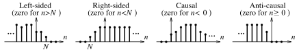

# Discrete Signals

Discrete signals may arise naturally or as a consequence of sampling continuous signals (typically at a uniform sampling interval $t_s$). A sampled or discrete signal $x[n]$ is just an ordered sequence of values corresponding to the integer index $n$ that embodies the time history of the signal. It contains no direct information about the ***sampling interval*** $t_s$, except through the index $n$ of the sample locations.

> A ***discrete signal*** $x[n]$ is plotted as lines against the integer index $n$.
>
> For example, $\displaystyle x[n] = \{1,\,2,\,\overset{\Downarrow}{4},\,8,\,\ldots\}$
>
> where marker $(\Downarrow)$ indicates the origin $n = 0$ and ellipses $(\ldots)$ denote infinite extent on either side.

A discrete signal $x[n]$ is called ***right-sided*** if it is zero for $n < N$, ***causal*** if it is zero for $n < 0$, ***left-sided*** if it is zero for $n > N$, and ***anti-causal*** if it is zero for $n \geq 0$.

A ***discrete periodic signal*** repeats every $N$ samples.

> $\boxed{x[n] = x[n \pm kN]}$
>
> The period $N$ is the smallest number of samples that repeats. Unlike its [analog counterpart](09fc41c7.md), the period $N$ of discrete signals is always an integer.
>
> The common period $N$ of a linear combination of periodic discrete signals is given by the least common multiple (LCM) of the individual periods.
