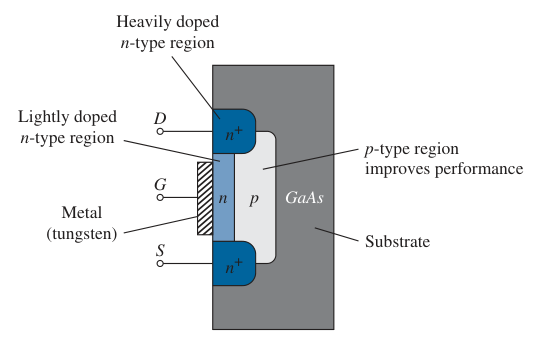
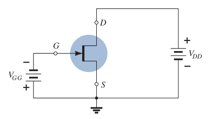
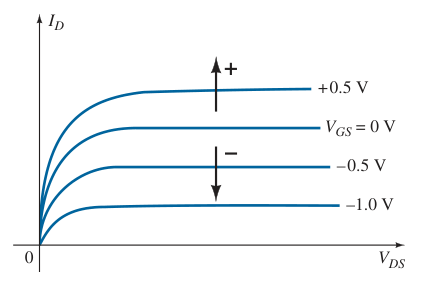
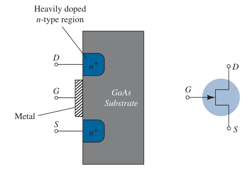

# Metal-Semiconductor Field-Effect Transistor (MESFET)

The use of a *Schottky barrier* at the gate is the major difference from the [depletion-type](1fbb3c8c.md) and [enhancement-type](c2667328.md) MOSFETs, which employ an insulating barrier between the metal contact and the *n*-type channel. The absence of an insulating layer reduces the distance between the metal contact surface of the gate and the semiconductor layer, resulting in a lower level of *stray capacitance* between the two surfaces. The result of the lower capacitance level is a reduced sensitivity to high frequencies (forming a shorting effect), which further supports the high mobility of carriers in the $GaAs$ material.

The gate terminal is connected directly to a metallic conductor lying directly against the *n*-channel between the source and drain terminals.

For increasing values of negative voltage at the gate terminal, the result is a reduced drain current. For positive voltages at the gate, additional electrons will be attracted into the channel and drain current will rise.

> The drain and transfer characteristics of depletion-type MESFET are so similar to those of the [depletion-type](1fbb3c8c.md) MOSFET results in analysis techniques similar to those applied to [depletion-type](1fbb3c8c.md) MOSFETs.

There are also enhancement-type MESFETs with a construction the same as the depletion-type MESFET but without the initial channel. The response and characteristics are essentially the same as for the [enhancement-type](c2667328.md) MOSFET. However, due to the Schottky barrier at the gate, the positive threshold voltage is limited to $0\ V$ to about $0.4\ V$ because the "turn-on" voltage for a Schottky barrier diode is about $0.7\ V$.

> The analysis techniques applied to enhancement-type MESFETs are similar to those employed for [enhancement-type](c2667328.md) MOSFETs.

It is important to realize, however, that the channel must be an *n*-type material in a MESFET. The mobility of holes in $GaAs$ is relatively low compared to that of the negatively charged carriers, losing the advantage of using $GaAs$ for high-speed applications.

> Depletion-type and enhancement-type MESFETs are made with an *n*-channel between the drain and the source, and therefore only *n*-type MESFETs are commercially available.
