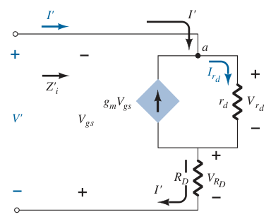

# JFET Common-Gate Configuration (AC Analysis)

Determine $g_m$ and $r_d$ from the specification sheets.

> $\boxed{g_m = g_{fs} = y_{fs}}$
>
> $\boxed{r_d = \frac{1}{g_{os}} = \frac{1}{y_{os}}}$

If $g_{fs}$ or $y_{fs}$ is not available, determine $g_m$ using the values of $V_{GS}$ and $I_D$ from the [DC biasing arrangement](d100de7d.md).

> $\boxed{g_m = \frac{2I_{DSS}}{\left|V_P\right|}\left(1 - \frac{V_{GS}}{V_P}\right) = \frac{2I_{DSS}}{\left|V_P\right|} \sqrt{\frac{I_D}{I_{DSS}}}}$

Once the levels of $g_m$ and $r_d$ are determined, the AC equivalent model can be substituted between the appropriate terminals. Set all capacitors and DC sources to short-circuit equivalent.

Input impedance $Z_i$

> $\displaystyle V_{gs} = -V^\prime$
>
> $\displaystyle V_{R_D} = I^\prime R_D$
>
> Applying Kirchoff's current law at node $a$.
>
> $\displaystyle I^\prime + g_m V_{gs} = I_{r_d}$
>
> $\displaystyle I^\prime - g_m V^\prime = \frac{V^\prime - V_{R_D}}{r_d}$
>
> $\displaystyle I^\prime - g_m V^\prime = \frac{V^\prime}{r_d} - \frac{I^\prime R_D}{r_d}$
>
> $\displaystyle I^\prime + \frac{I^\prime R_D}{r_d} = \frac{V^\prime}{r_d} + g_m V^\prime$
>
> $\displaystyle I^\prime \left(1 + \frac{R_D}{r_d}\right) = V^\prime \left(\frac{1}{r_d} + g_m\right)$
>
> $\displaystyle Z_i^\prime = \frac{V^\prime}{I^\prime} = \frac{\displaystyle 1 + \frac{R_D}{r_d}}{\displaystyle \frac{1}{r_d} + g_m} = \frac{r_d + R_D}{1 + g_m r_d}$
>
> $\boxed{Z_i = R_S \parallel Z_i^\prime = R_S \parallel \left(\frac{r_d + R_D}{1 + g_m r_d}\right)}$

Output impedance $Z_o$ (set $V_i = 0\ V$)

> $\boxed{Z_o = r_d \parallel R_D}$

Voltage gain $A_v$

> $\displaystyle V_o = -I_D R_D$
>
> $\displaystyle V_{gs} = -V_i$
>
> $\displaystyle I_D = -\frac{V_o}{R_D}$
>
> Applying Kirchoff's current law at node $b$.
>
> $\displaystyle I_D = g_m V_{gs} + I_{r_d}$
>
> $\displaystyle -\frac{V_o}{R_D} = -g_m V_i + \frac{V_o - V_i}{r_d}$
>
> $\displaystyle -\frac{V_o}{R_D} = -g_m V_i + \frac{V_o}{r_d} - \frac{V_i}{r_d}$
>
> $\displaystyle -\frac{V_o}{R_D} - \frac{V_o}{r_d} = -g_m V_i - \frac{V_i}{r_d}$
>
> $\displaystyle -V_o \left(\frac{1}{R_D} + \frac{1}{r_d}\right) = -V_i \left(g_m + \frac{1}{r_d}\right)$
>
> $\boxed{A_v = \frac{V_o}{V_i} = \frac{\displaystyle g_m + \frac{1}{r_d}}{\displaystyle \frac{1}{R_D} + \frac{1}{r_d}} = \frac{1 + g_m r_d}{\displaystyle 1 + \frac{r_d}{R_D}}}$

The fact that $A_v$ is a positive number will result in an *in-phase* relationship between $V_o$ and $V_i$ for the common-gate configuration.
