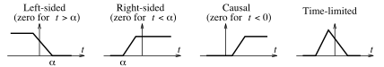

# Signal Classification

Signals can be of finite or infinite duration. Finite duration signals are called ***time-limited***. Signals of semi-infinite extent may be ***right-sided*** if they are zero for $t < \alpha$ (where $\alpha$ is finite) or ***left-sided*** if they are zero for $t > \alpha$. Signals that are zero for $t < 0$ are often called ***causal***.

***Piecewise continuous signals*** possess different expressions over different intervals. ***Continuous signals***, such as $x(t) = \sin(t)$, are defined by a single expression for all time.

> ***Periodic signals*** are infinite-duration signals that repeat the same pattern endlessly. The *smallest* repetition interval is called the ***period*** $T$.
>
> $\boxed{x_{p}(t) = x_{p}(t \pm nT)}$
>
> where $x_{p}(t)$ is the periodic signal and $n$ is an integer.

One-sided or time-limited signals can never be periodic.
