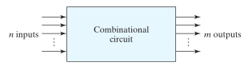

# Combinational Logic Circuits

> A ***combinational circuit*** can be described by $m$ [Boolean functions](3d005f51.md), one for each output variable. Each output function is expressed in terms of the $n$ input variables.

For $n$ input variables, there are $2^n$ possible combinations of the binary inputs. For each possible input combination, there is one possible value for each output variable. Thus, a combinational circuit can be specified with a [truth table](3d005f51.md) that lists the output values for each combination of input variables.

There are several combinational circuits that are employed extensively in the design of digital systems. These circuits are available in integrated circuits and are classified as standard components, such as adders, subtractors, comparators, decoders, encoders, and multiplexers.

## Analysis of Combinational Circuits

Analysis of a combinational circuit determines its *functionality*, that is, *the logic function that the circuit implements*. This task starts with a given logic diagram and culminates with a set of Boolean functions, a truth table, or, possibly, an explanation of the circuit operation.

The first step in the analysis of a circuit is to make sure that it is combinational and not [sequential](8a2342ad.md).

> The logic diagram of a ***combinational circuit*** has [logic gates](afcc79cf.md) with no [feedback paths](8a2342ad.md) or memory elements.

> A ***feedback path*** is a connection from the output of one gate to the input of a second gate whose output forms part of the input to the first gate. Feedback paths in a digital circuit define a [sequential circuit](8a2342ad.md) and must be analyzed by special methods.

To obtain the output [Boolean functions](3d005f51.md) of a combinational circuit from its logic diagram, the process involves:

1. With arbitrary, but meaningful, symbols, label the outputs of all gates whose inputs include at least one input of the circuit. Determine the Boolean functions for each gate output.
2. Label the gates that are a function of input variables and previously labeled gates with other arbitrary symbols. Find the Boolean functions for these gates.
3. Repeat the process outlined in step 2 until the outputs of the circuit are obtained.
4. By repeated substitution of previously defined functions, obtain the output Boolean functions in terms of input variables.

To obtain the [truth table](3d005f51.md) directly from the logic diagram without going through the derivations of the Boolean functions, the process involves:

1. Determine the number of input variables in the circuit. For $n$ inputs, form the $2^n$ possible input combinations and list the binary numbers from $0$ to $\left(2^n - 1\right)$ in a  table.
2. Label the outputs of selected gates with arbitrary symbols.
3. Obtain the truth table for the outputs of those gates whose set of inputs consists of only inputs to the circuit.
4. Proceed to obtain the truth table for the outputs of those gates, which are a function of previously defined values until the columns for all outputs are determined.

## Design Procedure

The design of combinational circuits starts from the specification of the design objective and culminates in a logic circuit diagram or a set of [Boolean functions](3d005f51.md) from which the logic diagram can be obtained. The procedure involves the following steps:

1. From the specifications of the circuit, determine the required number of inputs and outputs and assign a symbol to each.
2. Derive the truth table that defines the required relationship between inputs and outputs.
3. Obtain the simplified Boolean functions for each output as a function of the input variables.
4. Draw the logic diagram and verify the correctness of the design (manually or by simulation).
