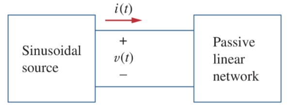
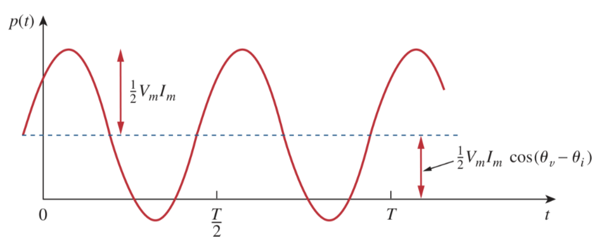

# Instantaneous and Average Power

## Instantaneous Power

> The ***instantaneous power*** (in watts) is the power at any instant of time.
>
> $\boxed{p(t) = v(t)\,i(t)}$

It is the rate at which an element absorbs energy.

Consider the general case of instantaneous power absorbed by an arbitrary combination of circuit elements under sinusoidal excitation.

> Let the voltage and current at the terminals of circuit be
>
> $\displaystyle v(t) = V_m \cos(\omega t + \theta_v)$
>
> $\displaystyle i(t) = I_m \cos(\omega t + \theta_i)$
>
> where $V_m$ and $I_m$ are the amplitudes (or peak values), and $\theta_v$ and $\theta_i$ are the phase angles of the voltage and current, respectively.
>
> The instantaneous power absorbed by the circuit is
>
> $\displaystyle p(t) = v(t)\,i(t) = V_m I_m \cos(\omega t + \theta_v)\cos(\omega t + \theta_i)$
>
> Applying the trigonometric identity
>
> $\displaystyle \cos(A)\cos(B) = \frac{1}{2}\left[\cos(A - B) + \cos(A + B)\right]$
>
> then
>
> $\boxed{p(t) = \frac{1}{2} V_m I_m \cos(\theta_v - \theta_i) + \frac{1}{2} V_m I_m \cos(2\omega t + \theta_v + \theta_i)}$

This shows that the instantaneous power has two parts. The first part is constant or time independent. Its value depends on the phase difference between the voltage and the current. The second part is a sinusoidal function whose frequency is $2\omega$, which is twice the angular frequency of the voltage or current.

When $p(t)$ is positive, power is absorbed by the circuit. When $p(t)$ is negative, power is absorbed by the source; that is, power is transferred from the circuit to the source. This is possible because of the storage elements ([capacitors](48507115.md) and [inductors](8be49ac8.md)) in the circuit.

## Average Power

The instantaneous power changes with time and is therefore difficult to measure. The *average power* is more convenient to measure. In fact, the wattmeter, the instrument for measuring power, responds to *average power*.

> The ***average power*** (in watts) is the average of the instantaneous power over one period.
>
> $\displaystyle P = \frac{1}{T}\int_{0}^{T}p(t)\,dt$
>
> $\boxed{P = \frac{1}{2} V_m I_m \cos(\theta_v - \theta_i)}$

Since $\cos(\theta_v - \theta_i) = \cos(\theta_i - \theta_v)$, what is important is the difference in the phases of the voltage and current.

Note that $p(t)$ is time-varying while $P$ does not depend on time.

The average power in the [frequency domain](82b1dcbd.md).

> The phasor forms of $v(t)$ and $i(t)$ are $\mathbf{V} = V_m\angle\theta_v$ and $\mathbf{I} = I_m\angle\theta_i$, respectively.
>
> $\displaystyle \frac{1}{2}\mathbf{V}\mathbf{I}^\ast = \frac{1}{2} V_m I_m \angle(\theta_v - \theta_i) = \frac{1}{2} V_m I_m \left[\cos(\theta_v - \theta_i) + j\sin(\theta_v - \theta_i)\right]$
>
> $\boxed{P = \frac{1}{2}\textrm{Re}\left(\mathbf{V}\mathbf{I}^\ast\right) = \frac{1}{2} V_m I_m \cos(\theta_v - \theta_i)}$

Consider two special cases:

1. When $\theta_v = \theta_i$, the voltage and current are in phase. This implies a purely resistive circuit or resistive load $R$.

    > $\displaystyle P = \frac{1}{2} V_m I_m = \frac{V_{m}^2}{2R} = \frac{1}{2} I_{m}^{2}R = \frac{1}{2} \left|\mathbf{I}\right|^{2}R$
    >
    > where $\displaystyle \left|\mathbf{I}\right|^2 = \mathbf{I}\times\mathbf{I}^\ast$

    Which shows that a purely resistive circuit absorbs power at all times.

2. When $\theta_v - \theta_i = \pm 90^\circ$, This implies a purely reactive circuit or reactive load ($L$ or $C$).

    > $\displaystyle P = \frac{1}{2} V_m I_m \cos\left(90^\circ\right) = 0$

    Which shows that a purely reactive circuit absorbs zero average power.
