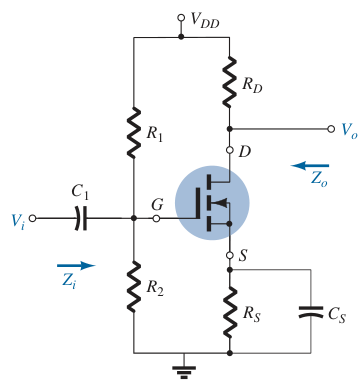
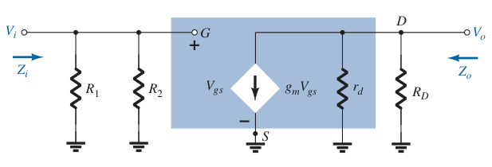

# E-MOSFET Voltage-Divider Configuration (AC Analysis)

Determine $g_m$ and $r_d$ from the specification sheets.

> $\boxed{g_m = g_{fs} = y_{fs}}$
>
> $\boxed{r_d = \frac{1}{g_{os}} = \frac{1}{y_{os}}}$

If $g_{fs}$ or $y_{fs}$ is not available, determine $g_m$ using the values of $V_{GS}$ and $I_D$ from the [DC biasing arrangement](1ce92e9d.md).

> $\boxed{g_m = 2k\left(V_{GS} - V_{GS(Th)}\right)}$
>
> $\boxed{k = \frac{I_{D(on)}}{\left( V_{GS(on)} - V_{GS(Th)} \right) ^ 2}}$

Once the levels of $g_m$ and $r_d$ are determined, the AC equivalent model can be substituted between the appropriate terminals. Set all capacitors and DC sources to short-circuit equivalent.

Input impedance $Z_i$

> $\boxed{Z_i = R_1 \parallel R_2}$

Output impedance $Z_o$

> $\boxed{Z_o = r_d \parallel R_D}$

Voltage gain $A_v$

> $\displaystyle V_{gs} = V_i$
>
> $\displaystyle V_o = -g_m V_{gs}\left(r_d \parallel R_D\right)$
>
> $\displaystyle V_o = -g_m V_i\left(r_d \parallel R_D\right)$
>
> $\boxed{A_v = \frac{V_o}{V_i} = -g_m\left(r_d \parallel R_D\right)}$

The negative sign for $A_v$ reveals that $V_o$ and $V_i$ are out of phase by $180^\circ$.
