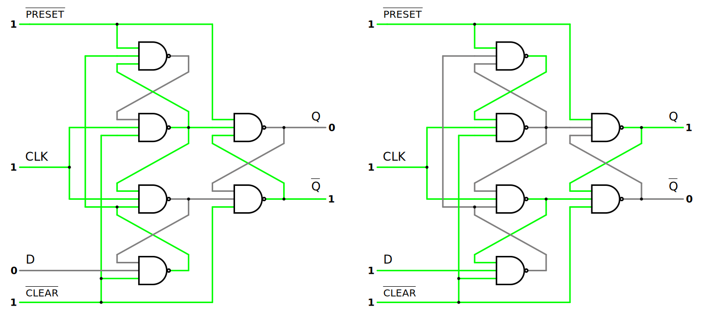

# Flip-Flops

A change in the control input of a [latch](b7c97843.md) or flip-flop switches its state. This momentary change is called ***trigger***, and the transition it causes is said to trigger the flip-flop. The $D$ [latch](b7c97843.md) with pulses in its control input is essentially a flip-flop that is triggered every time the pulse goes to  the logic-$1$ level.

> The term ***flip-flop*** has historically referred generically to both ***level-triggered*** ([asynchronous](8a2342ad.md), or transparent) and ***edge-triggered*** ([synchronous](8a2342ad.md), or clocked) circuits that store a single [bit](9075a57a.md) of data using [gates](afcc79cf.md). The terms edge-triggered, and level-triggered may be used to avoid ambiguity.

When a circuit is edge-triggered, the output can change only on the ***positive-edge*** (rising) or ***negative-edge*** (falling) of the clock. But when the circuit is level-triggered, the output can change while the clock is high or low.

Flip-flop circuits are constructed in such a way as to make them operate properly when they are part of a [sequential circuit](8a2342ad.md) that employs a common clock. The key to the proper operation of a flip-flop is to trigger it only during a signal *transition*.

## Timing Considerations

The timing of the response of a flip-flop to input data and to the clock must be taken into consideration when one is using edge-triggered flip-flops.

> The ***setup time*** is the minimum amount of time the data input should be held steady before the clock event, so that the data is reliably sampled by the clock.

> The ***hold time*** is the minimum amount of time the data input should be held steady after the clock event, so that the data is reliably sampled by the clock.

> The ***aperture*** is the sum of setup and hold time. The data input should be held steady throughout this time period.

The [propagation delay](6f989aae.md) time of the flip-flop is defined as the interval between the trigger edge and the stabilization of the output to a new state.

## Flip-Flop Characteristics

A ***characteristic table*** defines the logical properties of a flip-flop by describing its operation in tabular form. They define the next state (the state that results from a clock transition) as function of the inputs and the present state. $Q(t)$ refers to the present state (the state present prior to the application of a clock edge). $Q(t + 1)$ is the next state one clock period later.

> Note that the clock edge input is not included in the characteristic table, but is implied to occur between times $t$ and $(t + 1)$. Thus, $Q(t)$ denotes the state of the flip-flop immediately before the clock edge, and $Q(t + 1)$ denotes the state that results from the clock transition.

The logical properties of a flip-flop, as described in the characteristic table, can be expressed algebraically ([Boolean expression](3d005f51.md)) with a ***characteristic equation***.

## Edge-Triggered D Flip-Flop

The next state of a $D$ flip-flop is dependent on only the $D$ input and is independent of the present state. The characteristic equation for the $D$ flip-flop can be expressed as

> $\boxed{Q(t + 1) = D}$
>
> and the corresponding characteristic table is
>
> | $D$ | $Q(t + 1)$ | $\textrm{Comments}$ |
> | :- | :- | :- |
> | $0$ | $0$ | $\textit{reset state}$ |
> | $1$ | $1$ | $\textit{set state}$ |

### Positive-Edge-Triggered D Flip-Flop

A construction of an positive-edge-triggered $D$ flip-flop that uses three $\bar{S}$-$\bar{R}$ [latches](b7c97843.md). Two latches respond to the external $D$ (data) and $CLK$ (clock) inputs. The third latch provides the outputs for the flip-flop. The $\bar{S}$ and $\bar{R}$ inputs of the output latch are maintained at the logic-$1$ level when $CLK = 0$. This causes the output to remain in its present state.

| $\overline{PRESET}$ | $\overline{CLEAR}$ | $CLK$ | $D$ | $Q$ | $\bar{Q}$ | $\textrm{Comments}$ |
| :- | :- | :- | :- | :- | :- | :- |
| $0$ | $0$ | $\textrm{X}$ | $\textrm{X}$ | $1$ | $1$ | $\textit{invalid state }(\textrm{forbidden})$ |
| $1$ | $0$ | $\textrm{X}$ | $\textrm{X}$ | $0$ | $1$ | $\textit{reset state }(\textrm{direct reset})$ |
| $0$ | $1$ | $\textrm{X}$ | $\textrm{X}$ | $1$ | $0$ | $\textit{set state }(\textrm{direct set})$ |
| $1$ | $1$ | $0$ | $\textrm{X}$ | $Q_\textrm{previous}$ | $\bar{Q}_\textrm{previous}$ | $\textit{hold previous state }(\textrm{no change})$ |
| $1$ | $1$ | $1$ | $\textrm{X}$ | $Q_\textrm{previous}$ | $\bar{Q}_\textrm{previous}$ | $\textit{hold previous state }(\textrm{no change})$ |
| $1$ | $1$ | $\downarrow$ | $\textrm{X}$ | $Q_\textrm{previous}$ | $\bar{Q}_\textrm{previous}$ | $\textit{hold previous state }(\textrm{no change})$ |
| $1$ | $1$ | $\uparrow$ | $0$ | $0$ | $1$ | $\textit{reset state}$ |
| $1$ | $1$ | $\uparrow$ | $1$ | $1$ | $0$ | $\textit{set state}$ |

The up $\uparrow$ and down $\downarrow$ arrows represent the positive and negative edges of the clock, respectively. There is no output change when the clock $CLK$ is low $(0)$, high $(1)$, or on its negative edge $(\downarrow)$. The input data $D$ is stored only on the positive edge of the clock.

The direct (asynchronous) inputs $\overline{PRESET}$ and $\overline{CLEAR}$ are used to force the flip-flop to a particular state independently of the clock. The $\overline{PRESET}$ input that sets the flip-flop to $Q = 1$ is called *preset* or *direct set*. The $\overline{CLEAR}$ input that sets the flip-flop to $Q = 0$ is called *clear* or *direct reset*. The direct inputs are useful for bringing all flip-flops in the system to a known starting state prior to the clocked operation.

If $D = 0$ when $CLK$ goes from $0$ to $1$, the reset input of the output latch changes to $0$. This causes the flip-flop to go to the reset state $(Q = 0)$. Similarly, if $D = 1$ when $CLK$ goes from $0$ to $1$, the set input of the output latch changes to $0$. This causes the flip-flop to go to the set state $(Q = 1)$. Any change in $D$ does not affect the output when $CLK$ is $1$, $0$, or on a transition from $1$ to $0$.

### Master-Slave Negative-Edge-Triggered D Flip-Flop

A construction of a $D$ flip-flop with two $D$ [latches](b7c97843.md) and an [inverter](afcc79cf.md). The first latch is called the ***master*** and the second the ***slave***. The circuit samples the $D$ input and changes its output $Q$ only at the negative edge of the clock $CLK$. The value that is produced at the output of the flip-flop is the value that was stored in the master stage immediately before the negative edge occurred.

| $CLK$ | $D$ | $Q$ | $\bar{Q}$ | $\textrm{Comments}$ |
| :- | :- | :- | :- | :- |
| $0$ | $\textrm{X}$ | $Q_\textrm{previous}$ | $\bar{Q}_\textrm{previous}$ | $\textit{hold previous state }(\textrm{no change})$ |
| $1$ | $\textrm{X}$ | $Q_\textrm{previous}$ | $\bar{Q}_\textrm{previous}$ | $\textit{hold previous state }(\textrm{no change})$ |
| $\uparrow$ | $\textrm{X}$ | $Q_\textrm{previous}$ | $\bar{Q}_\textrm{previous}$ | $\textit{hold previous state }(\textrm{no change})$ |
| $\downarrow$ | $0$ | $0$ | $1$ | $\textit{reset state}$ |
| $\downarrow$ | $1$ | $1$ | $0$ | $\textit{set state}$ |

The up $\uparrow$ and down $\downarrow$ arrows represent the positive and negative edges of the clock, respectively. There is no output change when the clock $CLK$ is low $(0)$, high $(1)$, or on its positive edge $(\uparrow)$. The input data $D$ is stored only on the negative edge of the clock.

When the clock $CLK$ changes to the logic-$1$ level, the data from the external $D$ input are transferred to the master. The slave, however, is disabled as long as the clock remains at the $1$ level, because its enable $EN$ input is equal to $0$. Any change in the $D$ input changes the master output, but cannot affect the slave output. When the clock pulse returns to $0$, the master is disabled and is isolated from the $D$ input. At the same time, the slave is enabled and the output of the master is transferred to the output of the slave.

### Master-Slave Positive-Edge-Triggered D Flip-Flop

It is also possible to design a circuit so that the flip-flop output changes on the positive edge of the clock. This happens in a master-slave $D$ flip-flop that has an additional [inverter](afcc79cf.md) between the $CLK$ terminal and the junction between the other inverter and input $EN$ of the master $D$ latch. Such a flip-flop is triggered with a negative pulse, so that the negative edge of the clock affects the master and the positive edge affects the slave and the output terminal.

| $CLK$ | $D$ | $Q$ | $\bar{Q}$ | $\textrm{Comments}$ |
| :- | :- | :- | :- | :- |
| $0$ | $\textrm{X}$ | $Q_\textrm{previous}$ | $\bar{Q}_\textrm{previous}$ | $\textit{hold previous state }(\textrm{no change})$ |
| $1$ | $\textrm{X}$ | $Q_\textrm{previous}$ | $\bar{Q}_\textrm{previous}$ | $\textit{hold previous state }(\textrm{no change})$ |
| $\downarrow$ | $\textrm{X}$ | $Q_\textrm{previous}$ | $\bar{Q}_\textrm{previous}$ | $\textit{hold previous state }(\textrm{no change})$ |
| $\uparrow$ | $0$ | $0$ | $1$ | $\textit{reset state}$ |
| $\uparrow$ | $1$ | $1$ | $0$ | $\textit{set state}$ |

The up $\uparrow$ and down $\downarrow$ arrows represent the positive and negative edges of the clock, respectively. There is no output change when the clock $CLK$ is low $(0)$, high $(1)$, or on its negative edge $(\downarrow)$. The input data $D$ is stored only on the positive edge of the clock.

### Dual-Edge-Triggered D Flip-Flop

Flip-flops that read in new value on the positive and negative edge of the clock are called ***dual-edge-triggered flip-flops***. Such a flip-flop may be built using two single-edge triggered $D$ flip-flops and three [XOR](afcc79cf.md) gates.

| $CLK$ | $D$ | $Q$ | $\bar{Q}$ | $\textrm{Comments}$ |
| :- | :- | :- | :- | :- |
| $0$ | $\textrm{X}$ | $Q_\textrm{previous}$ | $\bar{Q}_\textrm{previous}$ | $\textit{hold previous state }(\textrm{no change})$ |
| $1$ | $\textrm{X}$ | $Q_\textrm{previous}$ | $\bar{Q}_\textrm{previous}$ | $\textit{hold previous state }(\textrm{no change})$ |
| $\downarrow$ | $0$ | $0$ | $1$ | $\textit{reset state}$ |
| $\downarrow$ | $1$ | $1$ | $0$ | $\textit{set state}$ |
| $\uparrow$ | $0$ | $0$ | $1$ | $\textit{reset state}$ |
| $\uparrow$ | $1$ | $1$ | $0$ | $\textit{set state}$ |

The up $\uparrow$ and down $\downarrow$ arrows represent the positive and negative edges of the clock, respectively. There is no output change when the clock $CLK$ is low $(0)$ or high $(1)$. The input data $D$ is stored only on the negative and positive edge of the clock.

### Graphical Symbol for D Flip-Flops

The dynamic indicator $(>)$ denotes the fact that the flip-flop responds to the edge transition of the clock. A bubble outside the block adjacent to the dynamic indicator designates a negative edge for triggering the circuit. The absence of bubble designates a positive-edge response. A bow-tie dynamic indicator $(\bowtie)$ denotes that the flip-flop responds to both positive and negative edge of the clock.

## Edge-Triggered J-K Flip-Flop

The next state of a $J$-$K$ flip-flop is equal to the present state when inputs $J$ and $K$ are both equal to $0$. This condition can be expressed as $Q(t + 1) = Q(t)$, indicating that the clock produces no change of state. When $K = 1$ and $J = 0$, the clock resets the flip-flop and $Q(t + 1) = 0$. With $J = 1$ and $K = 0$, the flip-flop sets and $Q(t + 1) = 1$. When both $J$ and $K$ are equal to $1$, the next state changes to the [complement](3d005f51.md) of the present state, a transition that can be expressed as $Q(t + 1) = Q'(t)$.

The characteristic equation for all the conditions of $J$-$K$ flip-flop can be expressed as

> $\boxed{Q(t + 1) = JQ' + K'Q}$
>
> and the corresponding characteristic table is
>
> | $J$ | $K$ | $Q(t + 1)$ | $\textrm{Comments}$ |
> | :- | :- | :- | :- |
> | $0$ | $0$ | $Q(t)$ | $\textit{hold state }(\textrm{no change})$ |
> | $0$ | $1$ | $0$ | $\textit{reset state}$ |
> | $1$ | $0$ | $1$ | $\textit{set state}$ |
> | $1$ | $1$ | $Q'(t)$ | $\textit{complement}$ |

### Positive-Edge-Triggered J-K Flip-Flop

With only a single input, the $D$ flip-flop can set or reset the output, depending on the value of the $D$ input immediately before the clock transition. Synchronized by a clock signal, the $J$-$K$ flip-flop has two input and performs all three operations. The $J$ input sets the flip-flop to $1$, $K$ input resets it to $0$, and when both inputs are enabled, the output is complemented. The $J$-$K$ flip-flop can be constructed using a $D$ flip-flop with $D$ input expressed as

> $\boxed{D =  Q(t + 1) = JQ' + K'Q}$

When $J = 1$ and $K = 0$, $D = Q' + Q = 1$, so the next clock edge sets the output to $1$. When $J = 0$ and $K = 1$, $D = 0$, so the next clock edge resets the output to $0$. When both $J = K = 1$ and $D = Q'$, the next clock edge complements the output. When both $J = K = 0$ and $D = Q$, the clock edge leaves the output unchanged.

This flip-flop utilizes a $D$ flip-flop, allowing it to be triggered by positive-edge, negative-edge, or dual-edge of the clock signal, depending on the specific type of $D$ flip-flop used.

The graphic symbol for the $J$-$K$ flip-flop is similar to the graphic symbol of the $D$ flip-flop, except that now the inputs are marked $J$ and $K$.

### Master-Slave Negative-Edge-Triggered J-K Flip-Flop

A master-slave $J$-$K$ flip-flop is a combination of two gated $\bar{S}$-$\bar{R}$ [latch](b7c97843.md); the first is called the master, and the second is the slave. When the clock is high, the master is active and the slave is inactive. When the clock is low, the master is inactive and the slave is active. So the value that is produced at the output of the flip-flop is the value that was stored in the master stage immediately before the negative edge occurred.

## Edge-Triggered T Flip-Flop

When $T = 0$, the clock edge does not change the state. When $T = 1$, the clock edge [complements](3d005f51.md) (toggles) the state of the flip-flop. The characteristic equation for the $T$ flip-flop can be expressed as

> $\boxed{Q(t + 1) = T \oplus Q = TQ' + T'Q}$
>
> and the corresponding characteristic table is
>
> | $T$ | $Q(t + 1)$ | $\textrm{Comments}$ |
> | :- | :- | :- |
> | $0$ | $Q(t)$ | $\textit{hold state }(\textrm{no change})$ |
> | $1$ | $Q'(t)$ | $\textit{complement}$ |

The $T$ (toggle) flip-flop is a complementing flip-flop and can be obtained from a $J$-$K$ flip-flop when inputs $J$ and $K$ are connected. When $T = 0$ $(J = K = 0)$, a clock edge does not change the output. When $T = 1$ $(J = K = 1)$, a clock edge complements the output. The graphic symbol for this flip-flop has a $T$ symbol in the input.

The $T$ flip-flop can be constructed using a $D$ flip-flop and an [XOR](afcc79cf.md) gate. The $D$ input is expressed as

> $\boxed{D =  Q(t + 1) = T \oplus Q = TQ' + T'Q}$

When $T = 0$, $D = Q$ and there is no change in the output. When $T = 1$, $D = Q'$ and output complements.

This flip-flop utilizes a $D$ flip-flop, allowing it to be triggered by positive-edge, negative-edge, or dual-edge of the clock signal, depending on the specific type of $D$ flip-flop used.
