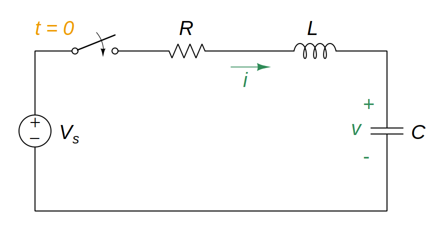

# Step Response of a Series RLC Circuit

To find the [complete response](3dd672e8.md) of a series *[RLC](29569029.md)* circuit, the following is required:

- The initial capacitor voltage $v(0)$.

  > Since the [capacitor](48507115.md) voltage cannot change instantaneously,
  >
  > $\boxed{v\left(0^-\right) = v\left(0^+\right) = v\left(0\right) = V_0}$
  >
  > where $v\left(0^-\right)$ is the voltage across the capacitor just before switching and $v\left(0^+\right)$ is its voltage immediately after switching.

- The initial inductor current $i(0)$.

  > Since the [inductor](8be49ac8.md) current cannot change instantaneously,
  >
  > $\boxed{i\left(0^-\right) = i\left(0^+\right) = i\left(0\right) = I_0}$
  >
  > where $i\left(0^-\right)$ is the current through the inductor just before switching and $i\left(0^+\right)$ is its current immediately after switching.

- The initial value of the derivative of capacitor voltage.

  > $\displaystyle i(0) = C\frac{dv(0)}{dt}$
  >
  > $\boxed{\frac{dv(0)}{dt} = \frac{i(0)}{C}}$

- The final (steady state) capacitor voltage $v(\infty)$.

  > Use the fact that the [capacitor](48507115.md) acts like an open circuit to DC at steady state.
  >
  > $\boxed{v(\infty) = V_s}$

- The damping ratio $\zeta$.

  > The [damping ratio](a61ce3dd.md) $\zeta$ for an *RLC* circuit is
  >
  > $\boxed{\zeta = \frac{\alpha}{\omega_0}}$
  >
  > where $\omega_0$ is the *undamped natural frequency* and $\alpha$ is the *[neper](fd7cf1fa.md) frequency*.

The circuit is being excited by the [energy](7e3e2f1f.md) initially stored in the capacitor and inductor.

> Applying [KVL](2a23acfb.md) around the loop for $t > 0$,
>
> $\displaystyle -V_s + R\,i(t) + L\frac{di(t)}{dt} + v(t) = 0$
>
> But $\displaystyle i(t) = C\frac{dv(t)}{dt}$,
>
> $\displaystyle -V_s + RC\frac{dv}{dt} + LC\frac{d^{2}v}{dt^2} + v(t) = 0$
>
> $\boxed{\frac{d^{2}v}{dt^2} + \frac{R}{L}\frac{dv}{dt} + \frac{1}{LC}v = \frac{V_s}{LC}}$
>
> This second-order circuit can also be solved by using [Laplace transforms](b2aaf243.md).

Since the *characteristic equation* for the series *[RLC](29569029.md)* circuit is not affected by the presence of the DC source, the roots are the same as the roots obtained for the [source-free series RLC circuit](7c356ea5.md).

> $\boxed{\alpha = \frac{R}{2L}}$
>
> $\boxed{\omega_{0} = \frac{1}{\sqrt{LC}}}$
>
> $\boxed{s_1 = -\alpha + \sqrt{\alpha^2 - \left.\omega_{0}\right.^2}}$
>
> $\boxed{s_2 = -\alpha - \sqrt{\alpha^2 - \left.\omega_{0}\right.^2}}$
>
> where roots $s_1$ and $s_2$ are called *natural frequencies*, measured in [nepers](fd7cf1fa.md) per second $(\textrm{Np}/\textrm{s})$; $\omega_0$ is known as the *resonant frequency* or strictly as the *undamped natural frequency*, expressed in radians per second $(\textrm{rad}/\textrm{s})$; $\alpha$ is the *[neper](fd7cf1fa.md) frequency* or the *damping factor*, expressed in nepers per second $(\textrm{Np}/\textrm{s})$; $R$ is the equivalent [resistance](427b2567.md); $L$ is the equivalent [inductance](8be49ac8.md); and $C$ is the equivalent [capacitance](48507115.md).

The solution (or [complete response](3dd672e8.md)) to the series *RLC* circuit with DC source consists of the *transient response* $v_{t}(t)$ and the *steady-state response* $v_{ss}(t)$.

> $\displaystyle v(t) = v_{t}(t) + v_{ss}(t)$
>
> The form of the transient response $v_{t}(t)$ is the same as the form of the solution (or [natural response](ea5e865c.md)) obtained for the [source-free series RLC circuit](7c356ea5.md).
>
> The steady-state response $v_{ss}(t)$ is the final value of $v(t)$.
>
> $\displaystyle v_{ss}(t) = v(\infty) = V_s$

## Overdamped Case ($\zeta > 1$)

The roots $(s_1 \neq s_2)$ are real and distinct.

> The [complete response](3dd672e8.md) is
>
> $\boxed{v\left(t\right) = v\left(\infty\right) + A_1 e^{s_1 t} + A_2 e^{s_2 t}}$
>
> where $A_1$ and $A_2$ are constants to be determined from the initial conditions.

Determine the value of $A_1$ and $A_2$ constants.

> The initial value $(t = 0)$ of the complete response.
>
> $\boxed{v(0) = v(\infty) + A_1 + A_2}$
>
> The initial value $(t = 0)$ of the derivative of the complete response.
>
> $\displaystyle \frac{dv(t)}{dt} = A_1 s_1 e^{s_1 t} + A_2 s_2 e^{s_2 t}$
>
> $\boxed{\frac{dv(0)}{dt} = A_1 s_1 + A_2 s_2}$

## Critically Damped Case ($\zeta = 1$)

The roots $(s_1 = s_2)$ are real and repeated.

> The [complete response](3dd672e8.md) is
>
> $\boxed{v\left(t\right) = v\left(\infty\right) + e^{-\alpha t}\left(A_1 + A_2 t\right)}$
>
> where $A_1$ and $A_2$ are constants to be determined from the initial conditions.

Determine the value of $A_1$ and $A_2$ constants.

> The initial value $(t = 0)$ of the complete response.
>
> $\boxed{v(0) = v(\infty) + A_1}$
>
> The initial value $(t = 0)$ of the derivative of the complete response.
>
> $\displaystyle \frac{dv(t)}{dt} = -\alpha e^{-\alpha t}\left(A_1 + A_2 t\right) + A_2 e^{-\alpha t}$
>
> $\boxed{\frac{dv(0)}{dt} = -\alpha A_1 + A_2}$

## Underdamped Case ($\zeta < 1$)

The roots are [complex](9efce189.md).

> $\displaystyle s_1 = -\alpha + \sqrt{-\left(\left.\omega_{0}\right.^2 - \alpha^2\right)} = -\alpha + j\omega_{d}$
>
> $\displaystyle s_2 = -\alpha - \sqrt{-\left(\left.\omega_{0}\right.^2 - \alpha^2\right)} = -\alpha - j\omega_{d}$
>
> The [complete response](3dd672e8.md) is
>
> $\boxed{v\left(t\right) = v\left(\infty\right) + e^{-\alpha t} \left[A_1\cos\left(\omega_{d}t\right) + A_2\sin\left(\omega_{d}t\right)\right] = v\left(\infty\right) + B e^{-\alpha t}\cos\left(\omega_{d}t - \theta\right)}$
>
> where $A_1$, $A_2$, and $B$ are constants to be determined from the initial conditions, $\theta$ is the phase angle, and $\omega_d$ is the *damped natural frequency*, expressed in radians per second $(\textrm{rad}/\textrm{s})$.
>
> $\boxed{A_1 = B\cos(\theta),\quad A_2 = B\sin(\theta)}$
>
> $\boxed{B = \sqrt{\left.A_{1}\right.^2 + \left.A_{2}\right.^2},\quad \theta = \tan^{-1}\left(\frac{A_2}{A_1}\right)}$
>
> $\boxed{\omega_d = \sqrt{\left.\omega_{0}\right.^2 - \alpha^2}}$

Determine the value of $B$ and $\theta$ constants.

> The initial value $(t = 0)$ of the complete response.
>
> $\boxed{v(0) = v(\infty) + B\cos(-\theta) = v(\infty) + B\cos(\theta)}$
>
> $\boxed{B = \frac{v(0) - v(\infty)}{\cos(\theta)}}$
>
> The initial value $(t = 0)$ of the derivative of the complete response.
>
> $\displaystyle \frac{dv(t)}{dt} = -\alpha B e^{-\alpha t}\cos\left(\omega_{d}t - \theta\right) - \omega_d B e^{-\alpha t}\sin\left(\omega_{d}t - \theta\right)$
>
> $\boxed{\frac{dv(0)}{dt} = -\alpha B\cos\left(\theta\right) + \omega_d B\sin\left(\theta\right)}$
>
> $\displaystyle \frac{dv(0)}{dt} = -\alpha\left[v(0) - v(\infty)\right] + \omega_d \tan\left(\theta\right)\left[v(0) - v(\infty)\right]$
>
> $\boxed{\theta = \tan^{-1}\left(\frac{1}{\omega_{d}\left[v(0) - v(\infty)\right]}\left[\alpha\left[v(0) - v(\infty)\right] + \frac{dv(0)}{dt}\right]\right)}$
