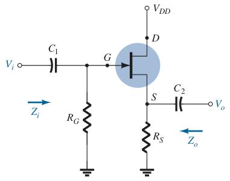
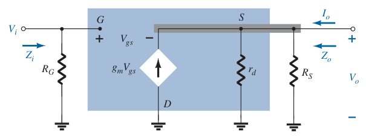

# JFET Source-Follower (Common-Drain) Configuration (AC Analysis)

The JFET equivalent of BJT emitter-follower configuration.

Determine $g_m$ and $r_d$ from the specification sheets.

> $\boxed{g_m = g_{fs} = y_{fs}}$
>
> $\boxed{r_d = \frac{1}{g_{os}} = \frac{1}{y_{os}}}$

If $g_{fs}$ or $y_{fs}$ is not available, determine $g_m$ using the values of $V_{GS}$ and $I_D$ from the [DC biasing arrangement](d356b0a5.md).

> $\boxed{g_m = \frac{2I_{DSS}}{\left|V_P\right|}\left(1 - \frac{V_{GS}}{V_P}\right) = \frac{2I_{DSS}}{\left|V_P\right|} \sqrt{\frac{I_D}{I_{DSS}}}}$

Once the levels of $g_m$ and $r_d$ are determined, the AC equivalent model can be substituted between the appropriate terminals. Set all capacitors and DC sources to short-circuit equivalent.

Input impedance $Z_i$

> $\boxed{Z_i = R_G}$

Output impedance $Z_o$ (set $V_i = 0\,V$)

> $V_{gs} = -V_o$
>
> Applying Kirchhoff's current law at node $S$.
>
> $\displaystyle V_{gs} = -V_o$
>
> $\displaystyle g_m V_{gs} + I_o = I_{r_d} + I_{R_S}$
>
> $\displaystyle -g_m V_o + I_o = \frac{V_o}{r_d} + \frac{V_o}{R_S}$
>
> $\displaystyle I_o = g_m V_o + \frac{V_o}{r_d} + \frac{V_o}{R_S}$
>
> $\displaystyle I_o = V_o \left(g_m + \frac{1}{r_d} + \frac{1}{R_S}\right)$
>
> $\boxed{Z_o = \frac{V_o}{I_o} = \frac{1}{\displaystyle g_m + \frac{1}{r_d} + \frac{1}{R_S}} = r_d \parallel R_S \parallel \left(\frac{1}{g_m}\right)}$

Voltage gain $A_v$

> Applying Kirchhoff's voltage law
>
> $\displaystyle -V_i + V_{gs} + V_o = 0$
>
> $\displaystyle V_{gs} = V_i - V_o$
>
> $\displaystyle V_o = g_m V_{gs}\left(r_d \parallel R_S\right)$
>
> $\displaystyle V_o = g_m\left(V_i - V_o\right)\left(r_d \parallel R_S\right)$
>
> $\displaystyle \frac{V_o}{r_d \parallel R_S} = g_m\left(V_i - V_o\right)$
>
> $\displaystyle \frac{V_o}{r_d \parallel R_S} + g_m V_o = g_m V_i$
>
> $\displaystyle V_o \left(\frac{1}{r_d \parallel R_S} + g_m\right) = g_m V_i$
>
> $\displaystyle A_v = \frac{V_o}{V_i} = \frac{g_m}{\displaystyle \frac{1}{r_d \parallel R_S} + g_m}$
>
> $\boxed{A_v = \frac{V_o}{V_i} = \frac{g_m}{\displaystyle \frac{1}{r_d} + \frac{1}{R_S} + g_m} = g_m\left[r_d \parallel R_S \parallel \left(\frac{1}{g_m}\right)\right]}$

Since $A_v$ is a positive quantity, $V_o$ and $V_i$ are in phase for the JFET source-follower configuration.
