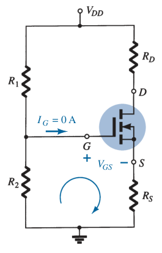

# E-MOSFET Voltage-Divider Biasing Arrangement (DC Analysis)

Since $I_G \simeq 0\ A$ and $I_D = I_S$

> $\boxed{I_{R_1} = I_{R_2} = \frac{V_{DD}}{R_1 + R_2}}$
>
> $\boxed{V_G = \frac{V_{DD} R_2}{R_1 + R_2}}$
>
> $\displaystyle -V_G + V_{GS} + I_S R_S = 0$
> $\displaystyle -V_G + V_{GS} + I_D R_S = 0$
>
> $\boxed{V_{GS} = V_G - I_D R_S}$

For $V_{GS} > V_{GS(Th)}$, substitute $V_{GS}$ to the transfer curve equation:

> $\boxed{k = \frac{I_{D(on)}}{\left( V_{GS(on)} - V_{GS(Th)} \right) ^ 2}}$
>
> $I_D = k \left( V_{GS} - V_{GS(Th)} \right) ^ 2$
>
> $\boxed{I_D = k \left( V_G - I_D R_S - V_{GS(Th)} \right) ^ 2}$
>
> $-V_{DD} + I_D R_D + V_{DS} + I_S R_S = 0$
> $-V_{DD} + I_D R_D + V_{DS} + I_D R_S = 0$
>
> $\boxed{V_{DS} = V_{DD} - I_D \left( R_D + R_S \right)}$
>
> $\boxed{V_D = V_{DD} - I_D R_D}$
>
> $\boxed{V_S = I_D R_S}$
