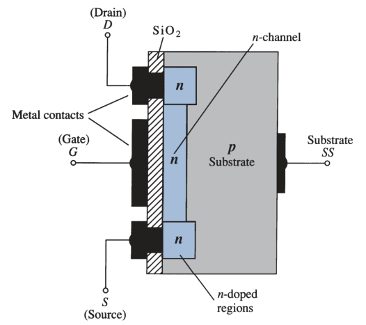
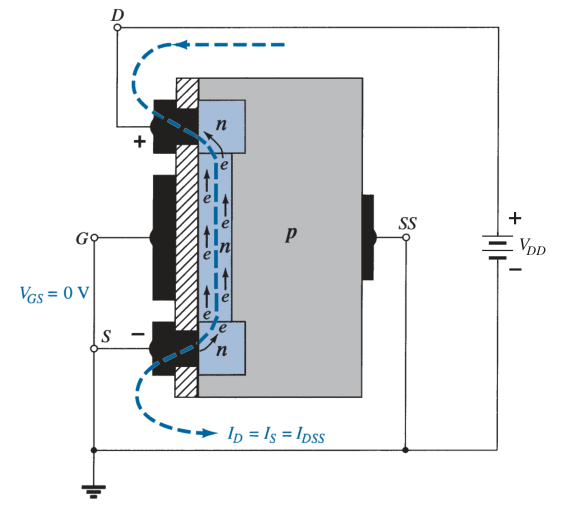
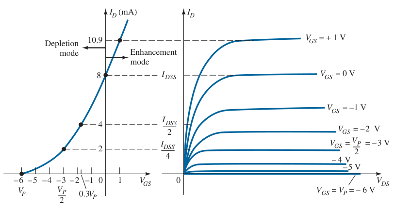
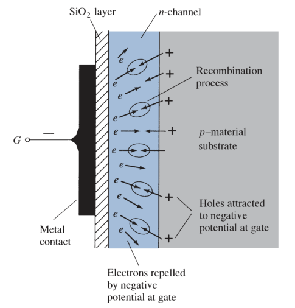
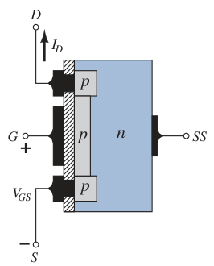
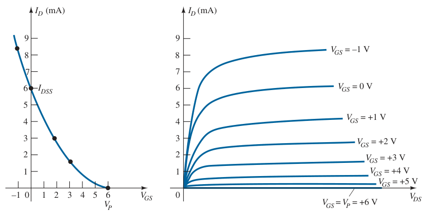
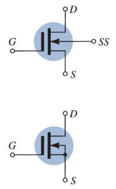
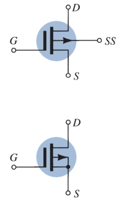
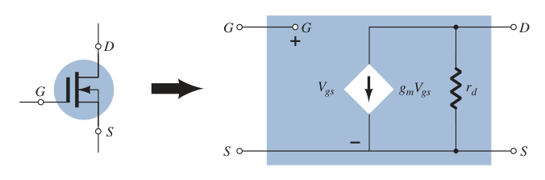

# Depletion-type MOSFET

A slab of *p*-type material is formed from a silicon base and is referred to as the *substrate*. The source and drain terminals are connected through metallic contacts to *n*-doped regions linked by an *n*-channel. The gate is also connected to a metal contact surface but remains insulated from the *n*-channel by a very thin silicon dioxide ($SiO_2$) layer. $SiO_2$ is a type of insulator referred to as a *dielectric*.

> There is no direct electrical connection between the gate terminal and the channel of a [MOSFET](ebb52c96.md).

> It is the insulating layer of $SiO_2$ in the [MOSFET](ebb52c96.md) construction that accounts for the very desirable high input impedance of the device.

The input resistance of a MOSFET is usually more than that of a typical [JFET](4023da85.md). Because of the very high input impedance, the gate current $I_G$ is essentially $0\ A$ for DC-biased configurations.

## Basic Operation and Characteristics

The gate-to-source voltage $V_{GS}$ is set to $0\ V$ and a voltage $V_{DD}$ is applied across the drain-to-source terminals. The result is an attraction of the free electrons of the *n*-channel for the positive voltage at the drain.

The negative potential at the gate will tend to pressure electrons toward the *p*-type substrate. Depending on the magnitude of the negative bias established by $V_{GS}$, a level of recombination between electrons and holes will occur that will reduce the number of free electrons in the *n*-channel available for conduction. The resulting level of drain current $I_D$ is therefore reduced with increasing negative bias for $V_{GS}$.

For positive values of $V_{GS}$, the positive gate will draw additional electrons from the *p*-type substrate due to the reverse leakage current and establish new carriers through the collisions resulting between accelerating particles. As the gate-to-source voltage $V_{GS}$ continues to increase in the positive direction, the drain current $I_D$ will increase at a rapid rate. Due to the rapid rise, the user must be aware of the maximum drain current rating since it could be exceeded with a positive gate voltage.

For the region of positive gate voltages is often referred to as the ***enhancement region***, with the region between cutoff and the saturation level of $I_{DSS}$ referred to as the ***depletion region***.

> Shockley's equation will continue to be applicable for the depletion-type MOSFET characteristics in both the depletion and enhancement regions.

## P-channel Depletion-type MOSFET

The construction of a *p*-channel depletion-type MOSFET is exactly the reverse of the *n*-channel depletion-type MOSFET. The terminals remain as identified, but all the voltage polarities and the current directions are reversed.

The drain characteristics would appear exactly as in *n*-channel depletion-type MOSFET, but with $V_{DS}$ having negative values and $V_{GS}$ having the opposite polarities.

## Symbols

- *n*-channel Depletion-type MOSFET

  

- *p*-channel Depletion-type MOSFET

  

## Biasing

See [FET biasing](de2d417f.md) for the general analysis of all FET amplifiers.

### DC Analysis

The similarities in appearance between the transfer curves of [JFET](4023da85.md)s and depletion-type MOSFETs permit a similar analysis of each in the DC domain. The primary difference between the two is the fact that depletion-type MOSFETs permit operating points with positive values of $V_{GS}$ and levels of $I_D$ that exceed $I_{DSS}$.

### AC Analysis

The fact that Shockley's equation is also applicable to depletion-type MOSFETs (D-MOSFETs) results in the same equation for $g_m$. The AC equivalent model for D-MOSFETs is exactly the same as that employed for [JFET](4023da85.md)s.

