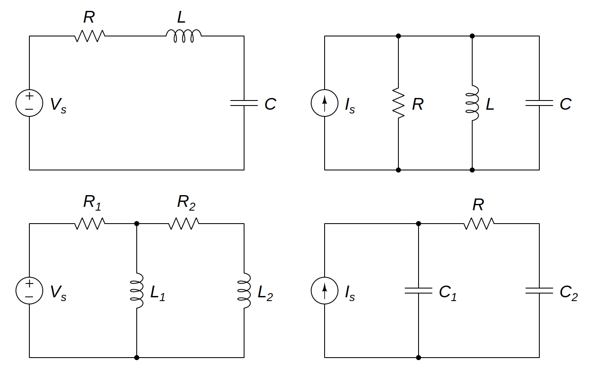

# Second-Order Circuits

A *second-order circuit* may have two storage elements of different type or the same type (provided elements of the same type cannot be represented by an equivalent single element).

> A ***second-order circuit*** is characterized by a second-order differential equation. It consists of resistors and the equivalent of two energy storage storage elements.

An [op amp](bd63e87b.md) circuit with two storage elements that cannot be combined into a single equivalent element is second-order. Such circuits find a wide range of applications in devices such as filters and [oscillators](ee0de5b3.md).

Typical examples of second-order circuits are *RLC* circuits, in which the three kinds of passive elements ([resistors](427b2567.md), [inductors](8be49ac8.md), and [capacitors](48507115.md)) are present. Other examples are *RL* and *RC* circuits.

General procedures to find the [complete response](3dd672e8.md) $x(t)$ of *second-order* circuits:

- Determine the initial conditions $x(0)$ and $dx(0)/dt$ and the final (steady state) value $x(\infty)$.
- Turn off the independent sources and obtain the second-order differential equation by applying [KCL](f7ac01a2.md) and [KVL](2a23acfb.md).
- Once a second-order differential equation is obtained, determine its characteristic roots.
- Obtain the transient response $x_{t}(t)$ depending on whether the response ([damping](a61ce3dd.md)) is overdamped (real and distinct roots), critically damped (real and repeated roots), or underdamped ([complex](9efce189.md) roots).
- Obtain the steady-state response as $x_{ss}(t) = x(\infty)$.
- The complete response $x(t)$ is now found as the sum of the transient response $x_{t}(t)$ and steady-state response $x_{ss}(t)$.
- Determine the constants associated with the transient response $x_{t}(t)$ by imposing the initial conditions $x(0)$ and $dx(0)/dt$ to the complete response $x(t)$.

> Second-order circuits can also be solved by using [Laplace transforms](b2aaf243.md).
