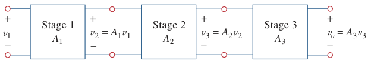

# Cascaded Op Amp Circuits

It is often necessary in practical applications to connect [op amp](bd63e87b.md) circuits in cascade to achieve a large [overall gain](2f56aca1.md).

> A ***cascade connection*** is a head-to-tail arrangement of two or more [op amp](bd63e87b.md) circuits such that the output of one is the input of the next.

When op amp circuits are cascaded, each circuit in the string is called a *stage*; the original input signal is increased by the gain of the individual stage.

Since the output of one stage is the input to the next stage, the [overall gain](2f56aca1.md) of the cascade connection is the product of the gains of the individual op amp circuits.

> $\displaystyle A = A_1 \cdot A_2 \cdot A_3$
