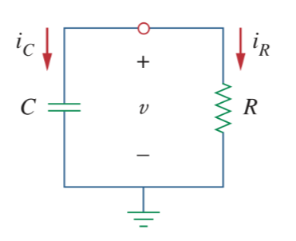
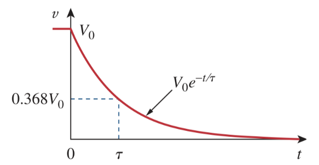

# Source-Free RC Circuit

To find the [natural response](ea5e865c.md) of an *[RC](2abe1de7.md)* circuit, the following is required:

- The initial capacitor voltage $v(0)$.

  > Since the [capacitor](48507115.md) voltage cannot change instantaneously,
  >
  > $\boxed{v\left(0^-\right) = v\left(0^+\right) = v\left(0\right) = V_0}$
  >
  > where $v\left(0^-\right)$ is the voltage across the capacitor just before switching and $v\left(0^+\right)$ is its voltage immediately after switching.

- The time constant $\tau$.

  > The [time constant](ea5e865c.md) $\tau$ for an *RC* circuit is
  >
  > $\boxed{\tau = RC}$
  >
  > where $R$ is the [thevenin](b153529a.md) resistance at the capacitor terminals and $C$ is the equivalent [capacitance](48507115.md).

A source-free *[RC](2abe1de7.md)* circuit occurs when its DC source is suddenly disconnected. The energy already stored in the [capacitor](48507115.md) is released to the [resistors](427b2567.md).

> Assume $v\left(t\right)$ is the voltage across the [capacitor](48507115.md). Since the capacitor is initially charged, the initial voltage at time $t = 0$ is
>
> $\boxed{v\left(0\right) = V_0}$
>
> with the corresponding value of the energy stored as
>
> $\boxed{w\left(0\right) = \frac{1}{2} CV_{0}^2}$
>
> Applying [KCL](f7ac01a2.md) at the top node
>
> $\displaystyle i_C + i_R = 0$
>
> $\displaystyle C\frac{dv}{dt} + \frac{v}{R} = 0$
>
> $\displaystyle \frac{dv}{dt} + \frac{v}{RC} = 0$
>
> This is a *first-order differential equation*. To solve it, arrange the terms as
>
> $\displaystyle \frac{dv}{v} = -\frac{1}{RC} dt$
>
> Integrating both sides
>
> $\displaystyle \ln{v} = -\frac{t}{RC} + \ln{A}$
>
> where $\ln{A}$ is the integration constant.
>
> $\displaystyle \ln{v} - \ln{A} = -\frac{t}{RC}$
>
> $\displaystyle \ln{\frac{v}{A}} = -\frac{t}{RC}$
>
> $\displaystyle \frac{v}{A} = e^{\displaystyle -\frac{t}{RC}}$
>
> $\displaystyle v\left(t\right) = Ae^{\displaystyle -\frac{t}{RC}}$
>
> But from the initial conditions, $v\left(0\right) = V_0$
>
> $\displaystyle v\left(t\right) = Ae^{\displaystyle -\frac{t}{RC}}$
>
> $\displaystyle V_0 = Ae^{\displaystyle -\frac{0}{RC}}$
>
> $\displaystyle V_0 = Ae^0 = A$
>
> $\boxed{v\left(t\right) = V_0\,e^{\displaystyle -\frac{t}{RC}} = V_0\,e^{\displaystyle -\frac{t}{\tau}}}$
>
> where [time constant](ea5e865c.md) $\tau = RC$

This shows that the [natural response](ea5e865c.md) of the *RC* circuit is an exponential decay of the initial voltage $V_0$.

The [energy](7e3e2f1f.md) that was initially stored in the [capacitor](48507115.md) is eventually dissipated in the [resistor](427b2567.md).

> The power dissipated in the resistor is
>
> $\displaystyle i_R \left(t\right) = \frac{v}{R} = \frac{V_0}{R} e^{\displaystyle -t/\tau}$
>
> $\boxed{p\left(t\right) = v i_R = \frac{V_{0}^{2}}{R} e^{\displaystyle -2t/\tau}}$
>
> The energy absorbed by the resistor up to time $t$ is
>
> $\displaystyle w_{R}\left(t\right) = \int_{0}^{t} p\left(\lambda\right)\,d\lambda = \int_{0}^{t} \frac{V_{0}^{2}}{R} e^{\displaystyle -2\lambda/\tau}\,d\lambda$
>
> $\displaystyle w_{R}\left(t\right) = -\left.\frac{\tau V_{0}^{2}}{2R} e^{\displaystyle -2\lambda/\tau}\right|_{0}^{t},\quad \tau = RC$
>
> $\boxed{w_{R}\left(t\right) = \frac{1}{2} CV_{0}^{2} \left(1 - e^{\displaystyle -2t/\tau}\right)}$
>
> where [time constant](ea5e865c.md) $\tau = RC$
