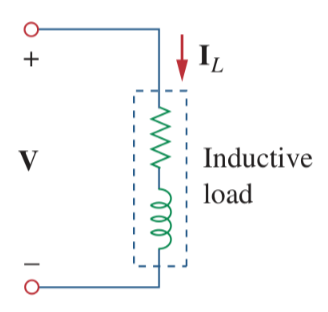
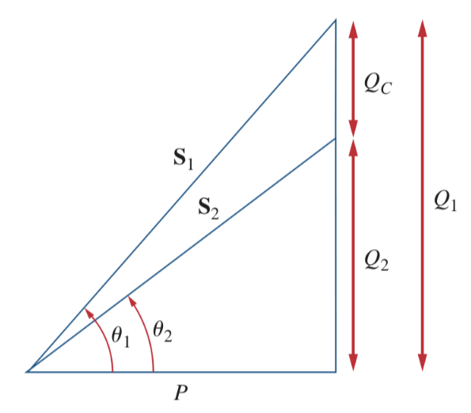
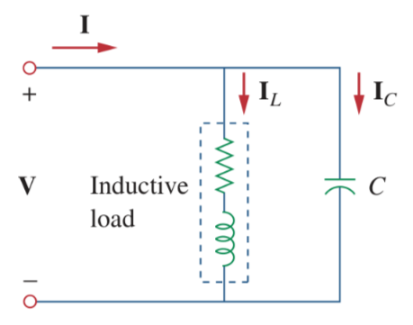

# Power Factor Correction

Most domestic loads (such as washing machines, air conditioners, and refrigerators) and industrial loads (such as induction motors) are inductive and operate at a low lagging [power factor](0e5be61b.md).

An inductive load is modeled as a series combination of an [inductor](8be49ac8.md) and a resistor.

> The process of increasing the power factor without altering the voltage or current to the original load is known as ***power factor correction***.

Consider the power triangle. If the original inductive load has [apparent power](0e5be61b.md) $S_1$.

> $\displaystyle P = S_1\cos(\theta_1)$
>
> $\displaystyle Q_1 = S_1\sin(\theta_1) = P\tan(\theta_1)$

To increase the power factor from $\cos(\theta_1)$ to $\cos(\theta_2)$ without altering the [real power](103c4ff6.md) $P$.

> $\displaystyle P = S_2\cos(\theta_2)$
>
> $\displaystyle Q_2 = S_2\sin(\theta_2) = P\tan(\theta_2)$
>
> The reduction in the [reactive power](ab6f0a93.md) is caused by the shunt [capacitor](48507115.md) *(in parallel with the inductive load)*.
>
> $\displaystyle Q_C = Q_1 - Q_2 = P\left[\tan(\theta_1) - \tan(\theta_2)\right]$
>
> But $\displaystyle Q_C = V_\textrm{rms}^2 / X_C = \omega CV_\textrm{rms}^2$.
>
> The value of the required shunt [capacitance](48507115.md) $C$ is determined as
>
> $\boxed{C = \frac{Q_C}{\omega V_\textrm{rms}^2} = \frac{Q_1 - Q_2}{\omega V_\textrm{rms}^2} = \frac{P\left[\tan(\theta_1) - \tan(\theta_2)\right]}{\omega V_\textrm{rms}^2}}$
>
> where $Q_C$ is the difference between the old and new reactive powers.

Note that the real power $P$ dissipated by the load is not affected by the power factor correction because the [average power](103c4ff6.md) due to the capacitance is zero.

It is also possible that the load is capacitive; that is, the load is operating at a leading power factor. In this case, an [inductor](8be49ac8.md) should be connected across *(in parallel with)* the load for power factor correction. The value of the required shunt [inductance](8be49ac8.md) $L$ is determined as

> $\displaystyle Q_L = \frac{V_\textrm{rms}^2}{X_L} = \frac{V_\textrm{rms}^2}{\omega L}$
>
> $\boxed{L = \frac{V_\textrm{rms}^2}{\omega Q_L} = \frac{V_\textrm{rms}^2}{\omega(Q_1 - Q_2)} = \frac{V_\textrm{rms}^2}{\omega P\left[\tan(\theta_1) - \tan(\theta_2)\right]}}$
>
> where $Q_L$ is the difference between the old and new [reactive powers](ab6f0a93.md).
