# Junction Field-Effect Transistor (JFET)

## N-channel JFET

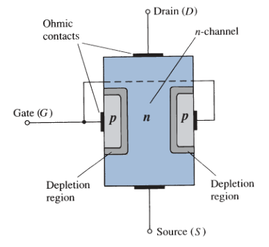

The *drain* (D) and the *source* (S) are connected together to the ends of the *n*-type channel and the *gate* (G) to the two layers of *p*-type material. In the absence of any applied potentials, the JFET has two *p-n* junctions under *no-bias* conditions. The result is a depletion region at each junction.

## For $V_{GS} = 0 V$ and $V_{DS} > 0 V$

A positive $V_{DS}$ is applied across the channel, and the gate is connected directly to the source to establish the condition $V_{GS} = 0 V$. The instant the voltage $V_{DD}$, the electrons are drawn to the drain terminal, establishing the conventional current $I_D$. The path of charge flow clearly reveals that the drain and source currents are equivalent ($I_D = I_S$).

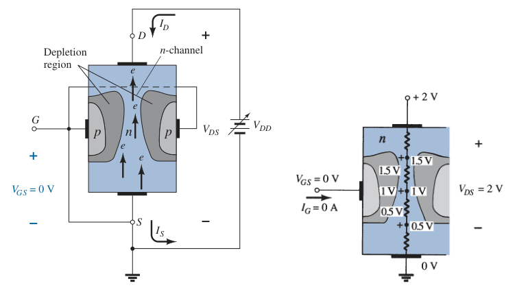

The depletion region is wider near the top of both *p*-type materials. This is due to the voltage drops across the resistances in the channel, the two *p-n* junctions are in reverse-biased condition.

For the region of low values of $V_{DS}$, the resistance is essentially constant. As $V_{DS}$ increases and approaches the ***pinch-off voltage*** $V_P$, the depletion regions will widen, causing a noticeable reduction in the channel width. The reduced path of conduction causes the resistance to increase. The more horizontal the curve, the higher the resistance, suggesting that the resistance is approaching "*infinite*" ohms.

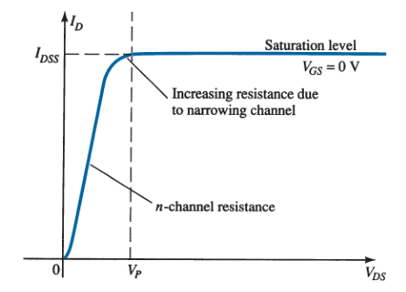

If $V_{DS}$ is increased to a level where it appears that the two depletion regions would "*touch*", a condition referred to as the ***pinch-off*** will result. The level of $V_{DS}$ that establishes this condition is referred to as the ***pinch-off voltage*** and is denoted by $V_P$.

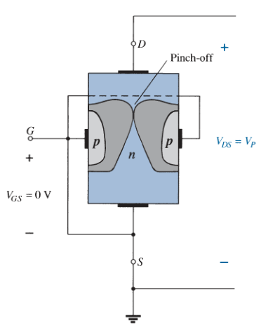

$I_D$ does not drop to $0A$ at pinch-off and maintains the saturation level $I_{DSS}$. The absence of a drain current $I_D$ would remove the possibility of different potential levels through the *n*-channel material to establish the varying levels of reverse bias along *p-n* junction. The result would be a loss of the depletion region distribution that caused pinch-off in the first place.

Once $V_{DS} \geq V_P$ the JFET has the characteristics of a current source, the current is fixed at $I_D = I_{DSS}$, but the voltage $V_{DS}$ (for levels greater than $V_P$) is determined by the applied load.

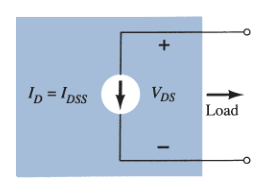

> For *n*-channel JFET, the maximum drain current $I_{DSS}$ is defined by the conditions $V_{GS} = 0\ V$ and $V_{DS} \geq - V_P$, with $V_P$ being a negative voltage.

> For *p*-channel JFET, the maximum drain current $I_{DSS}$ is defined by the conditions $V_{GS} = 0\ V$ and $V_{DS} \leq - V_P$, with $V_P$ being a positive voltage.

## For $V_{GS} < 0V$

The voltage from gate (G) to source (S), denoted $V_{GS}$, is the controlling voltage of the JFET. For the *n*-channel device the controlling voltage $V_{GS}$ is made more and more negative from its $V_{GS} = 0V$ level.

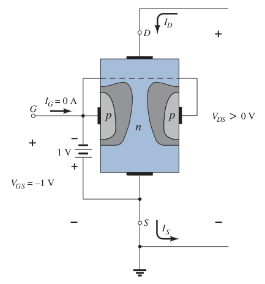

The effect of the applied negative-bias $V_{GS}$ is to establish depletion regions similar to those obtained with $V_{GS} = 0V$, but at the lower levels of $V_{DS}$. The resulting saturation level for $I_D$ has been reduced and in fact will continue to decrease as $V_{GS}$ is made more and more negative.

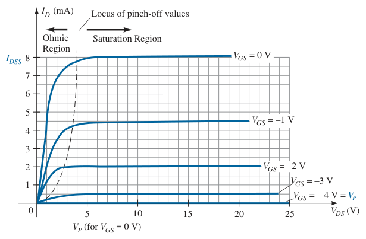

> The level of $V_{GS}$ that results in $I_D = 0\ mA$ is defined by $V_{GS} = V_P$, with $V_P$ being a negative voltage for *n*-channel JFETs and a positive voltage for *p*-channel JFETs.

The region to the *right of the pinch-off locus* is the region typically employed in linear amplifiers (amplifiers with minimum distortion of the applied signal) and is commonly referred to as the *constant-current*, *saturation*, or *linear amplification region*.

On most specification sheets the pinch-off voltage is specified as $V_{GS(off)}$ rather than $V_P$.

### Voltage-Controlled Resistor

The region to the *left of the pinch-off locus* is referred to as the *ohmic* or *voltage-controlled resistance region*. In this region the JFET can actually be employed as a variable resistor (possibly for an automatic gain control system) whose resistance is controlled by the applied gate-to-source voltage $V_{GS}$.

$$\boxed{r_d = \frac{r_o}{\left(1 - V_{GS}/V_P\right)^2}}$$

where $r_o$ is the resistance with $V_{GS} = 0\ V$ and $r_d$ is the resistance at a particular level of $V_{GS}$.

## P-channel JFET

The *p*-channel JFET is constructed in exactly the same manner as the *n*-channel JFET but with a reversal of the *p*- and *n*-type materials. The defined current directions are reversed, as are the actual polarities for the voltage $V_{GS}$ and $V_{DS}$.

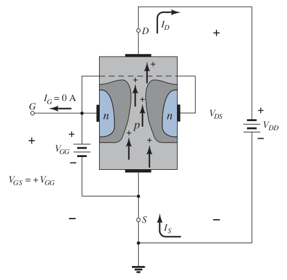

For the *p*-channel JFET, the channel will be constricted by increasing positive voltages from gate to source and the double-subscript notation $V_{DD}$ for $V_{DS}$ will result in negative voltages for $V_{DS}$.

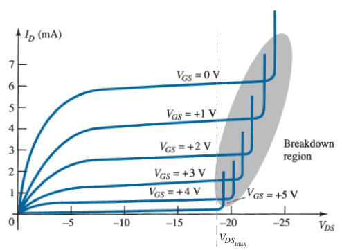

Note at high levels of $V_{DS}$ that the curves suddenly rise to levels that seem unbounded. The vertical rise is an indication that breakdown has occured and the current through the channel is now limited solely by the external circuit. This region can be avoided if the level of $V_{{DS}_{max}}$ is noted on specification sheet and the design is such that the actual level of $V_{DS}$ is less than this value $V_{{DS}_{max}}$ for all values of $V_{GS}$.

## Symbols

- *n*-channel JFET

  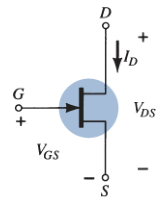

- *p*-channel JFET

  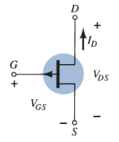

## Transfer Characteristics

The relationship between $I_D$ and $V_{GS}$ is defined by ***Shockley's equation***:

$$\boxed{I_D = I_{DSS} \left( 1 - \frac{V_{GS}}{V_P} \right) ^ 2}$$

$$\boxed{V_{GS} = V_P \left( 1 - \sqrt{\frac{I_D}{I_{DSS}}} \right)}$$

The *maximum drain current* $I_{DSS}$ and *pinch-off voltage* $V_P$ are constants. The squared term in the equation results in a non-linear relationship between $I_D$ and $V_{GS}$.

> The transfer characteristics defined by *Shockley's equation* are unaffected by the network in which the device is employed.

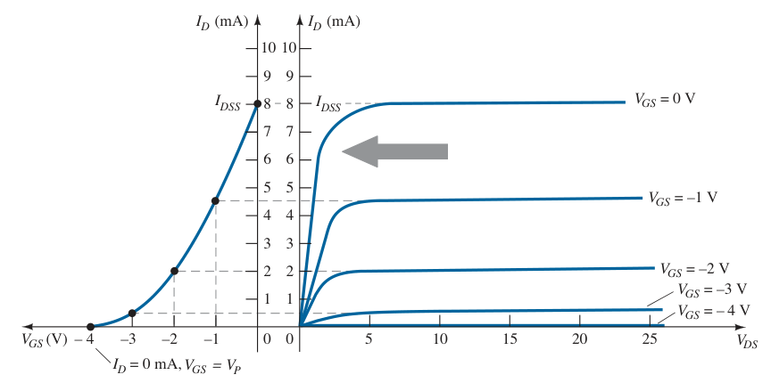

### Applying Shockley's Equation

The transfer curve can be obtained directly from Shockley's equation. The levels of $I_{DSS}$ and $V_P$ define the limits of the curve on both axes.

Substituting $V_{GS} = 0\ V$ gives

$$I_D = I_{DSS} \left( 1 - \frac{V_{GS}}{V_P} \right) ^ 2 = I_{DSS} \left( 1 - \frac{0}{V_P} \right) ^ 2$$

$$\boxed{I_D = I_{DSS}}$$

Substituting $V_{GS} = V_P$ gives

$$I_D = I_{DSS} \left( 1 - \frac{V_{GS}}{V_P} \right) ^ 2 = I_{DSS} \left( 1 - \frac{V_P}{V_P} \right) ^ 2$$

$$\boxed{I_D = 0\ A}$$

## Important Relationships

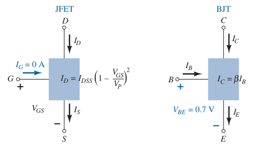

In BJT configuration, $V_{BE} = 0.7\ V$ is often the key to initiating an analysis. Similarly, the condition $I_G = 0\ A$ is often the starting point for the analysis of a JFET configuration. For the BJT configuration, $I_B$ is normally the first parameter to be determined. For the JFET, it is normally $V_{GS}$.

| JFET | BJT |
| :-: | :-: |
| $I_D = I_{DSS} \left( 1 - \frac{V_{GS}}{V_P} \right) ^ 2$ | $I_C = \beta I_B$ |
| $I_D = I_S$ | $I_C \simeq I_E$ |
| $I_G \simeq 0\ A$ | $V_{BE} \simeq 0.7\ V$ |

## Biasing

See [FET biasing](de2d417f.md) for the general analysis of all FET amplifiers.

### DC Analysis

- [Fixed-bias configuration](5de05d8e.md)
- [Self-bias configuration](d356b0a5.md)
- [Voltage-divider biasing](76d5df5d.md)
- [Common-gate configuration](d100de7d.md)

### AC Analysis

- [Fixed-bias configuration](a3c8ef03.md)
- [Self-bias configuration](4aafd311.md)
- [Voltage-divider configuration](c8f3cfd5.md)
- [Common-gate configuration](08a98547.md)
- [Source-follower (common-drain) configuration](1aac4750.md)
