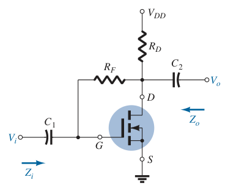
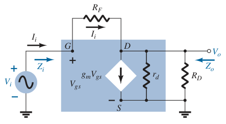

# E-MOSFET Drain-Feedback Configuration (AC Analysis)

Determine $g_m$ and $r_d$ from the specification sheets.

> $\boxed{g_m = g_{fs} = y_{fs}}$
>
> $\boxed{r_d = \frac{1}{g_{os}} = \frac{1}{y_{os}}}$

If $g_{fs}$ or $y_{fs}$ is not available, determine $g_m$ using the values of $V_{GS}$ and $I_D$ from the [DC biasing arrangement](d31b939f.md).

> $\boxed{g_m = 2k\left(V_{GS} - V_{GS(Th)}\right)}$
>
> $\boxed{k = \frac{I_{D(on)}}{\left( V_{GS(on)} - V_{GS(Th)} \right) ^ 2}}$

Once the levels of $g_m$ and $r_d$ are determined, the AC equivalent model can be substituted between the appropriate terminals. Set all capacitors and DC sources to short-circuit equivalent.

Input impedance $Z_i$

> $\displaystyle V_i = V_{gs}$
>
> Applying Kirchhoff's voltage law from input to output.
>
> $\displaystyle -V_i + I_i R_F + V_o = 0$
>
> $\displaystyle V_o = V_i - I_i R_F$
>
> Applying Kirchhoff's current law at node $D$.
>
> $\displaystyle I_i = g_m V_{gs} + \frac{V_o}{r_d \parallel R_D}$
>
> $\displaystyle I_i = g_m V_i + \frac{V_i - I_i R_F}{r_d \parallel R_D}$
>
> $\displaystyle I_i = g_m V_i + \frac{V_i}{r_d \parallel R_D} - \frac{I_i R_F}{r_d \parallel R_D}$
>
> $\displaystyle I_i + \frac{I_i R_F}{r_d \parallel R_D} = g_m V_i + \frac{V_i}{r_d \parallel R_D}$
>
> $\displaystyle I_i\left(1 + \frac{R_F}{r_d \parallel R_D}\right) = V_i\left(g_m + \frac{1}{r_d \parallel R_D}\right)$
>
> $\displaystyle Z_i = \frac{V_i}{I_i} = \frac{\displaystyle 1 + \frac{R_F}{r_d \parallel R_D}}{\displaystyle g_m + \frac{1}{r_d \parallel R_D}}$
>
> $\boxed{Z_i = \frac{R_F + \left(r_d \parallel R_D\right)}{1 + g_m\left(r_d \parallel R_D\right)}}$

Output impedance $Z_o$ (set $V_i = 0\ V$)

> $\boxed{Z_o = R_F \parallel r_d \parallel R_D}$

Voltage gain $A_v$

> $\displaystyle V_i = V_{gs}$
>
> Applying Kirchhoff's current law at node $D$.
>
> $\displaystyle I_i = g_m V_{gs} + \frac{V_o}{r_d \parallel R_D}$
>
> $\displaystyle \frac{V_i - V_o}{R_F} = g_m V_i + \frac{V_o}{r_d \parallel R_D}$
>
> $\displaystyle \frac{V_i}{R_F} - \frac{V_o}{R_F} = g_m V_i + \frac{V_o}{r_d \parallel R_D}$
>
> $\displaystyle \frac{V_i}{R_F} - g_m V_i = \frac{V_o}{R_F} + \frac{V_o}{r_d \parallel R_D}$
>
> $\displaystyle V_i\left(\frac{1}{R_F} - g_m\right) = V_o\left(\frac{1}{R_F} + \frac{1}{r_d \parallel R_D}\right)$
>
> $\displaystyle A_v = \frac{V_o}{V_i} = \frac{\displaystyle \frac{1}{R_F} - g_m}{\displaystyle \frac{1}{R_F} + \frac{1}{r_d \parallel R_D}} = \frac{\displaystyle \frac{1}{R_F} - g_m}{\displaystyle \frac{1}{R_F} + \frac{1}{r_d} + \frac{1}{R_D}}$
>
> $\boxed{A_v = \left(\frac{1}{R_F} - g_m\right)\left(R_F \parallel r_d \parallel R_D\right)}$
>
> Since $\displaystyle g_m \gg \frac{1}{R_F}$
>
> $\boxed{A_v = -g_m\left(R_F \parallel r_d \parallel R_D\right)}$

The negative sign for $A_v$ reveals that $V_o$ and $V_i$ are out of phase by $180^\circ$.
