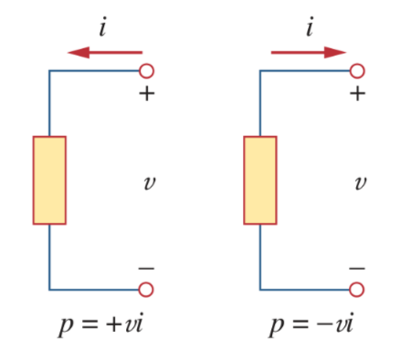

# Passive Sign Convention

> ***Passive sign convention*** is satisfied when the current enters through the positive terminal of an element and $p = +vi$ (absorbing power). If the current enters through the negative terminal, $p = -vi$ (supplying power).

