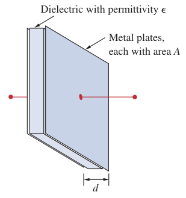
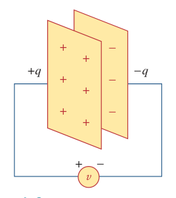
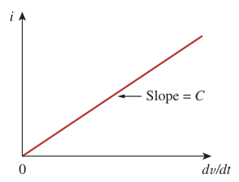
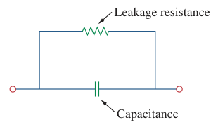
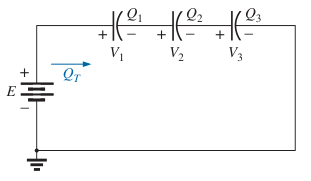
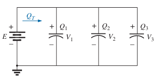

# Capacitors

A ***capacitor*** is a passive element designed to store energy in its electric field.

> A ***capacitor*** consists of two conducting plates separated by an insulator (or dielectric).

The amount of charge stored, represented by *q*, is directly proportional to the applied voltage *v*

> $\boxed{q = Cv}$

where $C$, the constant of proportionality, is known as the ***capacitance*** of the capacitor.

> ***Capacitance*** is the ratio of the charge on one plate of a capacitor to the voltage difference between the two plates, measured in *farads* (F).

> $\boxed{1\ farad = 1\ coulomb/volt}$

Although the capacitance $C$ of a capacitor is the ratio of the charge $q$ per plate to the applied voltage $v$, it does not depend on $q$ or $v$. It depends on the physical dimensions of the capacitor.

> $\boxed{C = \frac{\epsilon A}{d}}$
>
> $\boxed{\epsilon = \epsilon_0 \epsilon_r}$
>
> where:
>
> - $A$ is the surface area (in square meters) of each plate.
> - $d$ is the distance (in meters) between the plates.
> - $\epsilon$ is the permittivity (in farads per meter) of the dielectric material between the plates.
> - $\epsilon_0$ is the *vacuum permittivity* or *permittivity of free space*, $8.854 \times 10^{-12} F/m$ (farads per meter).
> - $\epsilon_r$ is the *relative permittivity* or *dielectric constant* (a dimensionless quantity).

Relative permittivity $\epsilon_r$ of various dielectrics.

| Dielectric | Relative permittivity $\epsilon_r$ (Average Values) |
| :- | :-: |
| Vacuum | 1.0 |
| Air | 1.0006 |
| Teflon | 2.0 |
| Paraffined paper | 2.5 |
| Rubber | 3.0 |
| Polystyrene | 3.0 |
| Oid | 4.0 |
| Mica | 5.0 |
| Porcelain | 6.0 |
| Bakelite | 7.0 |
| Aluminum oxide | 7 |
| Glass | 7.5 |
| Tantalum oxide | 30 |
| Ceramics | 20 - 7500 |
| Barium-strontium titanite (ceramic) | 7500.0 |

In general, three factors determine the value of the capacitance:

1. *The surface area of the plates* - the larger the area, the greater the capacitance.
2. *The spacing between the plates* - the smaller the spacing, the greater the capacitance.
3. *The permittivity of the material* - the higher the permittivity, the greater the capacitance.

According to the [passive sign convention](427ee046.md), if $v \cdot i > 0$, the capacitor is being charged, and if $v \cdot i < 0$, the capacitor is discharging.

Current-voltage relationship of the capacitor:

> $\displaystyle q = Cv$
>
> $\displaystyle \frac{dq}{dt} = \frac{d}{dt} \left( Cv \right)$
>
> $\boxed{i = C \frac{dv}{dt}}$

For a capacitor to carry current, its voltage must vary with time. Hence, for constant voltage, $i = 0\ A$.

The voltage-current relation can be obtained by integrating the current-voltage relation of the capacitor.

> $\displaystyle i\, dt = C\,dv$
>
> Integrating both sides
>
> $\displaystyle \int_{-\infty}^{t} i\left(\tau\right)\,d\tau = C \int_{-\infty}^{t}dv$
>
> $\displaystyle v\left(t\right) - v\left(-\infty\right) = \frac{1}{C} \int_{-\infty} ^ t i \left(\tau\right)\,d\tau$
>
> $\displaystyle v\left(t\right) = \frac{1}{C} \int_{-\infty} ^ t i \left(\tau\right)\,d\tau + v\left(-\infty\right)$
>
> where $v\left(-\infty\right) = 0$
>
> $\boxed{v\left(t\right) = \frac{1}{C} \int_{-\infty} ^ t i \left(\tau\right)\,d\tau}$
>
> or
>
> $\boxed{v \left( t \right) = \frac{1}{C} \int_{t_0} ^ t i \left(\tau\right)\,d\tau + v \left( t_0 \right) = \frac{1}{C} \int_{t_0} ^ t i \left(\tau\right)\,d\tau + \frac{q \left( t_0 \right)}{C}}$

The voltage-current relation of the capacitor shows that the voltage depends on the past history of capacitor current. Hence, *the capacitor has memory*.

The energy stored $w$ in the electric field that exists between the plates of the capacitor.

> $\displaystyle p = vi = Cv \frac{dv}{dt}$
>
> $\displaystyle w = \int_{-\infty}^t p\left(\tau\right)\,d\tau = C \int_{-\infty}^t v\,\frac{dv}{d\tau}\,d\tau$
>
> $\displaystyle w = C \int_{v\left(-\infty\right)}^{v\left(t\right)} v\,dv = \left.\frac{1}{2}Cv^2\right|_{v\left(-\infty\right)}^{v\left(t\right)}$
>
> where $\displaystyle v\left(-\infty\right) = 0$
>
> $\boxed{w = \frac{1}{2} Cv^2 = \frac{q^2}{2C}}$

Important properties of a capacitor:

1. When the voltage across a capacitor is not changing with time, the current through the capacitor is zero.

    > A capacitor is an open circuit to dc.

2. The voltage on the capacitor must be continuous.

    > The voltage on a capacitor cannot change abruptly.

    The capacitor resists an abrupt change in the voltage across it. A discontinuous change in voltage requires an infinite current, which is not physically possible. Conversely, the current though a capacitor can change instantaneously.

3. The ideal capacitor does not dissipate energy. It takes power from the circuit when storing energy in its field and returns previously stored energy when delivering power to the circuit.
4. A real, non-ideal capacitor has a parallel-model leakage resistance. The leakage resistance may be as high as $100\,M\Omega$ and can be neglected for most practical applications.

    

The *[wye-delta transformation](73f13eae.md)* for resistors can be extended to capacitors.

## Series Capacitors

For capacitors in series, the charge is the same on each capacitor.

> $\boxed{Q_T = Q_1 = Q_2 = Q_3}$

Applying Kirchoff's voltage law around the closed loop gives

> $\displaystyle -E + V_1 + V_2 + V_3 = 0$
>
> $\displaystyle E = V_1 + V_2 + V_3$
>
> $\displaystyle V = \frac{Q}{C}$
>
> $\displaystyle \frac{Q_T}{C_T} = \frac{Q_1}{C_1} + \frac{Q_2}{C_2} + \frac{Q_3}{C_3}$
>
> $\boxed{\frac{1}{C_T} = \frac{1}{C_1} + \frac{1}{C_2} + \frac{1}{C_3}}$

The equivalent capacitance $C_T$ of $N$ series-connected capacitors is the reciprocal of the sum of the reciprocals of the individual capacitances.

> $\boxed{C_T = \frac{1}{\displaystyle \sum_{n=1}^N \frac{1}{C_n}}}$

## Parallel Capacitors

For capacitors in parallel, the voltage is the same across each capacitor, and the total charge is the sum of that on each capacitor.

> $\boxed{E = V_1 = V_2 = V_3}$
>
> $\boxed{Q_T = Q_1 + Q_2 + Q_3}$
>
> $\displaystyle Q = CV$
>
> $\displaystyle C_T E = C_1 V_1 + C_2 V_2 + C_3 V_3$
>
> $\boxed{C_T = C_1 + C_2 + C_3}$

The equivalent capacitance $C_T$ of $N$ parallel-connected capacitors is the sum of the individual capacitances.

> $\boxed{C_T = \sum_{n=1}^N C_n}$
