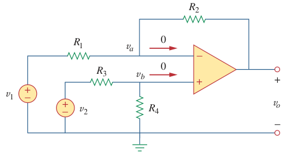

# Difference Amplifier (Op Amp)

> A ***difference amplifier*** is an [op amp](bd63e87b.md) circuit that amplifies the difference between two inputs but rejects any signals common to the two inputs.

> Applying KCL at node $a$ gives
>
> $\displaystyle \frac{v_1 - v_a}{R_1} = \frac{v_a - v_o}{R_2}$
>
> $\displaystyle v_o = \left(\frac{R_2}{R_1} + 1\right) v_a - \frac{R_2}{R_1} v_1$
>
> Applying KCL at node $b$ gives
>
> $\displaystyle \frac{v_b}{R_4} = \frac{v_2 - v_b}{R_3}$
>
> $\displaystyle v_b = \frac{R_4}{R_3 + R_4} v_2$
>
> But $v_a = v_b$ for an [ideal op amp](fc89a5a0.md). Hence,
>
> $\displaystyle v_o = \left(\frac{R_2}{R_1} + 1\right) \left(\frac{R_4}{R_3 + R_4}v_2\right) - \frac{R_2}{R_1} v_1$
>
> $\boxed{v_o = \frac{R_2 \left(1 + R_1 / R_2\right)}{R_1 \left(1 + R_3 / R_4\right)} v_2 - \frac{R_2}{R_1} v_1}$

If $R_1 = R_2$ and $R_3 = R_4$, the difference amplifier becomes a ***subtractor amplifier***.

> $\displaystyle v_o = v_2 - v_1$
