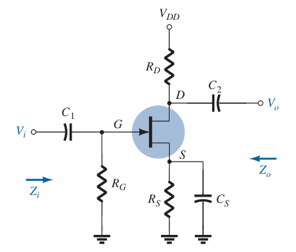
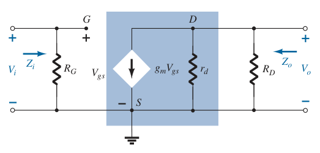
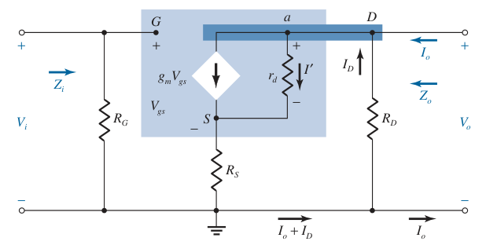

# JFET Self-Bias Configuration (AC Analysis)

Determine $g_m$ and $r_d$ from the specification sheets.

> $\boxed{g_m = g_{fs} = y_{fs}}$
>
> $\boxed{r_d = \frac{1}{g_{os}} = \frac{1}{y_{os}}}$

If $g_{fs}$ or $y_{fs}$ is not available, determine $g_m$ using the values of $V_{GS}$ and $I_D$ from the [DC biasing arrangement](d356b0a5.md).

> $\boxed{g_m = \frac{2I_{DSS}}{\left|V_P\right|}\left(1 - \frac{V_{GS}}{V_P}\right) = \frac{2I_{DSS}}{\left|V_P\right|} \sqrt{\frac{I_D}{I_{DSS}}}}$

Once the levels of $g_m$ and $r_d$ are determined, the AC equivalent model can be substituted between the appropriate terminals. Set all capacitors and DC sources to short-circuit equivalent.

## Bypassed $R_S$

The resulting configuration is same as appearing in JFET [fixed-bias configuration](a3c8ef03.md), the resulting equations for $Z_i$, $Z_o$, and $A_v$ will be the same.

## Unbypassed $R_S$

Input impedance $Z_i$

> $\boxed{Z_i = R_G}$

Output impedance $Z_o$ (set $V_i = 0\,V$)

> $\displaystyle V_o = -I_D R_D$
>
> $\displaystyle V_{gs} = -\left(I_D + I_o\right) R_S$
>
> $\displaystyle V_S = -V_{gs}$
>
> $\displaystyle I_D = -\frac{V_o}{R_D}$
>
> $\displaystyle I^\prime = \frac{V_o - V_S}{r_d} = \frac{-I_D R_D + V_{gs}}{r_d}$
>
> $\displaystyle I^\prime = \frac{-I_D R_D -\left(I_D + I_o\right) R_S}{r_d} = -\frac{I_D\left(R_D + R_S\right)}{r_d} - \frac{I_o R_S}{r_d}$
>
> Apply Kirchoff's current law (KCL)
>
> $\displaystyle I_D + I_o = g_m V_{gs} + I^\prime$
>
> $\displaystyle I_D + I_o = -g_m \left(I_D + I_o\right) R_S - \frac{I_D\left(R_D + R_S\right)}{r_d} - \frac{I_o R_S}{r_d}$
>
> $\displaystyle I_D + I_o = - g_m R_S I_D - g_m R_S I_o - \frac{I_D\left(R_D + R_S\right)}{r_d} - \frac{I_o R_S}{r_d}$
>
> $\displaystyle I_D + g_m R_S I_D + \frac{I_D\left(R_D + R_S\right)}{r_d} = - I_o - g_m R_S I_o - \frac{I_o R_S}{r_d}$
>
> $\displaystyle I_D\left(1 + g_m R_S + \frac{R_D + R_S}{r_d}\right) = -I_o\left(1 + g_m R_S + \frac{R_S}{r_d}\right)$
>
> $\displaystyle -\frac{V_o}{R_D}\left(1 + g_m R_S + \frac{R_D + R_S}{r_d}\right) = -I_o\left(1 + g_m R_S + \frac{R_S}{r_d}\right)$
>
> $\displaystyle \boxed{Z_o = \frac{V_o}{I_o} = \frac{\displaystyle R_D\left(1 + g_m R_S + \frac{R_S}{r_d}\right)}{\displaystyle 1 + g_m R_S + \frac{R_D + R_S}{r_d}}}$
>
> For $r_d \geq 10R_D$
>
> $\boxed{Z_o \simeq R_D}$

Voltage gain $A_v$

> $\displaystyle V_o = -I_D R_D$
>
> $\displaystyle I_D = -\frac{V_o}{R_D}$
>
> $\displaystyle V_{R_S} = I_D R_S$
>
> Apply Kirchoff's voltage law (KVL) to the input circuit
>
> $\displaystyle -V_i + V_{gs} + V_{R_S} = 0$
>
> $\displaystyle V_{gs} = V_i - I_D R_S$
>
> Find the current in $r_d$
>
> $\displaystyle I^\prime = \frac{V_o - V_{R_S}}{r_d} = \frac{-I_D R_D - I_D R_S}{r_d} = -\frac{I_D\left(R_D + R_S\right)}{r_d}$
>
> Apply Kirchoff's current law (KCL) to the output circuit
>
> $\displaystyle I_D = g_m V_{gs} + I^\prime$
>
> $\displaystyle I_D = g_m\left(V_i - I_D R_S\right) - \frac{I_D\left(R_D + R_S\right)}{r_d}$
>
> $\displaystyle I_D = g_m V_i - g_m I_D R_S - \frac{I_D\left(R_D + R_S\right)}{r_d}$
>
> $\displaystyle I_D + g_m I_D R_S + \frac{I_D\left(R_D + R_S\right)}{r_d} = g_m V_i$
>
> $\displaystyle I_D\left(1 + g_m R_S + \frac{R_D + R_S}{r_d}\right) = g_m V_i$
>
> $\displaystyle -\frac{V_o}{R_D}\left(1 + g_m R_S + \frac{R_D + R_S}{r_d}\right) = g_m V_i$
>
> $\boxed{A_v = \frac{V_o}{V_i} = -\frac{g_m R_D}{\displaystyle 1 + g_m R_S + \frac{R_D + R_S}{r_d}}}$
>
> For $r_d \geq 10\left(R_D + R_S\right)$
>
> $\boxed{A_v = \frac{V_o}{V_i} = -\frac{g_m R_D}{\displaystyle 1 + g_m R_S}}$

The negative sign in the resulting equation for $A_v$ clearly reveals a *phase shift* of $180^\circ$ between input and output voltages.
