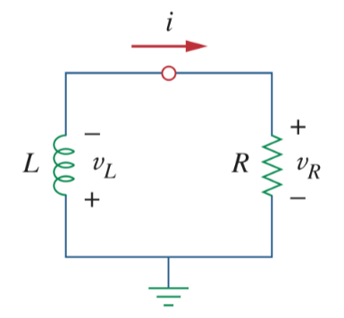

# Source-Free RL Circuit

To find the [natural response](ea5e865c.md) of an *[RL](2abe1de7.md)* circuit, the following is required:

- The initial inductor current $i(0)$.

  > Since the [inductor](8be49ac8.md) current cannot change instantaneously,
  >
  > $\boxed{i\left(0^-\right) = i\left(0^+\right) = i\left(0\right) = I_0}$
  >
  > where $i\left(0^-\right)$ is the current through the inductor just before switching and $i\left(0^+\right)$ is its current immediately after switching.

- The time constant $\tau$.

  > The [time constant](ea5e865c.md) $\tau$ for an *RL* circuit is
  >
  > $\boxed{\tau = \frac{L}{R}}$
  >
  > where $R$ is the [thevenin](b153529a.md) resistance at the inductor terminals and $L$ is the equivalent [inductance](8be49ac8.md).

A source-free *[RL](2abe1de7.md)* circuit occurs when its DC source is suddenly disconnected. The energy already stored in the [inductor](8be49ac8.md) is released to the [resistors](427b2567.md).

> Assume $i\left(t\right)$ is the current through the [inductor](8be49ac8.md). At $t = 0$, the inductor has an initial current $I_0$
>
> $\boxed{i\left(0\right) = I_0}$
>
> with the corresponding energy stored in the inductor as
>
> $\boxed{w\left(0\right) = \frac{1}{2} LI_{0}^2}$
>
> Applying [KVL](2a23acfb.md) around the loop
>
> $\displaystyle v_L + v_R = 0$
>
> $\displaystyle L\frac{di}{dt} + Ri = 0$
>
> $\displaystyle \frac{di}{dt} + \frac{R}{L}i = 0$
>
> $\displaystyle \frac{di}{i} = -\frac{R}{L}dt$
>
> Integrating gives
>
> $\displaystyle \int_{I_0}^{i\left(t\right)}\frac{di}{i} = -\int_{0}^{t}\frac{R}{L}dt$
>
> $\displaystyle \left.\ln{\left(i\right)}\right|_{I_0}^{i\left(t\right)} = -\left.\frac{Rt}{L}\right|_{0}^{t}$
>
> $\displaystyle \ln{\left[i\left(t\right)\right]} - \ln{I_0} = -\frac{Rt}{L}$
>
> $\displaystyle \ln{\displaystyle \frac{i\left(t\right)}{I_0}} = -\frac{Rt}{L}$
>
> $\displaystyle \frac{i\left(t\right)}{I_0} = e^{\displaystyle -\frac{Rt}{L}}$
>
> $\boxed{i\left(t\right) = I_0\,e^{\displaystyle -\frac{Rt}{L}} = I_0\,e^{\displaystyle -\frac{t}{\tau}}}$
>
> where [time constant](ea5e865c.md) $\displaystyle \tau = \frac{L}{R}$

This shows that the [natural response](ea5e865c.md) of the *RL* circuit is an exponential decay of the initial current $I_0$.

The [energy](7e3e2f1f.md) that was initially stored in the [inductor](8be49ac8.md) is eventually dissipated in the [resistor](427b2567.md).

> The power dissipated in the resistor is
>
> $\displaystyle v_R \left(t\right) = iR = I_{0}R e^{\displaystyle -t/\tau}$
>
> $\boxed{p\left(t\right) = v_{R}i = I_{0}^{2}R e^{\displaystyle -2t/\tau}}$
>
> The energy absorbed by the resistor up to time $t$ is
>
> $\displaystyle w_{R}\left(t\right) = \int_{0}^{t} p\left(\lambda\right)\,d\lambda = \int_{0}^{t} I_{0}^{2}R e^{\displaystyle -2\lambda/\tau}\,d\lambda$
>
> $\displaystyle w_{R}\left(t\right) = -\left.\frac{\tau}{2} I_{0}^{2}R e^{\displaystyle -2\lambda/\tau}\right|_{0}^{t},\quad \tau = \frac{L}{R}$
>
> $\boxed{w_{R}\left(t\right) = \frac{1}{2} LI_{0}^{2} \left(1 - e^{\displaystyle -2t/\tau}\right)}$
>
> where [time constant](ea5e865c.md) $\displaystyle \tau = \frac{L}{R}$
