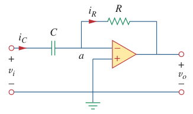

# Differentiator (Op Amp)

> A ***differentiator*** is an [op amp](bd63e87b.md) circuit whose output is proportional to the rate of change (or derivative) of the input signal.

If the input resistor in the [inverting amplifier](d6dfa54d.md) is replaced by a [capacitor](48507115.md), the resulting circuit is a differentiator.

> At node $a$, $i_C = i_R$ for an [ideal op amp](fc89a5a0.md). Hence,
>
> $\displaystyle i_C = i_R = C\,\frac{dv_i}{dt} = -\frac{v_o}{R}$
>
> $\boxed{v_o = -RC\,\frac{dv_i}{dt}}$

Solving for the output voltage $v_o$ using the [impedance](45a5fbef.md) $\mathbf{Z}_C$ of the capacitor $C$.

> $\displaystyle \mathbf{Z}_C = \frac{1}{j\omega C}$
>
> In [s-domain](b2aaf243.md), $\displaystyle s = j\omega \to \mathbf{Z}_C = 1 / sC$
>
> $\displaystyle i_C\left(s\right) = i_R\left(s\right) = \frac{v_i\left(s\right)}{\mathbf{Z}_C} = -\frac{v_o\left(s\right)}{R} = \frac{v_i\left(s\right)}{1 / sC} = sC\,v_i\left(s\right)$
>
> $\displaystyle sC\,v_i\left(s\right) = -\frac{v_o\left(s\right)}{R}$
>
> $\displaystyle v_o\left(s\right) = -RC\cdot s\,v_i\left(s\right)$
>
> Find the [inverse Laplace transform](c9a77663.md) to obtain the time domain function.
>
> $\boxed{v_o\left(t\right) = -RC\,\frac{dv_i\left(t\right)}{dt}}$

Differentiator circuits are electronically unstable because any electrical noise within the circuit is exaggerated by the differentiator. For this reason, the differentiator circuit is not as useful and popular as the [integrator](99d23403.md). It is seldom used in practice.
