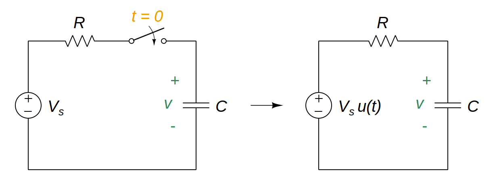

# Step Response of an RC Circuit

To find the [step response](aef193dd.md) of an *[RC](2abe1de7.md)* circuit, the following is required:

- The initial capacitor voltage $v(0)$.

  > Since the [capacitor](48507115.md) voltage cannot change instantaneously,
  >
  > $\boxed{v\left(0^-\right) = v\left(0^+\right) = v\left(0\right) = V_0}$
  >
  > where $v\left(0^-\right)$ is the voltage across the capacitor just before switching and $v\left(0^+\right)$ is its voltage immediately after switching.

- The final (steady state) capacitor voltage $v(\infty)$.

  > Use the fact that the [capacitor](48507115.md) acts like an open circuit to DC at steady state.

- The time constant $\tau$.

  > The [time constant](ea5e865c.md) $\tau$ for an *RC* circuit is
  >
  > $\boxed{\tau = RC}$
  >
  > where $R$ is the [thevenin](b153529a.md) resistance at the capacitor terminals and $C$ is the equivalent [capacitance](48507115.md).

When the DC source of an *[RC](2abe1de7.md)* circuit is suddenly applied, the voltage or current source can be modeled as a [step function](58fcc503.md), and the response is known as a *[step response](aef193dd.md)*.

> Applying [KCL](f7ac01a2.md)
>
> $\displaystyle C\frac{dv}{dt} + \frac{v - V_s\,u\left(t\right)}{R} = 0$
>
> $\displaystyle \frac{dv}{dt} + \frac{v - V_s\,u\left(t\right)}{RC} = 0$
>
> $\displaystyle \frac{dv}{dt} + \frac{v}{RC} = \frac{V_s}{RC} u\left(t\right)$
>
> For $t > 0$
>
> $\displaystyle \frac{dv}{dt} + \frac{v}{RC} = \frac{V_s}{RC}$
>
> $\displaystyle \frac{dv}{dt} = -\frac{v - V_s}{RC}$
>
> $\displaystyle \frac{dv}{v - V_s} = -\frac{dt}{RC}$
>
> Integrating both sides and introducing the initial conditions,
>
> $\displaystyle \int_{V_0}^{v\left(t\right)}\frac{dv}{v - V_s} = -\int_{0}^{t}\frac{dt}{RC}$
>
> $\displaystyle \left.\ln{\left(v - V_s\right)}\right|_{V_0}^{v\left(t\right)} = -\left.\frac{t}{RC}\right|_{0}^{t}$
>
> $\displaystyle \ln{\left[v\left(t\right) - V_s\right]} - \ln{\left(V_0 - V_s\right)} = -\frac{t}{RC}$
>
> $\displaystyle \ln{\frac{v - V_s}{V_0 - V_s}} = -\frac{t}{RC}$
>
> $\displaystyle \frac{v - V_s}{V_0 - V_s} = e^{\displaystyle -\frac{t}{RC}}$
>
> $\displaystyle v = V_s + \left(V_0 - V_s\right)\,e^{\displaystyle -\frac{t}{RC}}$
>
> $\boxed{v\left(t\right) = V_s + \left(V_0 - V_s\right)\,e^{\displaystyle -t/\tau}, \quad t > 0}$
>
> Thus,
>
> $\boxed{v\left(t\right) = \begin{cases}V_0\,, & t < 0 \\ V_s + \left(V_0 - V_s\right)\,e^{\displaystyle -t/\tau}\,, & t > 0\end{cases}}$
>
> where [time constant](ea5e865c.md) $\tau = RC$
>
> This is known as the *[complete response](3dd672e8.md)* of the *RC* circuit to a sudden application of a DC source.

The *complete response* may be written as

> $\boxed{v\left(t\right) = v\left(\infty\right) + \left[v\left(0\right) - v\left(\infty\right)\right]\,e^{\displaystyle -t/\tau}, \quad t > 0}$
>
> where time constant $\tau = RC$, $v\left(0\right)$ is the initial voltage at $t = 0^+$ and $v\left(\infty\right)$ is the final or steady-state value.
>
> This equation can be used in *[source-free RC circuit](3a7f354b.md)*.

If the switch changes position at time $t = t_0$ instead of at $t = 0$, there is a time delay in the response.

> $\boxed{v\left(t\right) = v\left(\infty\right) + \left[v\left(t_0\right) - v\left(\infty\right)\right]\,e^{\displaystyle -\left(t - t_0\right)/\tau}, \quad t > t_0}$
>
> where time constant $\tau = RC$ and $v\left(t_0\right)$ is the initial value at $t = t_{0}^{+}$.
>
> This equation can be used in *[source-free RC circuit](3a7f354b.md)*.
