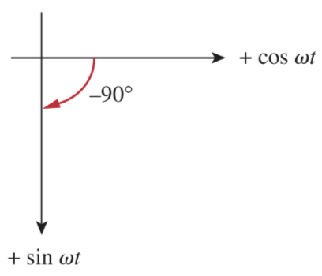

# Sinusoids

> A ***sinusoid*** is a signal that has the form of the sine or cosine function.

A sinusoidal current is usually referred to as *alternating current* (ac). Such a current reverses at regular time intervals and has alternately positive and negative values. Circuits driven by sinusoidal current or voltage sources are called *ac circuits*.

Reasons:

1. Nature itself is characteristically sinusoidal.
2. Sinusoidal signal is easy to generate and transmit.
3. Through *fourier analysis*, any practical periodic signal can be represented by a sum of sinusoids.
4. A sinusoid is easy to handle mathematically. The derivative and integral of a sinusoid are themselves sinusoids.

A [periodic function](09fc41c7.md) is one that satisfies $f\left(t\right) = f\left(t + nT\right)$, for all $t$ and for all integers $n$.

> $\boxed{f\left(t\right) = f\left(t + nT\right)}$

The ***period*** $T$ of the periodic function is the time of one complete cycle or the number of seconds per cycle.

> $\boxed{T = \frac{2\pi}{\omega}}$
>
> where $\omega$ is the *angular frequency*, measured in radians per second.

The reciprocal of the *period* $T$ is the number of cycles per second, known as the ***cyclic frequency*** $f$ of the sinusoid, measured in *hertz* (Hz).

> $\boxed{f = \frac{1}{T}}$

The ***angular frequency*** $w$ from the equations of *period* $T$ and *cyclic frequency* $f$, measured in radians per second.

> $\displaystyle T = \frac{2\pi}{\omega}$
>
> $\displaystyle \frac{1}{f} = \frac{2\pi}{\omega}$
>
> $\boxed{\omega = 2\pi f}$

General expression for the sinusoid.

> $\boxed{v\left(t\right) = V_m \sin{\left(\omega t + \phi\right)}}$
>
> where:
>
> * $V_m$ is the *amplitude* of the sinusoid.
> * $\omega$ is the *angular frequency*, measured in radians per second.
> * $\phi$ is the *phase*.

Using the two sinusoids $v_1\left(t\right) = V_m \sin\left(\omega t\right)$ and $v_2\left(t\right) = V_m \sin\left(\omega t + \phi\right)$.

If $\phi \ne 0$, then $v_1$ and $v_2$ are *out of phase*. If $\phi = 0$, then $v_1$ and $v_2$ are said to be *in phase*.

A sinusoid can be expressed in either sine or cosine form. When comparing two sinusoids, it is expedient to express both as either sine or cosine with with positive amplitudes. Using the trigonometric identities:

> $\sin\left(A \pm B\right) = \sin\left(A\right)\cos\left(B\right) \pm \cos\left(A\right)\sin\left(B\right)$
>
> $\cos\left(A \pm B\right) = \cos\left(A\right)\cos\left(B\right) \mp \sin\left(A\right)\sin\left(B\right)$
>
> With these identities
>
> $\boxed{\sin\left(\omega t \pm 180^{\circ}\right) = -\sin\left(\omega t\right)}$
>
> $\boxed{\cos\left(\omega t \pm 180^{\circ}\right) = -\cos\left(\omega t\right)}$
>
> $\boxed{\sin\left(\omega t \pm 90^{\circ}\right) = \pm\cos\left(\omega t\right)}$
>
> $\boxed{\cos\left(\omega t \pm 90^{\circ}\right) = \mp\sin\left(\omega t\right)}$
>
> Use these relationships to transform a sinusoid from sine form to cosine form or vice versa.

A graphical approach may be used to relate or compare sinusoids as an alternative to using trigonometric identities. The horizontal axis represents the magnitude of cosine, while the vertical axis (pointing down) denotes the magnitude of sine. Angles are measured positively counter-clockwise.

The graphical technique can also be used to add two sinusoids of the same frequency when one is in sine form and the other is in cosine form.

> $\boxed{A\cos\left(\omega t\right) + B\sin\left(\omega t\right) = C\cos\left(\omega t - \theta\right)}$
>
> where:
>
> $\displaystyle C = \sqrt{A^2 + B^2}$
>
> $\displaystyle \theta = \tan^{-1}\left(\frac{B}{A}\right)$
