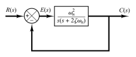
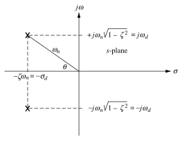

# Second-Order Systems

This form of the [control system](5ab15bd7.md) is called the ***standard form*** of second-order system.

The closed-loop [transfer function](6f158a97.md) $C(s)/R(s)$ of the second-order system,

> $\displaystyle G(s) = \frac{\omega_{n}^2}{s\left(s + 2\zeta\omega_{n}\right)}$
>
> Since the system is an [unity feedback system](5ab15bd7.md),
>
> $\displaystyle \mathrm{CLTF} = \frac{C(s)}{R(s)} = \frac{G(s)}{1 + G(s)} = \frac{\mathrm{num}\left[G(s)\right]}{\mathrm{den}\left[G(s)\right] + \mathrm{num}\left[G(s)\right]}$
>
> $\displaystyle \mathrm{CLTF} = \frac{\omega_{n}^2}{s\left(s + 2\zeta\omega_{n}\right) + \omega_{n}^2}$

> Then, the ***general second-order transfer function*** is
>
> $\boxed{\displaystyle \mathrm{CLTF} = \frac{C(s)}{R(s)} = \frac{\omega_{n}^2}{s^2 + 2\zeta\omega_{n}s + \omega_{n}^2}}$
>
> where $\zeta$ is the [damping ratio](a61ce3dd.md); and $\omega_{n}$ is the ***undamped natural frequency***, expressed in radians per second (rad/s).

> For the ***damping attenutation*** $(\alpha = \sigma_{d})$, expressed in nepers per second (Np/s):
>
> $\boxed{\displaystyle \alpha = \sigma_{d} = \zeta\omega_{n}}$

> For the ***damped natural frequency*** $(\omega_{d})$, expressed in radians per second (rad/s):
>
> $\boxed{\displaystyle \omega_{d} = \omega_{n}\sqrt{1 - \zeta^2}}$

## Pole Location

Solving for the [poles](6f158a97.md) of the *general second-order transfer function*,

> $\displaystyle s^2 + 2\zeta\omega_{n}s + \omega_{n}^2 = 0$
>
> $\displaystyle s^2 + 2\zeta\omega_{n}s + (\zeta\omega_{n})^2 - (\zeta\omega_{n})^2 + \omega_{n}^2 = 0$
>
> $\displaystyle \left(s + \zeta\omega_{n}\right)^2 = (\zeta\omega_{n})^2 - \omega_{n}^2$
>
> $\displaystyle s = -\zeta\omega_{n} \pm \sqrt{(\zeta\omega_{n})^2 - \omega_{n}^2}$
>
> Then, the poles are located at
>
> $\boxed{\displaystyle s = -\zeta\omega_{n} \pm \omega_{n}\sqrt{1 - \zeta^2} = -\sigma_{d} \pm j\,\omega_{d}}$

The *natural frequency* $(\omega_{n})$ can also be found from the poles by using the pythagorean theorem,

> $\displaystyle \omega_{n}^2 = \sigma_{d}^2 + \omega_{d}^2$
>
> $\boxed{\displaystyle \omega_{n} = \sqrt{\sigma_{d}^2 + \omega_{d}^2}}$

For the value of the angle $\theta$,

> By [trigonometry](f71f21ec.md),
>
> $\displaystyle \cos(\theta) = \frac{\sigma_{d}}{\omega_{n}} = \frac{\zeta\omega_{n}}{\omega_{n}}$
>
> $\boxed{\displaystyle \theta = \cos^{-1}(\zeta)}$
>
> or
>
> $\displaystyle \cot(\theta) = \frac{\sigma_{d}}{\omega_{d}} = \frac{\zeta\omega_{n}}{\omega_{n}\sqrt{1 - \zeta^2}}$
>
> $\boxed{\displaystyle \theta = \cot^{-1}\left(\frac{\zeta}{\sqrt{1 - \zeta^2}}\right)}$

