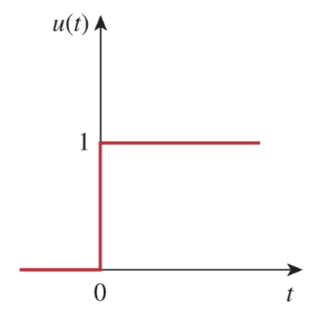

# Unit Step Function

> The ***unit step function*** $u\left(t\right)$ is 0 for negative of $t$ and 1 for positive values of $t$.
>
> $\boxed{u\left(t\right) = \begin{cases}0\,, & t < 0 \\ 1\,, & t > 0\end{cases}}$

The unit step function is undefined at $t = 0$, where it changes abruptly from 0 to 1. It is dimensionless.

If the abrupt change occurs at $t = t_0$ (where $t_0 > 0$) instead of $t = 0$, the unit step function becomes

> $\displaystyle u\left(t - t_0\right) = \begin{cases}0\,, & t < t_0 \\ 1\,, & t > t_0\end{cases}$
>
> meaning that $u\left(t\right)$ is delayed by $t_0$ seconds.

If the change is at $t = -t_0$, the unit step function becomes

> $\displaystyle u\left(t + t_0\right) = \begin{cases}0\,, & t < -t_0 \\ 1\,, & t > -t_0\end{cases}$
>
> meaning that $u\left(t\right)$ is advanced by $t_0$ seconds.

The step function is used to represent an abrupt change in voltage or current, like the changes that occur in the circuits of control systems and digital computers.
