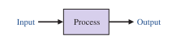
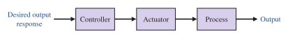
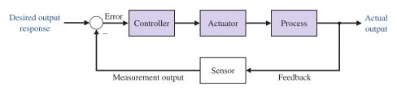
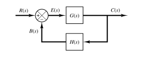
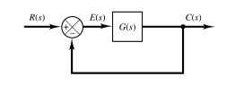

# Control Systems

A ***control system*** is an interconnection of components forming a system configuration that will provide a desired system response. The input-output relationship represents the cause-and-effect relationship of the process, which in turn represents a processing of the input signal to provide a desired output signal.

> An ***open-loop control system*** utilizes an actuating device to control the process directly without using feedback.

> A ***closed-loop control system*** uses a measurement of the output and feedback of this signal to compare it with the desired output (reference or command).

The system shown is a **negative feedback** control system, because the output is subtracted from the input and the difference is used as the input signal to the controller.

> The feedback of the system is called ***negative feedback*** if the sign at the [summing junction](e7a38585.md) is negative and ***positive feedback*** if the sign is positive.

A closed-loop control has many advantages over open-loop control, including the ability to reject external **disturbances** and improve **measurement noise** attenuation. External disturbances and measurement noise are inevitable in real-world applications and must be addressed in practical control system designs.

## Standard Feedback Control System

The [block diagram](e7a38585.md) of a closed-loop control system. The role of the feedback element whose [transfer function](6f158a97.md) is $H(s)$ is to modify the output $C(s)$ before it is compared with the input $R(s)$. In most cases, the feedback element is a sensor that measures the output of the plant (process) $G(s)$. The output $C(s)$ of the sensor is compared with the system input $R(s)$, and the actuating error signal $E(s)$ is generated.

> By analyzing the [block diagram](e7a38585.md), the following is obtained:
>
> Feedback signal, $\displaystyle B(s) = H(s)\,C(s)$
>
> Actuating error signal, $\displaystyle E(s) = \frac{C(s)}{G(s)} = R(s) - B(s)$

The ratio of the feedback signal $B(s)$ to the actuating error signal $E(s)$ is called the ***open-loop transfer function*** (**OLTF**).

> $\boxed{\displaystyle \mathrm{OLTF} = \frac{B(s)}{E(s)} = G(s)\,H(s)}$

The ratio of the output $C(s)$ to the actuating error signal $E(s)$ is called the ***feedforward transfer function*** (**FFTF**).

> $\boxed{\displaystyle \mathrm{FFTF} = \frac{C(s)}{E(s)} = G(s)}$

The [transfer function](6f158a97.md) relating $C(s)$ to $R(s)$ is called the ***closed-loop transfer function*** (**CLTF**). It relates the closed-loop system dynamics to the dynamics of the feedforward elements and feedback elements.

> $\displaystyle E(s) = R(s) - B(s) = R(s) - H(s)\,C(s)$
>
> $\displaystyle C(s) = G(s)\,E(s) = G(s)\left[R(s) - H(s)\,C(s)\right]$
>
> $\displaystyle C(s) + G(s)\,H(s)\,C(s) = G(s)\,R(s)$
>
> Then, the ***closed-loop transfer function*** is
>
> $\boxed{\displaystyle \mathrm{CLTF} = \frac{C(s)}{R(s)} = \frac{G(s)}{1 + G(s)\,H(s)}}$

### Unity Feedback Control System

If the feedback [transfer function](6f158a97.md) $H(s)$ is unity, then the open-loop transfer function and the feedforward transfer function are the same.

> For a ***unity feedback system***, $H(s) = 1$
>
> $\boxed{\displaystyle \mathrm{OLTF} = \mathrm{FFTF} = G(s)}$
>
> $\boxed{\displaystyle \mathrm{CLTF} = \frac{C(s)}{R(s)} = \frac{G(s)}{1 + G(s)} = \frac{\mathrm{num}\left[G(s)\right]}{\mathrm{den}\left[G(s)\right] + \mathrm{num}\left[G(s)\right]}}$
>
> where $\mathrm{num}[G(s)]$ and $\mathrm{den}[G(s)]$ are numerator and denominator of a transfer function $G(s)$, respectively.

