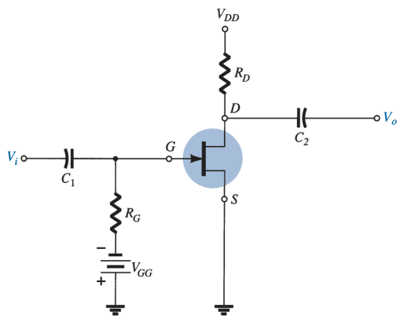
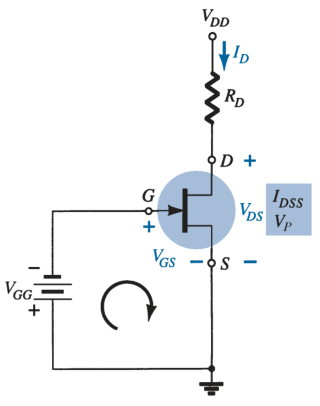

# JFET Fixed-Bias Configuration (DC Analysis)

For the DC analysis, the capacitors can be replaced by *open circuits*.

Since $I_G \simeq 0\ A$, the voltage across $R_G$ is equal to $0\ V$.

> $V_{GG} + V_{GS} = 0$
>
> $\boxed{V_G = V_{GS} = -V_{GG}}$

Drain current $I_D$ can be found using Shockley's equation:

> $\boxed{I_D = I_{DSS} \left( 1 - V_{GS} / V_P \right) ^ 2}$
>
> $-V_{DD} + I_D R_D + V_{DS} = 0$
>
> $\boxed{V_D = V_{DS} = V_{DD} - I_D R_D}$
>
> $\boxed{V_S = 0\ V}$
