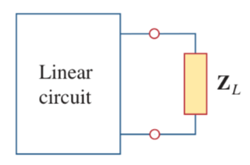
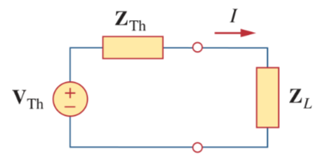

# Maximum Average Power Transfer

Consider the circuit, where an AC circuit is connected to a load $\mathbf{Z}_L$ and is represented by its Thevenin equivalent. The load is usually represented by an impedance, which may model an electric motor, an antenna, a TV, and so forth.

In rectangular form, the Thevenin impedance $\mathbf{Z}_{\textrm{Th}}$ and the load impedance $\mathbf{Z}_L$ are

> $\displaystyle \mathbf{Z}_{\textrm{Th}} = R_{\textrm{Th}} + jX_{\textrm{Th}}$
>
> $\displaystyle \mathbf{Z}_L = R_L + jX_L$

For maximum average power transfer, $\mathbf{Z}_L$ must be selected so that $X_L = -X_{\textrm{Th}}$ and $R_L = R_{\textrm{Th}}$.

> For ***maximum average power transfer***, the load impedance $\mathbf{Z}_L$ must be equal to the complex conjugate of the Thevenin impedance $\mathbf{Z}_{\textrm{Th}}$.
>
> $\boxed{\mathbf{Z}_L = R_L + jX_L = R_{\textrm{Th}} - jX_{\textrm{Th}} = \mathbf{Z}_{\textrm{Th}}^{\ast}}$

This result is known as the *maximum average power transfer theorem* for the sinusoidal steady state.

The [average power](103c4ff6.md) delivered to the load is

> $\displaystyle \mathbf{I} = \frac{\mathbf{V}_{\textrm{Th}}}{\mathbf{Z}_{\textrm{Th}} + \mathbf{Z}_L} = \frac{\mathbf{V}_{\textrm{Th}}}{(R_{\textrm{Th}} + jX_{\textrm{Th}}) + (R_L + jX_L)}$
>
> $\boxed{P = \frac{1}{2} \left|\mathbf{I}\right|^2 R_L = \frac{\left|\mathbf{V}_{\textrm{Th}}\right|^2 R_L / 2}{\left(R_{\textrm{Th}} + R_L\right)^2 + \left(X_{\textrm{Th}} + X_L\right)^2}}$

Setting $R_L = R_{\textrm{Th}}$ and $X_L = -X_{\textrm{Th}}$, gives us the ***maximum average power*** as

> $\boxed{P_{\textrm{max}} = \frac{\left|\mathbf{V}_{\textrm{Th}}\right|^2}{8 R_{\textrm{Th}}}}$

Occasionally it is not possible to adjust the reactance portion of a load. In such cases, a ***relative maximum average power*** will be delivered to the load when the load resistance has a value determined as

> $\boxed{R_L = \sqrt{R_{\textrm{Th}}^2 + \left(X_{\textrm{Th}} + X_L\right)^2}}$
