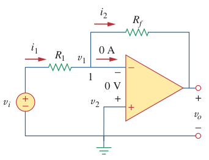

# Negative Feedback (Op Amp)

A ***negative feedback*** is achieved when the output is fed back to the inverting terminal of the [op amp](bd63e87b.md), the ratio of the output voltage to the input voltage is called the ***closed-loop gain***. As a result of the negative feedback, it can be shown that the closed-loop gain is almost insensitive to the *[open-loop gain](7180590d.md)* $A$ of the op amp. For this reason, op amps are used in circuits with feedback paths.

