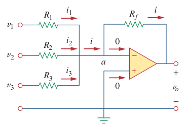

# Summing Amplifier (Op Amp)

> A ***summing amplifier*** is an [op amp](bd63e87b.md) circuit that combines several inputs and produces an output that is the weighted sum of the inputs.

The summing amplifier is a variation of the [inverting amplifier](d6dfa54d.md).

> Applying KCL at node $a$ gives
>
> $\displaystyle i = i_1 + i_2 + i_3 = \frac{v_1 - v_a}{R_1} + \frac{v_2 - v_a}{R_2} + \frac{v_3 - v_a}{R_3}$
>
> $\displaystyle i = \frac{v_a - v_o}{R_f}$
>
> $\displaystyle \frac{v_a - v_o}{R_f} = \frac{v_1 - v_a}{R_1} + \frac{v_2 - v_a}{R_2} + \frac{v_3 - v_a}{R_3}$
>
> But $v_a = 0$ for an [ideal op amp](fc89a5a0.md), since the non-inverting terminal is grounded. Hence,
>
> $\displaystyle \frac{- v_o}{R_f} = \frac{v_1}{R_1} + \frac{v_2}{R_2} + \frac{v_3}{R_3}$
>
> $\boxed{v_o = -\left(\frac{R_f}{R_1}v_1 + \frac{R_f}{R_2}v_2 + \frac{R_f}{R_3}v_3\right)}$
