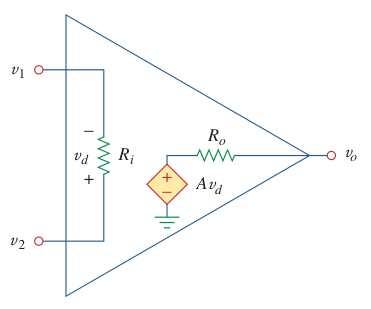

# Non-Ideal Op Amp

Equivalent circuit of ***non-ideal [Op Amp](bd63e87b.md)***.

> $\displaystyle v_{d} = v_{2} - v_{1}$
>
> $\boxed{v_{o} = Av_{d} = A(v_{2} - v_{1})}$
>
> where:
>
> - $A$ is called the ***open-loop voltage gain*** because it is the gain of the op amp without any external feedback from output to input.
> - $V_{d}$ is the differential input voltage.
> - $R_{i}$ is the input resistance.
> - $R_{o}$ is the output resistance.
>
> The [op amp](bd63e87b.md) senses the difference between the two inputs, multiplies it by the gain $A$, and causes the resulting voltage to appear at the output $v_{o}$.

| Parameter | Typical range | [Ideal values](fc89a5a0.md) |
| :- | :-: | :-: |
| Open-loop gain, $A$ | $10^{5}$ to $10^{8}$ | $\infty$ |
| Input resistance, $R_{i}$ | $10^{5}$ to $10^{13}\,\Omega$ | $\infty\,\Omega$ |
| Output resistance, $R_{o}$ | $10$ to $100\,\Omega$ | $0\,\Omega$ |
| Supply voltage, $V_{CC}$ | $5$ to $24\,V$ | |
