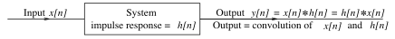

# Discrete Convolution

[Discrete-time](03141daf.md) [convolution](a8e13dd6.md) is a method of finding the zero-state response of relaxed [linear time-invariant](72022de7.md) (LTI) systems. It is based on the concepts of linearity and time invariance and assumes that the system information is known in terms of its impulse response $h[n]$.

> The superposition principle allows expressing the response to input signal $x[n]$ as the sum of scaled and shifted versions of the impulse response $h[n]$. This relation defines the convolution operation, specifically referred to as ***linear convolution***. The mathematical expression used to compute the response $y[n]$ is known as the ***convolution sum***.
>
> $\boxed{y[n] = x[n] \ast h[n] = \sum_{k = -\infty}^{\infty} x[k]\,h[n - k]}$
>
> $\boxed{y[n] = h[n] \ast x[n] = \sum_{k = -\infty}^{\infty} h[k]\,x[n - k]}$
>
> As with [continuous-time convolution](a8e13dd6.md), the order in which the operation is performed does not matter, the arguments $x[n]$ and $h[n]$ can be interchanged without altering the result.

When evaluating the convolution sum, keep in mind that $x[k]$ and $h[n - k]$ are functions of the summation variable $k$. The summations frequently involve [step functions](b7942234.md) of the form $x[n] = u[n - \alpha] \to x[k] = u[k - \alpha]$ and $h[n] = u[n - \beta] \to h[n - k] = u[n - k - \beta]$. Since $u[k - \alpha] = 0$ for $k < \alpha$ and $u[n - k - \beta] = 0$ for $k > n - \beta$, these can be used to simplify the lower and upper summation limits to $k = \alpha$ and $k = n - \beta$, respectively.

## Discrete Convolution Properties

### Commutative

In [linear time-invariant](786783af.md) (LTI) systems, the input $x[n]$ and impulse response $h[n]$ can be interchanged mathematically due to the commutative property of discrete convolution.

> $\boxed{y[n] = x[n] \ast h[n] = h[n] \ast x[n]}$

### Associative

This property states that the order of discrete convolution operations can be rearranged without affecting the result.

> $\boxed{y[n] = x_{1}[n] \ast \left(x_{2}[n] \ast x_{3}[n]\right) = \left(x_{1}[n] \ast x_{2}[n]\right) \ast x_{3}[n]}$

### Distributive

Discrete convolution is a linear operation and obeys superposition.

> $\boxed{y[n] = \left(x_{1}[n] + x_{2}[n]\right) \ast h[n] = x_{1}[n] \ast h[n] + x_{2}[n] \ast h[n]}$
>
> For constant $c$,
>
> $\boxed{c \cdot y[n] = c\left(x[n] \ast h[n]\right) = \left(c \cdot x[n]\right) \ast h[n] = x[n] \ast \left(c \cdot h[n]\right)}$

### Multiplicative Identity

The discrete convolution of any signal $x[n]$ with an [impulse](b7942234.md) $\delta[n]$ reproduces the signal $x(t)$.

> $\boxed{y[n] = x[n] \ast \delta[n] = \delta[n] \ast x[n] = x[n]}$

### Time Shifting

Discrete convolution is a time-invariant operation and implies that shifting the input $x[n]$ or the impulse response $h[n]$ by $\alpha$ shifts the output response $y[n]$ by $\alpha$.

> If $\displaystyle y[n] = x[n] \ast h[n]$, then
>
> $\boxed{x[n - \alpha] \ast h[n] = x[n] \ast h[n - \alpha] = y[n - \alpha]}$
>
> If both $x[n]$ and $h[n]$ are shifted,
>
> $\boxed{x[n - \alpha] \ast h[n - \beta] = y[n - \alpha - \beta]}$

### Summation

The sum of the samples in $x[n]$, $h[n]$, and $y[n]$ are related by

> $\boxed{\sum_{n = -\infty}^{\infty}y[n] = \sum_{n = -\infty}^{\infty}x[n] \ast h[n] = \left(\sum_{n = -\infty}^{\infty}x[n]\right) \left(\sum_{n = -\infty}^{\infty}h[n]\right)}$

The discrete convolution of a signal $x[n]$ with an [unit step](b7942234.md) $u[n]$ is the *running sum* of the signal $x[n]$.

> $\boxed{y[n] = x[n] \ast u[n] = \sum_{k = -\infty}^{n} x[k]}$

### Conjugation

The complex conjugate of a discrete convolution involves taking the complex conjugate of each function before performing the convolution.

> $\boxed{\overline{y[n]} = \overline{x[n] \ast h[n]} = \overline{x[n]} \ast \overline{h[n]}}$

## Some Useful Discrete Convolution Results

> $\displaystyle u[n] \ast u[n] = \sum_{k = -\infty}^{\infty} u[k]\,u[n - k] = \sum_{k = 0}^{n} 1$
>
> $\boxed{u[n] \ast u[n] = (n + 1)\,u[n] = r[n + 1]}$

> $\displaystyle \alpha^{n} u[n] \ast \alpha^{n} u[n] = \sum_{k = -\infty}^{\infty} \alpha^{k} \alpha^{n - k} u[k]\,u[n - k] = \alpha^{n}\sum_{k = 0}^{n} 1$
>
> $\boxed{\alpha^{n} u[n] \ast \alpha^{n} u[n] = (n + 1)\,\alpha^{n} u[n] = \alpha^{n} r[n + 1]}$

> $\displaystyle \alpha^{n} u[n] \ast u[n] = \sum_{k = -\infty}^{\infty} \alpha^{k} u[k]\,u[n - k] = \sum_{k = 0}^{n} \alpha^{k}$
>
> $\boxed{\alpha^{n} u[n] \ast u[n] = u[n] \ast \alpha^{n} u[n] = \frac{1 - \alpha^{n + 1}}{1 - \alpha} u[n]}$

## Discrete Convolution of Finite-Length Sequences

The convolution of two finite-length sequences $x[n]$ and $h[n]$ is also of finite length and is subject to the following rules:

- The starting index of $y[n]$ equals the sum of the starting indices of $x[n]$ and $h[n]$.
- The ending index of $y[n]$ equals the sum of the ending indices of $x[n]$ and $h[n]$.
- The length $L_y$ of $y[n]$ is related to the lengths $L_x$ and $L_h$ of $x[n]$ and $h[n]$ by $L_y = L_x + L_h - 1$.

  > $\boxed{\mathrm{length}(y[n]) = \mathrm{length}(x[n] \ast h[n]) = \mathrm{length}(x[n]) + \mathrm{length}(h[n]) - 1}$

### Sum-by-Column Method

This method is based on the idea that the convolution $y[n]$ equals the sum of the (shifted) impulse responses due to each of the impulses that make up the input $x[n]$. To find the discrete convolution $y[n]$ of $x[n]$ and $h[n]$:

- Arrange the sequences $x[n]$ and $h[n]$ vertically below each other, aligning the starting indices.
- Create a grid or table with rows representing the sequence elements and columns representing the corresponding indices.
- For each element in $x[n]$, multiply it with the corresponding element in $h[n]$. Place each product in the column corresponding to the sum of the indices of the multiplied elements.
- Sum the products in each column. Each column corresponds to a specific shift, representing the discrete convolution $y[n]$ result at that particular shift.
- The starting index (and the marker location corresponding to index $n = 0$) for the discrete convolution $y[n]$ is found by adding the starting indices of $x[n]$ and $h[n]$.
