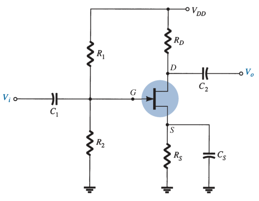
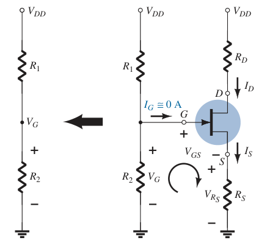

# JFET Voltage-Divider Bias Configuration (DC Analysis)

For the DC analysis, the capacitors can be replaced by *open circuits*.

Since $I_G \simeq 0\ A$ and $I_D = I_S$

> $\boxed{I_{R_1} = I_{R_2} = \frac{V_{DD}}{R_1 + R_2}}$
>
> $\boxed{V_G = \frac{V_{DD} R_2}{R_1 + R_2}}$
>
> $-V_G + V_{GS} + V_{R_S} = 0$
> $-V_G + V_{GS} + I_S R_S = 0$
> $-V_G + V_{GS} + I_D R_S = 0$
>
> $\boxed{V_{GS} = V_G - I_D R_S}$

Substituting $V_{GS}$ to Shockley's equation:

> $I_D = I_{DSS} \left( 1 - V_{GS} / V_P \right) ^ 2$
>
> $\boxed{I_D = I_{DSS} \left( 1 - \frac{V_G - I_D R_S}{V_P} \right) ^ 2}$
>
> $-V_{DD} + I_D R_D + V_{DS} + I_S R_S = 0$
> $-V_{DD} + I_D R_D + V_{DS} + I_D R_S = 0$
>
> $\boxed{V_{DS} = V_{DD} - I_D \left( R_D + R_S \right)}$
>
> $\boxed{V_D = V_{DD} - I_D R_D}$
>
> $\boxed{V_S = I_D R_S}$
