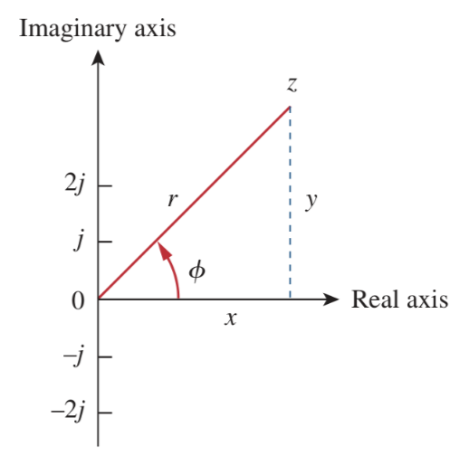
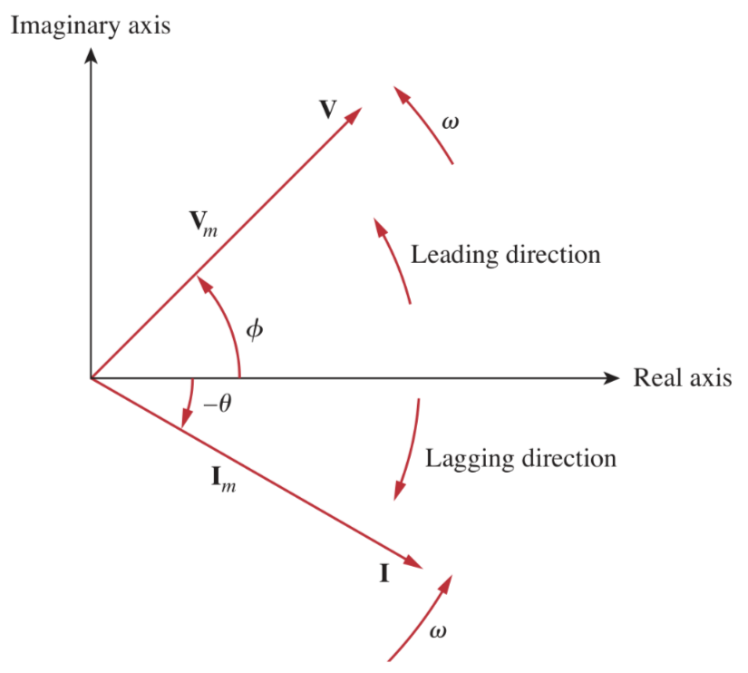

# Phasors

[Sinusoids](4ce008ed.md) are easily expressed in terms of phasors which are more convenient to work with than sine and cosine functions.

> A ***phasor*** is a complex number that represents the amplitude and phase of a sinusoid.

The complex number $z$ can be written in *rectangular form* as

> $\displaystyle z = x + jy$
>
> where $j = \sqrt{-1}$

The complex number $z$ can also be written in *polar form* as

> $\displaystyle z = r\angle{\phi} = r e^{\displaystyle\,j\phi} = r\left[\cos{(\phi)} + j\sin{(\phi)}\right]$
>
> where $j = \sqrt{-1}$

Relationship between the *rectangular form* and the *polar form*.

> $\boxed{z = x + jy = r\angle{\phi} = r e^{\displaystyle\,j\phi} = r\left[\cos{(\phi)} + j\sin{(\phi)}\right]}$
>
> where
>
> $\displaystyle r = \sqrt{x^2 + y^2}$
>
> $\displaystyle \phi = \tan^{-1}\left(\frac{y}{x}\right)$
>
> $\displaystyle x = r\cos{\left(\phi\right)}$
>
> $\displaystyle y = r\sin{\left(\phi\right)}$

Addition and subtraction of complex numbers are better performed in rectangular form; multiplication and division are better done in polar form.

> Given the complex numbers
>
> $\displaystyle z = x + jy = r\angle{\phi}$
>
> $\displaystyle z_1 = x_1 + jy_1 = r_1\angle{\phi_1}$
>
> $\displaystyle z_2 = x_2 + jy_2 = r_2\angle{\phi_2}$
>
> Basic operations:
>
> * Addition
>
>   $\boxed{z_1 + z_2 = \left(x_1 + x_2\right) + j\left(y_1 + y_2\right)}$
>
> * Subtraction
>
>   $\boxed{z_1 - z_2 = \left(x_1 - x_2\right) + j\left(y_1 - y_2\right)}$
>
> * Multiplication
>
>   $\boxed{z_1 z_2 = r_1 r_2 \angle{\left(\phi_1 + \phi_2\right)}}$
>
> * Division
>
>   $\boxed{\frac{z_1}{z_2} = \frac{r_1}{r_2} \angle{\left(\phi_1 - \phi_2\right)}}$
>
> * Reciprocal
>
>   $\boxed{\frac{1}{z} = \frac{1}{r} \angle{\left(-\phi\right)}}$
>
> * Square root
>
>   $\boxed{\sqrt{z} = \sqrt{r} \angle{\left(\frac{\phi}{2}\right)}}$
>
> * Complex conjugate
>
>   $\boxed{z^{\ast} = x - jy = r\angle{\left(-\phi\right)} = re^{\displaystyle -j\phi}}$
>
>   $\boxed{\frac{1}{j} = -j}$

The idea of phasor representation is based on [Euler's identity](f573c920.md).

> $\boxed{e^{\displaystyle \pm{j\phi}} = \cos{(\phi)} \pm j\sin{(\phi)}}$
>
> $\displaystyle \cos{(\phi)} = \textrm{Re}\left(e^{\displaystyle\,j\phi}\right)$
>
> $\displaystyle \sin{(\phi)} = \textrm{Im}\left(e^{\displaystyle\,j\phi}\right)$
>
> where Re and Im stand for the *real part of* and the *imaginary part of*.
>
> Given a sinusoid $v\left(t\right) = V_m \cos{\left(\omega t + \phi\right)}$
>
> $\displaystyle v\left(t\right) = V_m \cos{\left(\omega t + \phi\right)} = \textrm{Re}\left(V_m \left[\cos\left(\omega t + \phi\right) + j\sin\left(\omega t + \phi\right)\right]\right) = \textrm{Re}\left(V_m e^{\displaystyle\,j\left(\omega t + \phi\right)}\right)$
>
> $\displaystyle v\left(t\right) = \textrm{Re}\left(V_m e^{\displaystyle\,j\left(\omega t + \phi\right)}\right) = \textrm{Re}\left(V_m e^{\displaystyle\,j\phi} e^{\displaystyle\,j\omega t}\right)$
>
> $\boxed{v\left(t\right) = V_m \cos{\left(\omega t + \phi\right)} = \textrm{Re}\left(\displaystyle\mathbf{V}e^{\displaystyle\,j\omega t}\right)}$
>
> where $\mathbf{V}$ is the *phasor representation* of the sinusoid $v\left(t\right)$.
>
> $\boxed{\mathbf{V} = V_m\,e^{\displaystyle\,j\phi} = V_m\angle\phi}$
>
> If we use sine for the phasor instead of cosine for $v\left(t\right)$.
>
> $\displaystyle v\left(t\right) = V_m \sin{\left(\omega t + \phi\right)} = \textrm{Im}\left(V_m e^{\displaystyle\,j\left(\omega t + \phi\right)}\right) = \textrm{Im}\left(V_m e^{\displaystyle\,j\phi} e^{\displaystyle\,j\omega t}\right)$
>
> $\boxed{v\left(t\right) = V_m \sin{\left(\omega t + \phi\right)} = \textrm{Im}\left(\displaystyle\mathbf{V}e^{\displaystyle\,j\omega t}\right)}$
>
> where $\boxed{\mathbf{V} = V_m\,e^{\displaystyle\,j\phi} = V_m\angle\phi}$

A phasor may be regarded as a mathematical equivalent of a sinusoid with the time dependence dropped.

As a complex quantity, a phasor may be expressed in rectangular form, polar form, or exponential form. Since a phasor has magnitude and phase ("direction"), it behaves as a vector and is printed in boldface.

A phasor diagram showing $\mathbf{V} = V_m\angle\phi$ and $\mathbf{I} = I_m\angle\left(-\theta\right)$.

Sinusoid-phasor transformation (based on the real part of Euler's identity).

| Time domain representation | Phasor domain representation |
| :- | :- |
| $\displaystyle V_m \cos{\left(\omega t + \phi\right)}$ | $\displaystyle V_m \angle{\phi}$ |
| $\displaystyle V_m \sin{\left(\omega t + \phi\right)}$ | $\displaystyle V_m \angle{\left(\phi - 90^{\circ}\right)}$ |
| $\displaystyle I_m \cos{\left(\omega t + \theta\right)}$ | $\displaystyle I_m \angle{\theta}$ |
| $\displaystyle I_m \sin{\left(\omega t + \theta\right)}$ | $\displaystyle I_m \angle{\left(\theta - 90^{\circ}\right)}$ |

Note that the frequency (or time) factor $e^{\displaystyle\,jwt}$ is suppressed, and the frequency is not explicitly shown in the phasor domain representation because the angular frequency $\omega$ is constant. However, the response depends on angular frequency $\omega$. For this reason, the phasor domain is also known as the ***frequency domain***.

Differentiating a sinusoid is equivalent to multiplying its corresponding phasor $\mathbf{V}$ by $j\omega$.

> $\boxed{\underset{\textrm{(Time domain)}}{\frac{dv}{dt}} \Leftrightarrow \underset{\textrm{(Phasor domain)}}{j\omega\mathbf{V}}}$
>
> This allows the replacement of a derivative with respect to time with multiplication of $j\omega$ in the phasor domain.

Integrating a sinusoid is equivalent to dividing its corresponding phasor $\mathbf{V}$ by $j\omega$.

> $\boxed{\underset{\textrm{(Time domain)}}{\int v\,dt} \Leftrightarrow \underset{\textrm{(Phasor domain)}}{\frac{\mathbf{V}}{j\omega}}}$
>
> This allows the replacement of an integral with respect to time with division by $j\omega$ in the phasor domain.

Adding [sinusoids](4ce008ed.md) of the same frequency is equivalent to adding their corresponding phasors.

The differences between $v\left(t\right)$ and $\mathbf{V}$:

1. $v\left(t\right)$ is the *instantaneous or time domain representation*, while $\mathbf{V}$ is the *frequency or phasor domain representation*.
2. $v\left(t\right)$ is time dependent, while $\mathbf{V}$ is not.
3. $v\left(t\right)$ is always real with no complex term, while $\mathbf{V}$ is generally complex.

> Phasor analysis applies only when frequency is constant; it applies in manipulating two or more sinusoidal signals only if they are of the same frequency.
