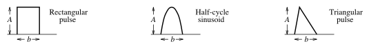

# Parseval's Theorem

The ***Parseval's theorem*** relates energy associated with a signal to its [Fourier transform](66f7fe92.md).

> If $p(t)$ is the [power](7e3e2f1f.md) associated with the signal, the energy carried by the signal is
>
> $\displaystyle W = \int_{-\infty}^{\infty}p(t)\,dt$
>
> where $\displaystyle p(t) = v^{2}(t)/R = i^{2}(t)R$
>
> In order to be able to compare the energy content of current and voltage signals, it is convenient to use a $1\:\Omega$ resistor as the base for energy calculation. For $R = 1\:\Omega$ resistor, $p(t) = i^{2}(t) = v^{2}(t) = f^{2}(t)$, where $f(t)$ stands for either voltage or current.
>
> $\boxed{W_{1\,\Omega} = \int_{-\infty}^{\infty}f^{2}(t)\,dt}$
>
> Substituting the [inverse Fourier transform](66f7fe92.md) $f(t) = \mathcal{F}^{-1}\left[F(\omega)\right]$.
>
> $\displaystyle W_{1\,\Omega} = \int_{-\infty}^{\infty}f(t)\left[\frac{1}{2\pi}\int_{-\infty}^{\infty}F(\omega)\,e^{\displaystyle\,j\omega t}\,d\omega\right]\,dt$
>
> Reversing the order of integration,
>
> $\displaystyle W_{1\,\Omega} = \frac{1}{2\pi}\int_{-\infty}^{\infty}F(\omega)\left[\int_{-\infty}^{\infty}f(t)\,e^{\displaystyle -j(-\omega)t}\,dt\right]\,d\omega$
>
> Applying the reversal property of Fourier transform,
>
> $\displaystyle W_{1\,\Omega} = \frac{1}{2\pi}\int_{-\infty}^{\infty}F(\omega)F(-\omega)\,d\omega = \frac{1}{2\pi}\int_{-\infty}^{\infty}F(\omega)F^{\ast}(\omega)\,d\omega$
>
> But if $z = x + jy$, $\displaystyle zz^{\ast} = (x + jy)(x - jy) = x^2 + y^2 = |z|^2$. Hence,
>
> $\boxed{W_{1\,\Omega} = \frac{1}{2\pi}\int_{-\infty}^{\infty}\left|F(\omega)\right|^2\,d\omega}$

Parseval's theorem provides the physical significance of $F(\omega)$, namely, that $\left|F(\omega)\right|^2$ is a measure of the *energy density* (in joules per hertz) corresponding to $f(t)$.

> ***Parseval's theorem*** states that the total energy delivered to a $1\:\Omega$ resistor equals the total area under the square of $f(t)$ or $1/2\pi$ times the total area under the square of the magnitude of the Fourier transform of $f(t)$.
>
> $\boxed{W_{1\,\Omega} = \int_{-\infty}^{\infty}f^{2}(t)\,dt = \frac{1}{2\pi}\int_{-\infty}^{\infty}\left|F(\omega)\right|^2\,d\omega}$

Since $\left|F(\omega)\right|^2$ is an even function, it might be possible to integrate from $0$ to $\infty$ and double the result.

> $\boxed{W_{1\,\Omega} = \int_{-\infty}^{\infty}f^{2}(t)\,dt = \frac{1}{2\pi}\int_{-\infty}^{\infty}\left|F(\omega)\right|^2\,d\omega = \frac{1}{\pi}\int_{0}^{\infty}\left|F(\omega)\right|^2\,d\omega}$

Parseval's theorem shows that the [energy](7e3e2f1f.md) associated with a non-periodic signal is spread over the entire frequency spectrum, whereas the energy of a [periodic signal](09fc41c7.md) is concentrated at the frequencies of its harmonic components.

Energy of some common signals.

> $\boxed{W_{1\,\Omega} = A^2 b}\quad\textrm{(rectangular pulse)}$
>
> $\boxed{W_{1\,\Omega} = \frac{A^2 b}{2}}\quad\textrm{(half-cycle sinusoid)}$
>
> $\boxed{W_{1\,\Omega} = \frac{A^2 b}{3}}\quad\textrm{(triangular pulse)}$
>
> where $A$ and $b$ are the height and width of the signal, respectively.

