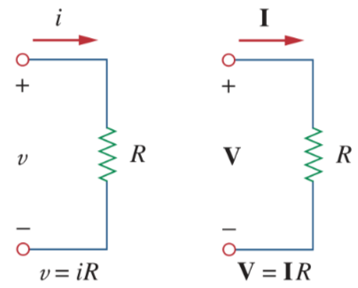
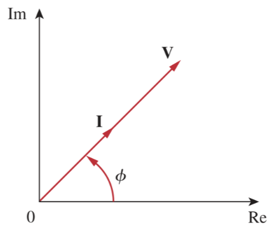
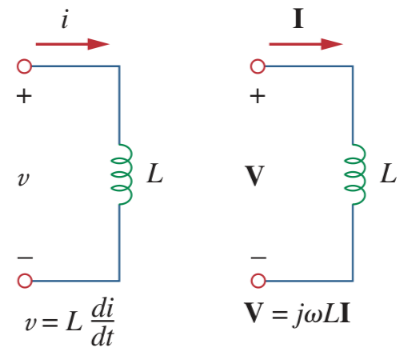
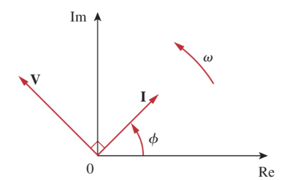
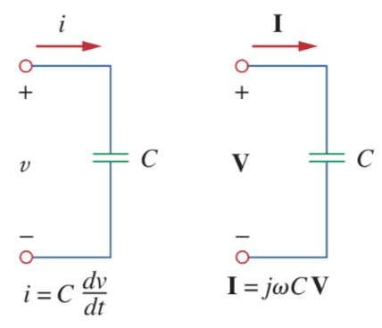
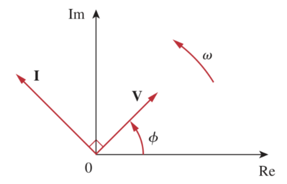

# Phasor Relationships for Circuit Elements

| Element | Time domain | Frequency domain |
| :-: | :-: | :-: |
| [Resistor](427b2567.md) $R$ | $\displaystyle v = Ri$ | $\displaystyle \mathbf{V} = R\mathbf{I}$ |
| [Inductor](8be49ac8.md) $L$ | $\displaystyle v = L\frac{di}{dt}$ | $\displaystyle \mathbf{V} = j\omega L\mathbf{I}$ |
| [Capacitor](48507115.md) $C$ | $\displaystyle i = C\frac{dv}{dt}$ | $\displaystyle \mathbf{V} = \frac{\mathbf{I}}{j\omega C}$ |

## For the resistor $R$

> $\displaystyle i = I_m \cos\left(\omega t + \phi\right)$
>
> $\displaystyle v = iR = R\,I_m \cos\left(\omega t + \phi\right)$
>
> In [phasor](82b1dcbd.md) form
>
> $\boxed{\mathbf{V} = R\,I_m\angle\phi = R\,\mathbf{I}}$
>
> where $\boxed{\mathbf{I} = I_m\angle\phi}$

The voltage and current of resistor are in phase.

## For the [inductor](8be49ac8.md) $L$

> $\displaystyle i = I_m \cos\left(\omega t + \phi\right)$
>
> $\displaystyle v = L\frac{di}{dt} = -\omega L I_m \sin\left(\omega t + \phi\right)$
>
> $\displaystyle v = \omega L I_m \cos\left(\omega t + \phi + 90^{\circ}\right)$
>
> In [phasor](82b1dcbd.md) form
>
> $\displaystyle \mathbf{V} = \omega L I_m\angle\left(\phi + 90^{\circ}\right) = \omega L I_m e^{\displaystyle\,j\left(\phi + 90^{\circ}\right)}$
>
> $\displaystyle \mathbf{V} = \omega L I_m e^{\displaystyle\,j\phi} e^{\displaystyle\,j90^{\circ}} = j\omega L I_m e^{\displaystyle\,j\phi}$
>
> $\boxed{\mathbf{V} = j\omega L I_m\angle\phi = j\omega L\mathbf{I}}$
>
> where $\boxed{\mathbf{I} = I_m\angle\phi}$

The voltage and current of [inductor](8be49ac8.md) are $90^{\circ}$ out of phase. Specifically, the current lags the voltage by $90^{\circ}$.

## For the [capacitor](48507115.md) $C$

> $\displaystyle v = V_m \cos\left(\omega t + \phi\right)$
>
> $\displaystyle i = C\frac{dv}{dt} = -\omega C V_m \sin\left(\omega t + \phi\right)$
>
> $\displaystyle i = \omega C V_m \cos\left(\omega t + \phi + 90^{\circ}\right)$
>
> In [phasor](82b1dcbd.md) form
>
> $\displaystyle \mathbf{I} = \omega C V_m\angle\left(\phi + 90^{\circ}\right) = \omega C V_m e^{\displaystyle\,j\left(\phi + 90^{\circ}\right)}$
>
> $\displaystyle \mathbf{I} = \omega C V_m e^{\displaystyle\,j\phi} e^{\displaystyle\,j90^{\circ}} = j\omega C V_m e^{\displaystyle\,j\phi}$
>
> $\boxed{\mathbf{I} = j\omega C V_m\angle\phi = j\omega C\mathbf{V} \Leftrightarrow \mathbf{V} = \frac{\mathbf{I}}{j\omega C}}$
>
> where $\boxed{\mathbf{V} = V_m\angle\phi}$

The voltage and current of [capacitor](48507115.md) are $90^{\circ}$ out of phase. Specifically, the current leads the voltage by $90^{\circ}$.

