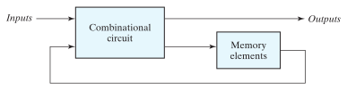
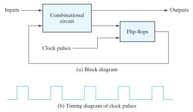

# Sequential Logic Circuits

> A ***sequential circuit*** consists of a [combinational circuit](0e17eb63.md) to which memory (storage) elements are connected to form a [feedback path](0e17eb63.md). The storage elements are devices capable of storing binary information. The binary information stored in these elements at any given time defines the ***state*** of the sequential circuit at that time.

The outputs in a sequential circuit are a function not only of the inputs but also of the present state of the storage elements. The next state of the storage elements is also a function of external inputs and the present state.

> Thus, a ***sequential circuit*** is specified by a time sequence of inputs, outputs, and internal states. In contrast, the outputs of [combinational logic](0e17eb63.md) depend on only the present values of the inputs.

There are two main types of sequential circuits, and their classification is a function of the timing of their signals.

## Synchronous sequential circuits

> A ***synchronous*** sequential circuit employs signals that affect the storage elements at only discrete instants of time. Synchronization is achieved by a timing device called a ***clock generator***, which provides a clock signal having the form of a periodic sequence of ***clock pulses***.

The clock signal is commonly denoted by the identifiers ***clock*** and ***clk***. The clock pulses are distributed throughout the system in such a way that storage elements are affected only with the arrival of each pulse.

> Synchronous sequential circuits that use clock pulses to control storage elements are called ***clocked sequential circuits***.

The storage elements (memory) used in clocked sequential circuits are called [flip-flops](16847013.md).

> A ***flip-flop*** is a binary storage device capable of storing one [bit](9075a57a.md) of information. In stable state, the output of a flip-flop is either $0$ or $1$. A sequential circuit may use many flip-flops to store as many bits as necessary.

If the clock (synchronizing) pulses arrive at a regular interval, the [combinational logic](0e17eb63.md) must respond to a change in the state of the [flip-flop](16847013.md) in time to be updated before the next pulse arrives. [Propagation delays](6f989aae.md) play an important role in determining the minimum interval between the clock pulses that will allow the circuit to operate correctly.

A change in state of the [flip-flops](16847013.md) is initiated only by a clock pulse transition. When a clock pulse is not active, the feedback loop between the value stored in the flip-flop and the value formed at the input to the flip-flop is effectively broken because the flip-flop outputs cannot change even if the outputs of the [combinational circuit](0e17eb63.md) driving their inputs change. Thus, the transition from one state to the next occurs only at predetermined intervals dictated by the clock pulses.

## Asynchronous sequential circuits

> An ***asynchronous*** sequential circuit is a system whose behavior depends upon the input signals at any instant of time and the order in which the inputs change. The storage elements commonly used in asynchronous sequential circuits are ***time-delay devices***.

The storage capability of a time-delay device varies with the time it takes for the signal to propagate through the device. In practice, the internal [propagation delay](6f989aae.md) of [logic gates](afcc79cf.md) is of sufficient duration to produce the needed delay, so that actual delay units may not be necessary.

In gate-type asynchronous systems, the storage elements consist of [logic gates](afcc79cf.md) whose propagation delay provides the required storage.
