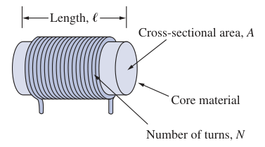
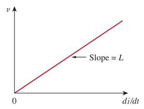
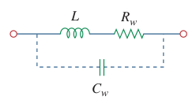
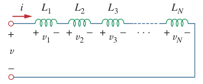
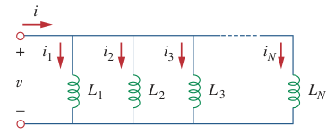

# Inductors

An inductor is a passive element designed to store energy in its magnetic field.

> An ***inductor*** consists of a coil of conducting wire.

***Inductance*** $L$ is the property whereby an inductor exhibits opposition to the change of current flowing through it, measured in henrys (H).

> $\boxed{L = \frac{\mu N^2 A}{l}}$
>
> $\boxed{\mu = \mu_0 \mu_r}$
>
> where:
>
> - $N$ is the number of turns (a dimentionless quantity).
> - $l$ is the length (in meters).
> - $A$ is the cross-sectional area (in square meters).
> - $\mu$ is the permeability (in henrys per meter) of the core.
> - $\mu_0$ is the *vacuum (magnetic) permeability* or *permeability of free space*, $4\pi \times 10^{-7} H/m$ (henrys per meter).
> - $\mu_r$ is the *relative permeability* (a dimensionless quantity).

If current is allowed to pass through an inductor, it is found that the voltage across the inductor is directly proportional to the time rate of change of the current. Using the [passive sign convention](427ee046.md),

> $\boxed{v = L\,\frac{di}{dt}}$
>
> where $L$ is the constant of proportionality called the *inductance* of the inductor, measured in henrys (H).
>
> $\boxed{1\,henry = 1\,\frac{volt \cdot second}{ampere}}$

For an inductor to have voltage across its terminals, its current must vary with time. Hence, $v = 0$ for constant current through the inductor.

The current-voltage relation can be obtained by integrating the voltage-current relation of the inductor.

> $\displaystyle v\,dt = L\,di$
>
> Integrating both sides
>
> $\displaystyle \int_{-\infty}^t v\left(\tau\right)\,d\tau = L \int_{-\infty}^t di$
>
> $\displaystyle i\left(t\right) - i\left(-\infty\right) = \frac{1}{L} \int_{-\infty}^t v\left(\tau\right)\,d\tau$
>
> $\displaystyle i\left(t\right) = \frac{1}{L} \int_{-\infty}^t v\left(\tau\right)\,d\tau + i\left(-\infty\right)$
>
> where $i\left(-\infty\right) = 0$
>
> $\boxed{i\left(t\right) = \frac{1}{L} \int_{-\infty}^t v\left(\tau\right)\,d\tau}$
>
> or
>
> $\boxed{i\left(t\right) = \frac{1}{L} \int_{t_0}^t v\left(\tau\right)\,d\tau + i\left(t_0\right)}$

The inductor is designed to store energy in its magnetic field. The power delivered to the inductor is

> $\displaystyle p = vi = \left(L\,\frac{di}{dt}\right)i$

The energy stored $w$ is

> $\displaystyle w = \int_{-\infty}^t p\left(\tau\right)\,d\tau = L \int_{-\infty}^t \frac{di}{d\tau}\,i\,d\tau = L \int_{-\infty}^t i\,di$
>
> $\displaystyle w = \frac{1}{2}L\left[i^2\left(t\right) - i^2\left(-\infty\right)\right]$
>
> where $i\left(-\infty\right) = 0$
>
> $\boxed{w = \frac{1}{2}Li^2}$

Important properties of an inductor:

1. The voltage across an inductor is zero when the current is constant.

    > An inductor acts like a short circuit to DC.

2. The current through an inductor cannot change instantaneously.

    A discontinuous change in the current through an inductor requires an infinite voltage, which is not physically possible. Thus, an inductor opposes an abrupt change in the current through it. However, the voltage across an inductor can change abruptly.

3. The ideal inductor does not dissipate. The energy stored in it can be retrieved at a later time. The inductor takes power from the circuit when storing energy and delivers the power to the circuit when returning previously stored energy.
4. A practical, non-ideal inductor has a significant resistive component. This resistance is called the *winding resistance* $R_w$, and it appears in series with the inductance of the inductor. The presence of $R_w$ makes it both an energy storage device and an energy dissipation device. Since $R_w$ is usually very small, it is ignored in most cases.

    

    The non-ideal inductor also has a *winding capacitance* $C_w$ due to the capacitive coupling between the conducting coils. $C_w$ is very small and can be ignored in most cases, except at high frequencies.

The *[wye-delta transformation](73f13eae.md)* for resistors can be extended to inductors.

## Series Inductors

The equivalent inductance $L_{eq}$ of $N$ series-connected inductors is the sum of the individual inductances.

> $\boxed{L_{eq} = \sum_{n=1}^N L_n}$

## Parallel Inductors

The equivalent inductance $L_{eq}$ of $N$ parallel-connected inductors is the reciprocal of the sum of the reciprocals of the individual inductances.

> $\boxed{L_{eq} = \frac{1}{\displaystyle \sum_{n=1}^N \frac{1}{L_n}}}$
