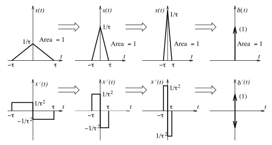

# Unit Doublet Function

> The derivative of an [impulse](b0a34c02.md) $\delta(t)$ is called a ***doublet*** and denoted by $\delta^{\prime}(t)$.
>
> $\boxed{\delta^{\prime}(t) = \frac{d}{dt} \delta(t) = \begin{cases}0\,, & t \neq 0 \\ \textrm{undefined}\,, & t = 0\end{cases}}$

Consider the [triangular pulse](78739d8e.md) $x(t) = (1 / \tau)\,\mathrm{tri}(1 / \tau)$. As $\tau \to 0$, $x(t)$ approaches $\delta(t)$. Its derivative $x^{\prime}(t)$ should then correspond to $\delta^{\prime}(t)$. Now, $x^{\prime}(t)$ is odd and shows two pulses of height $1 / \tau^2$ and $-1 / \tau^2$ with zero area. As $\tau \to 0$, $x^{\prime}(t)$ approaches $+\infty$ and $-\infty$ from below and above, respectively.

> Thus, $\delta^{\prime}(t)$ is an odd function characterized by zero width, zero area, and amplitudes of $+\infty$ and $-\infty$ at $t = 0$.
>
> $\boxed{\int_{-\infty}^{\infty} \delta^{\prime}(t)\,dt = 0}$
>
> $\boxed{\delta^{\prime}(-t) = -\delta^{\prime}(t)}$

The two infinite spikes in $\delta^{\prime}(t)$ are not impulses (their area is not constant), nor do they cancel. In fact, $\delta^{\prime}(t)$ is indeterminate at $t = 0$. Even though its area is zero, its absolute area is infinite.

## Properties of Doublet Function

### Scaling Property

The scaling property of the doublet can be obtained by taking the derivative of [scaled impulse](b0a34c02.md).

> $\boxed{\delta^{\prime}\left[\alpha (t - \beta)\right] = \frac{1}{\alpha |\alpha|}\delta^{\prime}(t - \beta)}$

### Product Property

The product property of the doublet can be obtained by comparing the derivative of $x(t)\,\delta(t - \alpha)$ to the derivative of the product property of [impulses](b0a34c02.md).

> $\boxed{x(t)\,\delta^{\prime}(t - \alpha) = x(\alpha)\,\delta^{\prime}(t - \alpha) - x^{\prime}(\alpha)\,\delta(t - \alpha)}$

### Sifting Property

The doublet $\delta^{\prime}(t - \alpha)$ sifts out the negative derivative of $x(t)$ at $t = \alpha$.

> $\boxed{\int_{-\infty}^{\infty} x(t)\,\delta^{\prime}(t - \alpha)\,dt = -x^{\prime}(\alpha)}$
