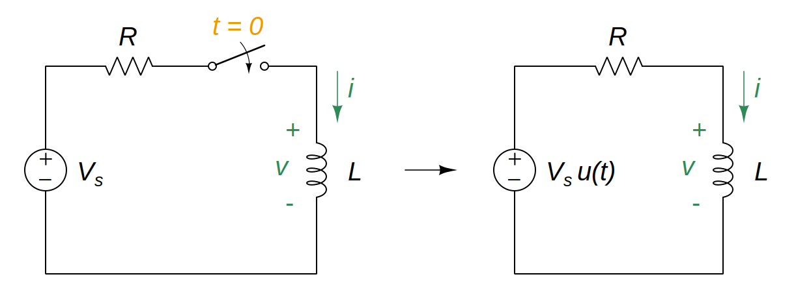

# Step Response of an RL Circuit

To find the [step response](aef193dd.md) of an *[RL](2abe1de7.md)* circuit, the following is required:

- The initial inductor current $i(0)$.

  > Since the [inductor](8be49ac8.md) current cannot change instantaneously,
  >
  > $\boxed{i\left(0^-\right) = i\left(0^+\right) = i\left(0\right) = I_0}$
  >
  > where $i\left(0^-\right)$ is the current through the inductor just before switching and $i\left(0^+\right)$ is its current immediately after switching.

- The final (steady state) inductor current $i(\infty)$.

  > Use the fact that the [inductor](8be49ac8.md) acts like a short circuit to DC at steady state.

- The time constant $\tau$.

  > The [time constant](ea5e865c.md) $\tau$ for an *RL* circuit is
  >
  > $\boxed{\tau = \frac{L}{R}}$
  >
  > where $R$ is the [thevenin](b153529a.md) resistance at the inductor terminals and $L$ is the equivalent [inductance](8be49ac8.md).

When the DC source of an *[RL](2abe1de7.md)* circuit is suddenly applied, the voltage or current source can be modeled as a [step function](58fcc503.md), and the response is known as a *[step response](aef193dd.md)*.

> Let the response be the sum of the transient response and the steady-state response,
>
> $\displaystyle i = i_t + i_{ss}$
>
> The *transient response* $i_t$ is always a decaying exponential,
>
> $\displaystyle i_t = Ae^{\displaystyle -t/\tau}, \quad \tau = \frac{L}{R}$
>
> where $A$ is the constant to be determined.
>
> The *steady-state response* $i_{ss}$ is the portion of *complete response* $i$ that remains after the *transient response* $i_t$ has died out.
>
> $\displaystyle i_{ss} = \frac{V_s}{R}$
>
> Determine constant $A$ using the initial value $I_0$
>
> $\displaystyle i\left(t\right) = i_t + i_{ss} = Ae^{\displaystyle -t/\tau} + \frac{V_s}{R}$
>
> $\displaystyle i\left(0\right) = I_0 = A + \frac{V_s}{R}$
>
> $\displaystyle A = I_0 - \frac{V_s}{R}$
>
> Substitute $A$ to $i\left(t\right)$
>
> $\boxed{i\left(t\right) = \frac{V_s}{R} + \left(I_0 - \frac{V_s}{R}\right) e^{\displaystyle -t/\tau}}$
>
> where [time constant](ea5e865c.md) $\displaystyle \tau = \frac{L}{R}$
>
> This is known as the *[complete response](3dd672e8.md)* of the *RL* circuit to a sudden application of a DC source.

The *complete response* may be written as

> $\boxed{i\left(t\right) = i\left(\infty\right) + \left[i\left(0\right) - i\left(\infty\right)\right]\,e^{\displaystyle -t/\tau}, \quad t > 0}$
>
> where time constant $\displaystyle \tau = \frac{L}{R}$, $i\left(0\right)$ is the initial voltage at $t = 0^+$ and $i\left(\infty\right)$ is the final or steady-state value.
>
> This equation can be used in *[source-free RL circuit](4b47afe4.md)*.

If the switch changes position at time $t = t_0$ instead of at $t = 0$, there is a time delay in the response.

> $\boxed{i\left(t\right) = i\left(\infty\right) + \left[i\left(t_0\right) - i\left(\infty\right)\right]\,e^{\displaystyle -\left(t - t_0\right)/\tau}, \quad t > t_0}$
>
> where time constant $\displaystyle \tau = \frac{L}{R}$ and $i\left(t_0\right)$ is the initial value at $t = t_{0}^{+}$.
>
> This equation can be used in *[source-free RL circuit](4b47afe4.md)*.
