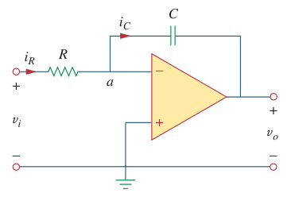

# Integrator (Op Amp)

The op amp integrator is used in numerous applications, especially in [analog computers](594a71cd.md).

> An ***integrator*** is an [op amp](bd63e87b.md) circuit whose output is proportional to the integral of the input signal.

If the feedback resistor $R_f$ in the [inverting amplifier](d6dfa54d.md) is replaced by a [capacitor](48507115.md), we obtain an ideal integrator.

> At node $a$, $i_R = i_C$ for an [ideal op amp](fc89a5a0.md). Hence,
>
> $\displaystyle i_R = i_C = \frac{v_i}{R} = -C\,\frac{dv_o}{dt}$
>
> $\displaystyle dv_o = -\frac{1}{RC}\,v_i\,dt$
>
> Integrating both sides
>
> $\displaystyle \int_{0}^{t}dv_o = -\frac{1}{RC}\int_{0}^{t}v_i\left(\tau\right)\,d\tau$
>
> $\displaystyle v_o\left(t\right) - v_o\left(0\right) = -\frac{1}{RC}\int_{0}^{t}v_i\left(\tau\right)\,d\tau$
>
> Assuming $v_o\left(0\right) = 0$
>
> $\boxed{v_o\left(t\right) = -\frac{1}{RC}\int_{0}^{t}v_i\left(\tau\right)\,d\tau}$

Solving for the output voltage $v_o$ using the [impedance](45a5fbef.md) $\mathbf{Z}_C$ of the capacitor $C$.

> $\displaystyle \mathbf{Z}_C = \frac{1}{j\omega C}$
>
> In [s-domain](b2aaf243.md), $\displaystyle s = j\omega \to \mathbf{Z}_C = 1 / sC$
>
> $\displaystyle i_R\left(s\right) = i_C\left(s\right) = \frac{v_i\left(s\right)}{R} = -\frac{v_o\left(s\right)}{\mathbf{Z}_C} = -\frac{v_o\left(s\right)}{1 / sC} = -sC\,v_o\left(s\right)$
>
> $\displaystyle \frac{v_i\left(s\right)}{R} = -sC\,v_o\left(s\right)$
>
> $\displaystyle v_o\left(s\right) = -\frac{1}{RC}\cdot\frac{v_i\left(s\right)}{s}$
>
> Find the [inverse Laplace transform](c9a77663.md) to obtain the time domain function.
>
> $\boxed{v_o\left(t\right) = -\frac{1}{RC}\int_{0^-}^{t}v_i\left(\tau\right)\,d\tau}$

To ensure that $V_o\left(0\right) = 0$, it is always necessary to discharge the integrator's capacitor prior to the application of signal.

In practice, the op amp integrator requires a [feedback resistor](6e0eb346.md) to reduce DC gain and prevent saturation. Care must be taken that the op amp operates within the linear range so that it does not saturate.
