# Bode Plots

The frequency range required in [frequency response](56a77e5f.md) is often so wide that it is inconvenient to use a linear scale for the frequency axis. For these reason, it has become standard practice to plot the [transfer function](6f158a97.md) on a pair of semilogarithmic plots: The magnitude in [decibels](2f56aca1.md) is plotted against the [logarithm](a9e9dea5.md) of the frequency; on a separate plot, the phase in degrees is plotted against the logarithm of the frequency.

> ***Bode plots*** are semilog plots of the magnitude (in decibels) and phase (in degrees) of a transfer function versus frequency.

Since [transfer function](6f158a97.md) is a [complex number](9efce189.md), $\displaystyle \mathbf{H}(\omega) = H(\omega)\angle\phi(\omega) = \textrm{Re}\left[\mathbf{H}(\omega)\right] + j\,\textrm{Im}\left[\mathbf{H}(\omega)\right]$.

> In a ***Bode magnitude plot***, the gain $\displaystyle H_{\textrm{dB}}$ is
>
> $\boxed{H(\omega)_{\textrm{dB}} = 20\log_{10}\left|\mathbf{H}(\omega)\right| = 20\log_{10}\left[H(\omega)\right]}$
>
> where $\displaystyle H(\omega) = \sqrt{\left(\textrm{Re}\left[\mathbf{H}(\omega)\right]\right)^2 + \left(\textrm{Im}\left[\mathbf{H}(\omega)\right]\right)^2}$
>
> In a ***Bode phase plot***, the phase $\phi$ is
>
> $\boxed{\phi(\omega) = \textrm{Arg}\left[\mathbf{H}(\omega)\right] = \tan^{-1}\left(\frac{\textrm{Im}\left[\mathbf{H}(\omega)\right]}{\textrm{Re}\left[\mathbf{H}(\omega)\right]}\right)}$

A transfer function $\mathbf{H}(\omega)$ may be written in terms of factors that have real and imaginary parts.

> $\boxed{\mathbf{H}(\omega) = K\frac{\displaystyle \left(j\omega\right)^{\pm 1} \left(1 + \frac{j\omega}{z}\right) \left[1 + \frac{j2\zeta_{1}\omega}{\omega_n} + \left(\frac{j\omega}{\omega_n}\right)^2\right]\cdots}{\displaystyle \left(1 + \frac{j\omega}{p}\right) \left[1 + \frac{j2\zeta_{2}\omega}{\omega_k} + \left(\frac{j\omega}{\omega_k}\right)^2\right]\cdots}}$
>
> where $z$, $p$, $\omega_n$, and $\omega_k$ are the *corner frequency* (or *break frequency*), and $\zeta$ is the damping factor.

The Bode plot can be constructed by plotting each factors of transfer function $\mathbf{H}(\omega)$ separately and adding them graphically. The factors can be considered one at a time and then combined additively because of the [logarithms](a9e9dea5.md) involved.

## Straight-line Plots of the Factors

For positive integer $N$.

| Factor | Magnitude | Phase |
| :-: | :-: | :-: |
| $\displaystyle K$ | 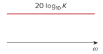 | 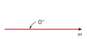 |
| $\displaystyle (j\omega)^N$ | 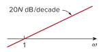 | 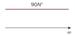 |
| $\displaystyle \frac{1}{(j\omega)^N}$ | 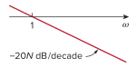 | 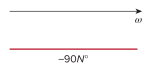 |
| $\displaystyle \left(1 + \frac{j\omega}{z}\right)^N$ | 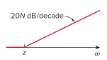 | 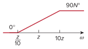 |
| $\displaystyle \frac{1}{\displaystyle \left(1 + \frac{j\omega}{p}\right)^N}$ | 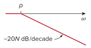 | 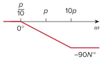 |
| $\displaystyle \left[1 + \frac{2j\omega\zeta}{\omega_n} + \left(\frac{j\omega}{\omega_n}\right)^2\right]^N$ | 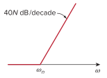 | 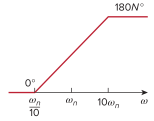 |
| $\displaystyle \frac{1}{\displaystyle \left[1 + \frac{2j\omega\zeta}{\omega_k} + \left(\frac{j\omega}{\omega_k}\right)^2\right]^N}$ | 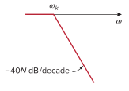 | 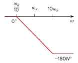 |

> A ***decade*** is an interval between two frequencies with a ratio of 10. Thus, $20\;\textrm{dB}/\textrm{decade}$ means that the magnitude changes $20\;\textrm{dB}$ whenever the frequency changes tenfold or one decade.

If $K$ is negative, the magnitude remains $20\log_{10}K$ but the phase is $\pm 180^\circ$.
