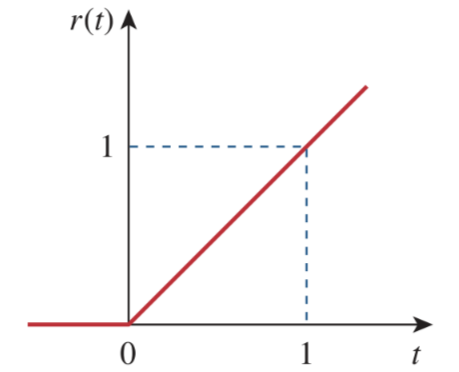
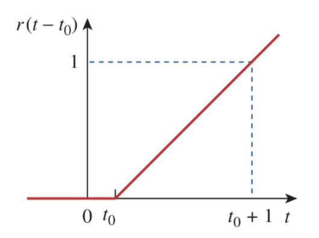
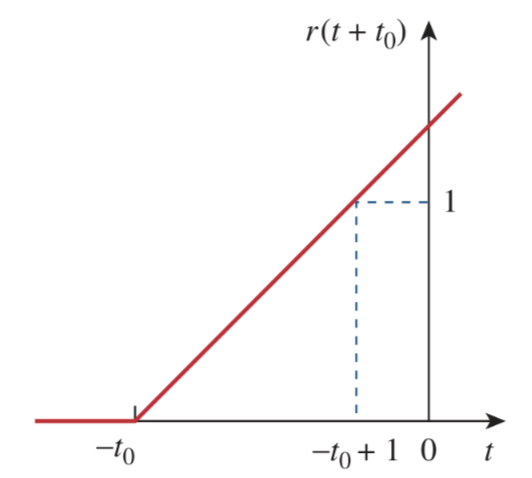

# Unit Ramp Function

Integrating the [unit step function](58fcc503.md) $u\left(t\right)$ results in the *unit ramp function* $r\left(t\right)$.

> The ***unit ramp function*** $r\left(t\right)$ is zero for negative values of $t$ and has a unit slope for positive values of $t$.
>
> $\boxed{r\left(t\right) = \int_{-\infty}^{t} u\left(\lambda\right)\,d\lambda = t\,u\left(t\right) = \begin{cases}0\,, & t \le 0 \\ t\,, & t \ge 0\end{cases}}$

In general, a ramp is a function that changes at a constant rate.

For the delayed unit ramp function,

> $\displaystyle r\left(t - t_0\right) = \begin{cases}0\,, & t \le t_0 \\ t - t_0\,, & t \ge t_0\end{cases}$

For the advanced unit ramp function,

> $\displaystyle r\left(t + t_0\right) = \begin{cases}0\,, & t \le -t_0 \\ t + t_0\,, & t \ge -t_0\end{cases}$

