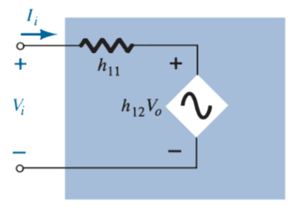

Tue 2023-03-14 09:04:44 +0800 PST
#transistor #bipolar-junction-transistor #bjt #hybrid-equivalent-model-transistor
#status/ongoing

# Hybrid Equivalent Model

> The [$r_e$ model](634c6884.md) has the advantage that the parameters are defined by the actual operating conditions, whereas the parameters of the hybrid equivalent circuit are defined in general terms for any operating conditions.

The [$r_e$ model](634c6884.md) suffers from the fact that parameters such as the output impedance and the feedback elements are not available, whereas the hybrid parameters provide the entire set on the specification sheet.

Hybrid parameters for the 2n4400 transistor.

The description of the hybrid equivalent model will begin with the general two-port system.

Relating four variables:

> $\boxed{V_i = h_{11}I_i + h_{12}V_o}$
>
> $\boxed{I_o = h_{21}I_i + h_{22}V_o}$

The parameters relating the four variables are called *h-parameters*, from the word "hybrid". The term *hybrid* was chosen because the mixture of variables ($V$ and $I$) in each equation results in a "hybrid" set of units of measurement for the *h-parameters*.

> *short-circuit input-impedance parameter* $h_{11}$, measured in ohms ($\ohm$).
>
> $\boxed{h_{11} = \left.\frac{V_i}{I_i}\right|_{V_o = 0}}$
>
> *open-circuit reverse transfer voltage ratio parameter* $h_{12}$ (unitless).
>
> $\boxed{h_{12} = \left.\frac{V_i}{V_o}\right|_{I_i = 0}}$
>
> *short-circuit forward transfer current ratio parameter* $h_{21}$ (unitless).
>
> $\boxed{h_{21} = \left.\frac{I_o}{I_i}\right|_{V_o = 0}}$
>
> *open-circuit output admittance parameter* $h_{22}$, measured in siemens (S).
>
> $\boxed{h_{22} = \left.\frac{I_o}{V_o}\right|_{I_i = 0}}$

Hybrid input equivalent circuit.

Hybrid output equivalent circuit.

The complete "ac" equivalent circuit for the basic three-terminal linear device with the new set of subscripts for the *h*-parameters.

> $\displaystyle h_{11} \rightarrow \text{input resistance} \rightarrow h_i$
>
> $\displaystyle h_{12} \rightarrow \text{reverse transfer voltage ratio} \rightarrow h_r$
>
> $\displaystyle h_{21} \rightarrow \text{forward transfer current ratio} \rightarrow h_f$
>
> $\displaystyle h_{22} \rightarrow \text{output conductance} \rightarrow h_o$

> This circuit is applicable to any linear three-terminal electronic device or system with no internal independent sources. For the transistor, therefore, even though it has three basic configurations, *they are all three-terminal configurations*.

The *h*-parameters, however, will change with each configuration. To distinguish which parameter has been used, a second subscript has been added to the *h*-parameter notation. For the common-base, common-emitter, and common-collector configurations, the letter b, e, and c were added, respectively.

Common-emitter configuration hybrid equivalent model.

Common-base configuration hybrid equivalent model.

## Approximate Hybrid Equivalent model

For the common-emitter and common-base configurations, the magnitude of $h_r$ and $h_o$ is often such that the results obtained for the important parameters such as $Z_i$, $Z_o$, $A_v$, and $A_i$ are only slightly affected if $h_r$ and $h_o$ are not included in the model.

Because $h_r$ is normally a relatively small quantity, its removal is approximated by $h_r \simeq 0$ and $h_r V_o = 0$, resulting in a short-circuit equivalent for the feedback element. The resistance determined by $1/h_o$ is often large enough to be ignored in comparison to a parallel load, permitting its replacement by an open-circuit equivalent for the common-emitter and common-base models.

The resulting equivalent is quite similar to the general structure of the common-base and common-emitter equivalent circuits obtained with the [$r_e$ model](634c6884.md).

The analysis using the approximate hybrid equivalent for the common-emitter and common-base configurations is very similar to that just performed using the [$r_e$ model](634c6884.md).

### Approximate Common-Emitter Hybrid Equivalent Circuit

> $\boxed{h_{ie} = \beta r_e}$
>
> $\boxed{h_{fe} = \beta}$

### Approximate Common-Base Hybrid Equivalent Circuit

> $\boxed{h_{ib} = r_e}$
>
> $\boxed{h_{fb} = -\alpha \simeq -1}$

## Complete Hybrid Equivalent Model
