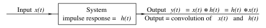
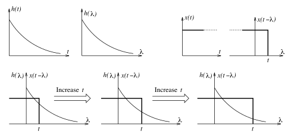
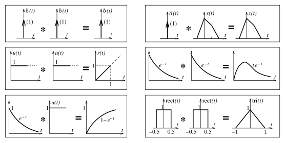

# Continuous Convolution

The convolution method for finding the zero-state response $y(t)$ of a system to an input $x(t)$ applies to [linear time-invariant](786783af.md) (LTI) systems. The system is assumed to be described by its impulse response $h(t)$.

> The ***convolution*** is defined as the integral of the product of the two functions after one is [reflected](2d215ea5.md) about the $y$-axis and shifted. The convolution integral is evaluated for all values of shift, producing the convolution function.
>
> $\boxed{y(t) = x(t) \ast h(t) = \int_{-\infty}^{\infty}x(\lambda)\,h(t - \lambda)\,d\lambda}$
>
> $\boxed{y(t) = h(t) \ast x(t) = \int_{-\infty}^{\infty}h(\lambda)\,x(t - \lambda)\,d\lambda}$
>
> The choice of which function is reflected and shifted before the integral does not change the integral result. This is the commutative property of convolution.

In the convolution integral, the time $t$ determines the relative location of $h(t - \lambda)$ with respect to $x(\lambda)$. The convolution will yield a non-zero result only for those values of $t$ over which $h(t - \lambda)$ and $x(\lambda)$ overlap. The response $y(t)$ for all time requires the convolution for every value of $t$. Varying $t$ amounts to sliding the folded function $h(-\lambda)$ past $x(\lambda)$ by the chosen values of $t$.

For two [causal signals](09fc41c7.md) $x(t)\,u(t)$ and $h(t)\,u(t)$, the product $x(\lambda)\,u(\lambda) \cdot h(t - \lambda)\,u(t - \lambda)$ is non-zero only over the range $0 \leq \lambda \leq t$. Since both $u(\lambda)$ and $u(t - \lambda)$ are unity in this range, the convolution integral simplifies to

> $\boxed{y(t) = x(t) \ast h(t) = \int_{0}^{t}x(\lambda)\,h(t - \lambda)\,d\lambda}$
>
> where $x(t)$ and $h(t)$ are zero for $t < 0$

While evaluating the convolution integral, keep in mind that $x(\lambda)$ and $h(t - \lambda)$ are functions of $\lambda$ (and not $t$), but $t$ is a constant with respect to $\lambda$. Simplification of the integration limits due to the [step functions](58fcc503.md) in the convolution kernel occurs frequently in problem solving.

> The step function in $x(\lambda)$ changes the lower limit; the step function in $h(t - \lambda)$ changes the upper limit.

> For example, for input $\displaystyle x(t) = u(t - \alpha)$ and impulse response $\displaystyle h(t) = u(t - \beta)$
>
> $\displaystyle x(t) = u(t - \alpha) \to x(\lambda) = u(\lambda - \alpha)$
>
> $\displaystyle h(t) = u(t - \beta) \to h(t - \lambda) = u(t - \lambda - \beta)$
>
> $\displaystyle y(t) = x(t) \ast h(t) = \int_{-\infty}^{\infty}u(\lambda - \alpha)\,u(t - \lambda - \beta)\,d\lambda = \int_{\alpha}^{t - \beta}d\lambda = (t - \beta - \alpha)\,u(t - \beta - \alpha)$

## Convolution Properties

See: [Properties of Convolution](https://en.wikipedia.org/wiki/Convolution#Properties)

### Commutative

In [linear time-invariant](786783af.md) (LTI) systems, the input $x(t)$ and impulse response $h(t)$ can be interchanged mathematically due to the commutative property of convolution.

> $\boxed{y(t) = x(t) \ast h(t) = h(t) \ast x(t)}$

### Associative

This property states that the order of convolution operations can be rearranged without affecting the result.

> $\boxed{y(t) = x_{1}(t) \ast \left[x_{2}(t) \ast x_{3}(t)\right] = \left[x_{1}(t) \ast x_{2}(t)\right] \ast x_{3}(t)}$

### Distributive

Convolution is a linear operation and obeys superposition.

> $\boxed{y(t) = \left[x_{1}(t) + x_{2}(t)\right] \ast h(t) = x_{1}(t) \ast h(t) + x_{2}(t) \ast h(t)}$
>
> For constant $k$,
>
> $\boxed{k \cdot y(t) = k\left[x(t) \ast h(t)\right] = \left[k \cdot x(t)\right] \ast h(t) = x(t) \ast \left[k \cdot h(t)\right]}$

### Multiplicative Identity

The convolution of any signal $x(t)$ with an [impulse](b0a34c02.md) $\delta(t)$ reproduces the signal $x(t)$.

> $\boxed{y(t) = x(t) \ast \delta(t) = \delta(t) \ast x(t) = x(t)}$

### Time Shifting

Convolution is a time-invariant operation and implies that shifting the input $x(t)$ or the impulse response $h(t)$ by $\alpha$ shifts the output response $y(t)$ by $\alpha$.

> If $\displaystyle y(t) = x(t) \ast h(t)$, then
>
> $\boxed{x(t - \alpha) \ast h(t) = x(t) \ast h(t - \alpha) = y(t - \alpha)}$
>
> If both $x(t)$ and $h(t)$ are shifted,
>
> $\boxed{x(t - \alpha) \ast h(t - \beta) = y(t - \alpha - \beta)}$

### Time Scaling

The time-scaling property is valid only when both functions are scaled by the same factor $\alpha$.

> $\boxed{x(\alpha t) \ast h(\alpha t) = \left|\frac{1}{\alpha}\right|\,y(\alpha t)}$

### Integration

The area of convolution $y(t)$ equals the product of the areas of $x(t)$ and $h(t)$.

> $\boxed{\int_{-\infty}^{\infty}y(t)\,dt = \int_{-\infty}^{\infty}x(t) \ast h(t)\,dt = \int_{-\infty}^{\infty}x(t)\,dt \int_{-\infty}^{\infty}h(t)\,dt}$

The convolution of a signal $x(t)$ with an [unit step](58fcc503.md) $u(t)$ is the *running integral* of the signal $x(t)$.

> $\boxed{y(t) = x(t) \ast u(t) = \int_{-\infty}^{t} x(\lambda)\,d\lambda}$

### Differentiation

The derivative of any one of the convolved signals results in the derivative of the convolution. Repeated derivatives of either $x(t)$ or $h(t)$ lead to the general result

> $\boxed{x^{(m)}(t) \ast h(t) = x(t) \ast h^{(m)}(t) = y^{(m)}(t)}$
>
> For the repeated derivatives of both $x(t)$ and $h(t)$,
>
> $\boxed{x^{(m)}(t) \ast h^{(n)}(t) = y^{(m + n)}(t)}$

### Conjugation

The complex conjugate of a convolution involves taking the complex conjugate of each function before performing the convolution.

> $\boxed{\overline{y(t)} = \overline{x(t) \ast h(t)} = \overline{x(t)} \ast \overline{h(t)}}$

## Some Useful Convolution Results

> $\displaystyle u(t) \ast u(t) = \int_{-\infty}^{\infty} u(\lambda)\,u(t - \lambda)\,d\lambda = \int_{0}^{t} d\lambda$
>
> $\boxed{u(t) \ast u(t) = t\,u(t) = r(t)}$

> $\displaystyle e^{-t} u(t) \ast e^{-t} u(t) = \int_{-\infty}^{\infty} e^{-\lambda} e^{-(t - \lambda)} u(\lambda)\,u(t - \lambda)\,d\lambda = e^{-t}\int_{0}^{t} d\lambda$
>
> $\boxed{e^{-t} u(t) \ast e^{-t} u(t) = te^{-t} u(t) = e^{-t} r(t)}$

> $\displaystyle e^{-t} u(t) \ast u(t) = \int_{-\infty}^{\infty} e^{-\lambda} u(\lambda)\,u(t - \lambda)\,d\lambda = \int_{0}^{t} e^{-\lambda}\,d\lambda$
>
> $\boxed{e^{-t} u(t) \ast u(t) = u(t) \ast e^{-t} u(t) = \left(1 - e^{-t}\right)\,u(t)}$

> $\displaystyle \mathrm{rect}(t) \ast \mathrm{rect}(t) = \left[u(t + 0.5) - u(t - 0.5)\right] \ast \left[u(t + 0.5) - u(t - 0.5)\right] = r(t + 1) - 2\,r(t) + r(t - 1)$
>
> $\boxed{\mathrm{rect}(t) \ast \mathrm{rect}(t) = \mathrm{tri}(t)}$

## Convolution of Finite-Duration Functions

The convolution of two finite-duration functions $x(t)$ and $h(t)$ is also of finite duration and is subject to the following rules:

- The starting time of $y(t)$ equals the sum of the starting times of $x(t)$ and $h(t)$.
- The ending time of $y(t)$ equals the sum of the ending times of $x(t)$ and $h(t)$.
- The duration of $y(t)$ equals the sum of the durations of $x(t)$ and $h(t)$.

  > $\boxed{\mathrm{duration}[y(t)] = \mathrm{duration}[x(t) \ast h(t)] = \mathrm{duration}[x(t)] + \mathrm{duration}[h(t)]}$
