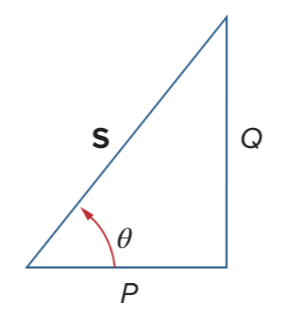
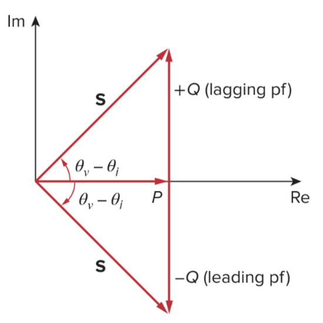

# Complex Power

> ***Complex Power*** (in $\textrm{VA}$) is the product of the [rms](28b471d6.md) voltage [phasor](82b1dcbd.md) and the complex conjugate of the rms current phasor. As a complex quantity, its real part is [real power](103c4ff6.md) $P$ and its imaginary part is reactive power $Q$.
>
> $\boxed{\mathbf{S} = \frac{1}{2}\mathbf{V}\mathbf{I}^\ast = \mathbf{V}_\mathrm{rms}\,\mathbf{I}_\mathrm{rms}^\ast = \left|\mathbf{V}_\mathrm{rms}\right|\left|\mathbf{I}_\mathrm{rms}\right|\angle\left(\theta_v - \theta_i\right) = \frac{V_\mathrm{rms}^2}{\mathbf{Z}^\ast} = I_\mathrm{rms}^2\,\mathbf{Z} = I_\mathrm{rms}^2\left(R + jX\right) = P + jQ}$
>
> where:
>
> $\displaystyle \mathbf{V}_\mathrm{rms} = \frac{\mathbf{V}}{\sqrt{2}} = V_\mathrm{rms}\angle\theta_v = \frac{V_m}{\sqrt{2}}\angle\theta_v$
>
> $\displaystyle \mathbf{I}_\mathrm{rms} = \frac{\mathbf{I}}{\sqrt{2}} = I_\mathrm{rms}\angle\theta_i = \frac{I_m}{\sqrt{2}}\angle\theta_i$
>
> $\displaystyle \mathbf{Z} = R + jX$

Complex power $\mathbf{S}$ contains all power information of a load. The real part of $\mathbf{S}$ is the [real (average) power](103c4ff6.md) $P$; its imaginary part is the reactive power $Q$; its magnitude is the [apparent power](0e5be61b.md) $S$; and the cosine of its phase angle is the [power factor](0e5be61b.md) $\mathrm{pf}$.

> $\boxed{\textrm{Apparent Power (in VA)} = S = \left|\mathbf{S}\right| = \left|\mathbf{V}_\mathrm{rms}\right|\left|\mathbf{I}_\mathrm{rms}\right| = \sqrt{P^2 + Q^2}}$
>
> $\boxed{\textrm{Real Power (in W)} = P = \mathrm{Re}\left(\mathbf{S}\right) = I_\mathrm{rms}^2 R = S\cos\left(\theta_v - \theta_i\right)}$
>
> $\boxed{\textrm{Reactive Power (in VAR)} = Q = \mathrm{Im}\left(\mathbf{S}\right) = I_\mathrm{rms}^2 X = S\sin\left(\theta_v - \theta_i\right)}$
>
> $\boxed{\textrm{Power Factor} = \mathrm{pf} = \frac{P}{S} = \cos\left(\theta_v - \theta_i\right)}$

The reactive power $Q$ is a measure of the energy exchange between the source and the reactive part of the load. The unit of $Q$ is the *volt-ampere reactive* ($\textrm{VAR}$) to distinguish it from the [real (average) power](103c4ff6.md) and [apparent power](0e5be61b.md). Notice that:

1. $\displaystyle Q = 0$ for resistive loads (unity $\mathrm{pf}$).
2. $\displaystyle Q < 0$ for capacitive loads (leading $\mathrm{pf}$).
3. $\displaystyle Q > 0$ for inductive loads (lagging $\mathrm{pf}$).

It is a standard practice to represent $\mathbf{S}$, $P$, $Q$ in the form of a triangle, known as the ***power triangle***. The power triangle has four items; the apparent/complex power, real power, reactive power, and the power factor angle. When $\mathbf{S}$ lies in the first quadrant, the load is inductive and the $\mathrm{pf}$ is lagging. When $\mathbf{S}$ lies in the fourth quadrant, the load is capacitive and the $\mathrm{pf}$ is leading.

It is also possible for the complex power to lie in the second or third quadrant. This requires that the load impedance have a negative resistance, which is possible with active circuits.

## Conservation of AC Power

The principle of conservation of power applies to AC circuits as well as DC circuits. Whether the loads are connected in series or in parallel (or in general), the total power *supplied* by the source equals the total power *delivered* to the load.

> $\boxed{\mathbf{S} = \sum_{n = 1}^N\mathbf{S}_n}$
>
> This means that the total complex power in a network is the sum of the complex powers of the individual components.

This is also true of [real (average) power](103c4ff6.md), [instantaneous power](103c4ff6.md), and reactive power, but not true of [apparent power](0e5be61b.md).

> The complex, real, and reactive powers of the sources equal the respective sums of the complex, real, and reactive powers of the individual loads.
