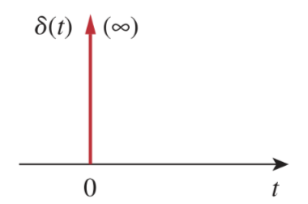
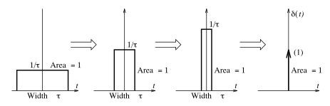

# Unit Impulse Function

The derivative of the [unit step function](58fcc503.md) $u\left(t\right)$ is the *unit impulse function* $\delta\left(t\right)$.

> The ***unit impulse function*** $\delta\left(t\right)$ (also known as the ***Dirac delta function***) is zero everywhere except at $t = 0$, where it is undefined.
>
> $\boxed{\delta\left(t\right) = \frac{d}{dt} u\left(t\right) = \begin{cases}0\,, & t \neq 0 \\ \infty\,, & t = 0\end{cases}}$

Impulsive currents and voltages occur in electric circuits as a result of switching operations or impulsive sources.

The unit impulse may be regarded as an applied or resulting shock. It may be visualized as a very short duration pulse of unit area. This may be expressed mathematically as

> $\boxed{\int_{-\infty}^{\infty} \delta\left(t\right)\,dt = \int_{0^-}^{0^+} \delta\left(t\right)\,dt = 1}$
>
> where $t = 0^-$ denotes the time just before $t = 0$ and $t = 0^+$ is the time just after $t = 0$.

> The area of the impulse $A\,\delta(t)$ equals $A$ and is also called its ***strength***.

Consider the [rectangular pulse](78739d8e.md) $(1 / \tau)\,\mathrm{rect}(t / \tau)$ of width $\tau$ and height $1 / \tau$. As $\tau$ decreases, the width shrinks and the height increases proportionately to maintain unit area. As $\tau \to 0$, the rectangular pulse becomes a narrow spike with unit area, exhibiting properties consistent with an impulse $\delta(t)$.

## Properties of Impulse function

### Scaling Property

Since $\delta(t)$ has unit area, the [time-compressed](2d215ea5.md) impulse $\delta(\alpha t)$ should have an area of $1 / |\alpha|$. Since the impulse $\delta(\alpha t)$ still occurs at $t = 0$, it may be regarded as an unscaled impulse $\delta(t) / |\alpha|$. Since a [time shift](2d215ea5.md) does not affect areas, the general result is

> $\boxed{\delta\left[\alpha(t - \beta)\right] = \frac{1}{|\alpha|}\delta(t - \beta)}$

### Product Property

The product of a signal $x(t)$ with an impulse $\delta(t)$ at $t = \alpha$ is also an impulse $\delta(t)$ at $t = \alpha$ whose height is scaled by the value of $x(t)$ at $t = \alpha$.

> $\boxed{x(t)\,\delta(t - \alpha) = x(\alpha)\,\delta(t - \alpha)}$

### Sifting Property

The product property immediately suggests that the area of the product $x(t)\,\delta(t - \alpha) = x(\alpha)\,\delta(t - \alpha)$ equals $x(\alpha)$. In other words, $\delta(t - \alpha)$ sifts out the value of $x(t)$ at the impulse location $t = \alpha$, and thus,

> $\boxed{\int_{-\infty}^{\infty} x(t)\,\delta(t - \alpha)\,dt = x(\alpha)}$
